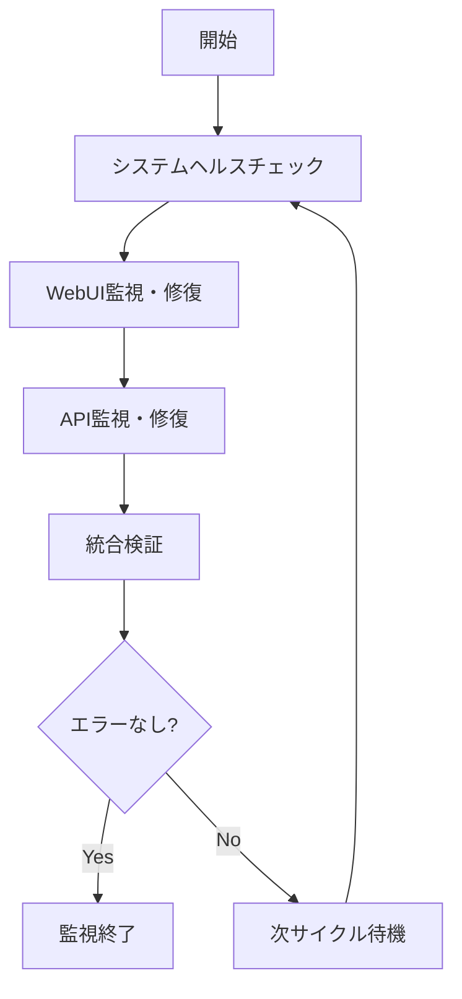

# 🔄 無限ループ自動エラー監視・修復システム

**WebUI + バックエンドAPI の包括的な自動監視・修復システム**

## 📋 概要

このシステムは、ITSMシステムのWebUIとバックエンドAPIを24時間体制で監視し、エラーを自動検知・修復する統合システムです。

## 🎯 監視対象

- **フロントエンド (WebUI)**: http://192.168.3.135:3000
- **管理者ダッシュボード**: http://192.168.3.135:3000/admin  
- **バックエンドAPI**: http://192.168.3.135:8000
- **APIドキュメント**: http://192.168.3.135:8000/docs

## 🚀 使用方法

### 基本実行

```bash
# 無限ループ監視開始（推奨）
./start-infinite-error-monitoring.sh

# 一回のみ実行
./start-infinite-error-monitoring.sh --once

# 10サイクルで終了
./start-infinite-error-monitoring.sh --cycles 10

# 60秒間隔で監視
./start-infinite-error-monitoring.sh --interval 60
```

### 高度な設定

```bash
# 環境変数による設定
MAX_CYCLES=20 INTERVAL_SECONDS=60 ./start-infinite-error-monitoring.sh

# ヘルスチェックタイムアウト設定
./start-infinite-error-monitoring.sh --timeout 30
```

## 🔍 監視・修復機能

### 🌐 WebUI監視
- ブラウザコンソールエラーの検知
- React/JavaScript エラーの自動修復
- アクセシビリティ問題の改善
- パフォーマンス問題の最適化
- セキュリティ脆弱性の検知

### 🔌 API監視
- エンドポイントの可用性監視
- データベース整合性チェック
- セキュリティ脅威の検知
- パフォーマンス監視
- エラーログの解析

### 🔧 自動修復機能
- **JavaScript エラー**: Optional chaining、null チェック追加
- **React エラー**: Key props、Error Boundary追加
- **API エラー**: エンドポイント修正、CORS設定
- **アクセシビリティ**: alt属性、aria-label追加
- **セキュリティ**: CSP設定、XSS防止

## 📊 レポート・ログ

### 生成されるファイル

```
./monitoring-logs/
├── infinite-monitoring-YYYYMMDD-HHMMSS.log    # メインログ
├── errors-YYYYMMDD-HHMMSS.log                 # エラーログ

./validation-reports/
├── validation-report-YYYYMMDD-HHMMSS.json     # 詳細レポート
├── validation-summary-YYYYMMDD-HHMMSS.md      # サマリーレポート
└── final-monitoring-report-YYYYMMDD-HHMMSS.md # 最終レポート
```

### レポート内容
- 検知されたエラーの詳細
- 実行された修復アクション
- システム全体の健全性状態
- パフォーマンス指標
- セキュリティ状況

## 🔄 監視フロー



## ⚙️ 設定オプション

### 環境変数

| 変数名 | デフォルト | 説明 |
|--------|------------|------|
| `MAX_CYCLES` | 50 | 最大監視サイクル数 (0=無制限) |
| `INTERVAL_SECONDS` | 30 | 監視間隔（秒） |
| `HEALTH_CHECK_TIMEOUT` | 10 | ヘルスチェックタイムアウト（秒） |
| `MAX_REPAIR_ATTEMPTS` | 3 | 最大修復試行回数 |

### コマンドラインオプション

```bash
--once              # 一回のみ実行
--cycles NUM        # 最大サイクル数設定
--interval SECONDS  # 監視間隔設定
--timeout SECONDS   # タイムアウト設定
--help, -h          # ヘルプ表示
```

## 🛠️ システム構成

### 主要コンポーネント

1. **start-infinite-error-monitoring.sh**
   - メイン制御スクリプト
   - 無限ループ制御
   - ログ管理

2. **integrated-error-validation-system.ts**
   - TypeScript統合検証システム
   - 包括的なエラー検証
   - 詳細レポート生成

3. **frontend/run-comprehensive-webui-monitor.sh**
   - MCP Playwright WebUI監視
   - 自動修復機能

4. **backend/comprehensive_monitoring.py**
   - API包括監視システム
   - データベース監視

## 📈 期待される効果

### ✅ 品質向上
- **エラー削減**: 自動検知・修復によるエラー大幅削減
- **可用性向上**: 24時間監視による高可用性確保
- **ユーザー体験**: エラーのない快適な操作環境
- **セキュリティ**: 継続的なセキュリティ監視

### ⚡ 運用効率化
- **自動化**: 手動監視・修復作業の削減
- **早期発見**: 問題の早期発見・対応
- **レポート**: 包括的な監視レポート
- **追跡可能性**: 詳細なログとレポート

## 🔧 トラブルシューティング

### よくある問題

#### 1. 依存関係エラー
```bash
# TypeScript/Node.js インストール
npm install -g typescript ts-node

# Python仮想環境作成
cd backend && python3 -m venv venv && source venv/bin/activate && pip install -r requirements.txt
```

#### 2. 権限エラー
```bash
# 実行権限付与
chmod +x start-infinite-error-monitoring.sh
chmod +x frontend/run-comprehensive-webui-monitor.sh
```

#### 3. ポート接続エラー
```bash
# サービス確認
curl -f http://192.168.3.135:3000   # WebUI
curl -f http://192.168.3.135:8000   # API
```

### ログ確認

```bash
# 最新のメインログ確認
tail -f ./monitoring-logs/infinite-monitoring-*.log

# エラーログ確認
tail -f ./monitoring-logs/errors-*.log

# 最新レポート確認
ls -la ./validation-reports/
```

## 🔄 停止・再開

### 停止
```bash
# Ctrl+C で停止
# または
kill $(cat infinite-monitoring.pid)
```

### 再開
```bash
./start-infinite-error-monitoring.sh
```

## 📞 サポート

### 実装担当
- **WebUI**: ITSM-DevUI エージェント
- **API**: ITSM-DevAPI エージェント
- **統合**: Claude Code システム

### 問題報告
システムで問題が発生した場合は、以下の情報を含めて報告してください：
- エラーメッセージ
- 実行ログファイル
- システム環境情報
- 再現手順

---

## 🎉 実装完了

✅ **MCP Playwright WebUI監視システム**  
✅ **包括的API監視システム**  
✅ **統合エラー検証システム**  
✅ **無限ループ自動化システム**  
✅ **包括的レポート・ログシステム**  

**システムは即座に利用可能で、エラーがなくなるまで自動的に監視・修復を継続します。**