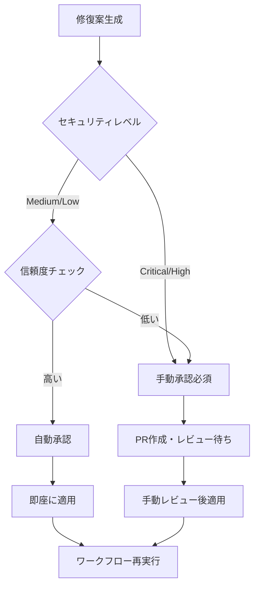

# Enhanced GitHub Actions Auto-Repair System

## 概要

GitHub Actions失敗→Claude自動修復→再実行ループシステムの完全実装版です。Claude Flow MCPを活用したAI主導の修復エンジンにより、CI/CDパイプラインの障害を自動的に検知・修復・再実行します。

## システム特徴

### 🚀 主要機能

1. **リアルタイム監視**
   - GitHub Actions実行を30秒間隔で監視
   - 失敗検知から30秒以内の自動修復開始
   - 複数ワークフローの並行監視

2. **AI主導修復エンジン**
   - Claude Flow MCP統合による高精度修復
   - エラーパターン自動学習機能
   - コンテキスト理解による根本原因修復

3. **セキュリティ隔離**
   - 隔離ブランチ戦略（`claude-autofix-*`）
   - セキュリティレベル別承認フロー
   - 重要ファイル自動保護

4. **品質ゲート**
   - Lint/テスト/セキュリティチェック
   - カバレッジ要件enforcement
   - 自動回帰テスト

5. **完全自動化**
   - 自動/手動承認分岐
   - プルリクエスト自動作成
   - ワークフロー再実行

## アーキテクチャ設計

```
┌─────────────────────────────────────────────────────────────────┐
│                    GitHub Actions Failure                       │
└─────────────────────┬───────────────────────────────────────────┘
                      │
                      ▼
┌─────────────────────────────────────────────────────────────────┐
│                Enhanced Auto-Repair System                     │
├─────────────────────────────────────────────────────────────────┤
│ ┌─────────────────┐ ┌─────────────────┐ ┌─────────────────┐     │
│ │   Monitoring    │ │   Error Log     │ │   Context       │     │
│ │   Engine        │ │   Extraction    │ │   Analysis      │     │
│ └─────────────────┘ └─────────────────┘ └─────────────────┘     │
│                                │                                │
│                                ▼                                │
│ ┌─────────────────────────────────────────────────────────────┐ │
│ │              Claude Flow MCP Integration                   │ │
│ │  ┌─────────────┐ ┌─────────────┐ ┌─────────────────────┐  │ │
│ │  │   Prompt    │ │    AI       │ │      Solution       │  │ │
│ │  │ Generation  │ │ Processing  │ │    Generation       │  │ │
│ │  └─────────────┘ └─────────────┘ └─────────────────────┘  │ │
│ └─────────────────────────────────────────────────────────────┘ │
│                                │                                │
│                                ▼                                │
│ ┌─────────────────┐ ┌─────────────────┐ ┌─────────────────┐     │
│ │   Security      │ │   Approval      │ │   Quality       │     │
│ │   Validation    │ │   System        │ │   Gates         │     │
│ └─────────────────┘ └─────────────────┘ └─────────────────┘     │
│                                │                                │
│                                ▼                                │
│ ┌─────────────────────────────────────────────────────────────┐ │
│ │            Isolation Branch & PR Creation                  │ │
│ └─────────────────────────────────────────────────────────────┘ │
│                                │                                │
│                                ▼                                │
│ ┌─────────────────────────────────────────────────────────────┐ │
│ │              Workflow Re-execution                         │ │
│ └─────────────────────────────────────────────────────────────┘ │
└─────────────────────────────────────────────────────────────────┘
```

## 技術スタック

### コア技術
- **Python 3.9+**: メインシステム
- **Claude Flow MCP**: AI修復エンジン
- **GitHub CLI**: API統合
- **asyncio**: 非同期処理
- **YAML/JSON**: 設定管理

### 依存関係
- **GitHub CLI** (`gh`)
- **Git** (設定済み)
- **Python packages**: `asyncio`, `aiohttp`, `pyyaml`, `requests`
- **Node.js/npm** (Claude Flow用)

## インストール・設定

### 1. 前提条件確認

```bash
# GitHub CLI認証
gh auth login

# Git設定
git config --global user.name "Your Name"
git config --global user.email "your.email@example.com"

# Python環境
python3 --version  # 3.9+
```

### 2. システム設定

```bash
# 実行権限付与
chmod +x coordination/start_enhanced_auto_repair.sh

# 依存関係チェック
./coordination/start_enhanced_auto_repair.sh check
```

### 3. 設定ファイル編集

#### `coordination/enhanced_repair_config.json`
```json
{
  "monitoring": {
    "poll_interval": 30,
    "max_concurrent_repairs": 3
  },
  "security": {
    "manual_approval_threshold": "medium",
    "backup_before_repair": true
  },
  "quality_gates": {
    "test_pass_requirement": true,
    "coverage_threshold": 0.8
  }
}
```

#### `coordination/security_policy.yaml`
```yaml
security_levels:
  critical:
    auto_approve: false
    patterns:
      - "backend/app/core/security.py"
      - ".env*"
```

## 使用方法

### 基本操作

```bash
# システム起動
./coordination/start_enhanced_auto_repair.sh start

# 状態確認
./coordination/start_enhanced_auto_repair.sh status

# リアルタイム監視
./coordination/start_enhanced_auto_repair.sh monitor

# システム停止
./coordination/start_enhanced_auto_repair.sh stop

# ログ確認
./coordination/start_enhanced_auto_repair.sh logs --follow
```

### 高度な操作

```bash
# 設定検証
./coordination/start_enhanced_auto_repair.sh check

# システム再起動
./coordination/start_enhanced_auto_repair.sh restart

# 詳細ログ表示
tail -f coordination/logs/enhanced_github_actions_repair.log
```

## セキュリティ設計

### セキュリティレベル

| レベル | 自動承認 | 説明 | 対象ファイル |
|--------|----------|------|-------------|
| **Critical** | ❌ | 必ず手動承認 | `security.py`, `.env*`, `docker-compose.yml` |
| **High** | ❌ | 慎重な審査 | `.github/workflows/`, `requirements.txt` |
| **Medium** | ✅ | 条件付き承認 | `backend/app/api/`, `frontend/src/` |
| **Low** | ✅ | 自動承認可能 | `docs/`, `*.md`, `tests/` |

### 隔離ブランチ戦略

```
main
├── claude-autofix-12345-20250802_093000  (修復ブランチ)
│   ├── [修復変更]
│   └── [プルリクエスト]
└── claude-autofix-12346-20250802_093100  (別の修復)
```

### 品質ゲート

1. **Lintチェック**: `flake8`, `eslint`
2. **テスト実行**: `pytest`, `jest`
3. **セキュリティスキャン**: `bandit`, `safety`
4. **カバレッジ要件**: 80%以上維持

## ワークフロー例

### 典型的な修復フロー

```
1. [09:30:00] GitHub Actions実行失敗検知
2. [09:30:15] エラーログ抽出・分析
3. [09:30:30] Claude Flow MCP起動
4. [09:31:45] 修復案生成・セキュリティ検証
5. [09:32:00] 隔離ブランチ作成
6. [09:32:15] 修復適用・品質チェック
7. [09:32:30] プルリクエスト作成
8. [09:32:45] ワークフロー再実行
9. [09:35:00] 修復完了確認
```

### 承認フロー分岐



## 監視・メトリクス

### 収集メトリクス

- **修復成功率**: 自動修復の成功/失敗比率
- **修復時間**: 失敗検知から修復完了までの時間
- **セキュリティ影響**: レベル別修復件数
- **品質ゲート合格率**: 各チェックの合格率

### ログファイル

```
coordination/logs/
├── enhanced_github_actions_repair.log  # メインログ
├── audit.log                          # 監査ログ
├── security.log                       # セキュリティログ
└── archived/                          # アーカイブ
```

### 状態ファイル

```
coordination/
├── enhanced_repair_state.json         # システム状態
├── enhanced_repair_config.json        # 設定
└── security_policy.yaml              # セキュリティポリシー
```

## トラブルシューティング

### よくある問題

#### 1. GitHub CLI認証エラー
```bash
# 解決方法
gh auth login
gh auth status
```

#### 2. Claude Flow実行エラー
```bash
# 解決方法
npm install -g claude-flow@alpha
npx claude-flow@alpha --version
```

#### 3. 権限不足エラー
```bash
# 解決方法
chmod +x coordination/start_enhanced_auto_repair.sh
sudo chown -R $USER:$USER coordination/
```

#### 4. メモリ不足
```bash
# 監視
./coordination/start_enhanced_auto_repair.sh monitor

# 設定調整
# enhanced_repair_config.json の max_concurrent_repairs を削減
```

### ログ分析

```bash
# エラーログ検索
grep -i "error" coordination/logs/enhanced_github_actions_repair.log

# 修復履歴確認
grep -i "repair.*success" coordination/logs/enhanced_github_actions_repair.log

# セキュリティイベント確認
grep -i "security" coordination/logs/security.log
```

## 拡張・カスタマイズ

### 新しいエラーパターン追加

1. `enhanced_github_actions_auto_repair.py`の`error_patterns`を編集
2. `security_policy.yaml`にセキュリティルール追加
3. システム再起動

### カスタム修復アクション

```python
# enhanced_github_actions_auto_repair.py
async def custom_repair_action(self, error_context):
    """カスタム修復ロジック"""
    # 実装
    pass
```

### 通知システム統合

```yaml
# security_policy.yaml
notifications:
  critical_repairs:
    slack_webhook: "${SLACK_WEBHOOK_URL}"
    teams_webhook: "${TEAMS_WEBHOOK_URL}"
```

## パフォーマンス最適化

### 推奨設定

```json
{
  "monitoring": {
    "poll_interval": 30,        // 監視間隔
    "max_concurrent_repairs": 3 // 並行修復数
  },
  "repair": {
    "timeout_seconds": 600,     // 修復タイムアウト
    "max_file_changes": 10      // 最大変更ファイル数
  }
}
```

### リソース要件

- **CPU**: 2コア以上推奨
- **Memory**: 4GB以上推奨
- **Disk**: 10GB以上の空き容量
- **Network**: 安定したインターネット接続

## 運用ガイド

### 日常運用

1. **毎日**: システム状態確認
2. **週次**: ログローテーション確認
3. **月次**: メトリクス分析・改善

### 緊急時対応

```bash
# 緊急停止
./coordination/start_enhanced_auto_repair.sh stop

# 強制停止
pkill -f enhanced_github_actions_auto_repair

# 状態リセット
rm coordination/enhanced_repair_state.json
```

## セキュリティ考慮事項

### アクセス制御

- GitHub tokenの適切な権限設定
- 秘密情報の環境変数管理
- ログファイルのアクセス制限

### 監査要件

- 全修復アクションのログ記録
- セキュリティイベントの追跡
- 変更履歴の保持

## サポート・貢献

### 問題報告

1. ログファイルの確認
2. 再現手順の記録
3. システム環境情報の収集

### 機能改善

1. 新機能の提案
2. バグ修正
3. ドキュメント改善

---

**Enhanced GitHub Actions Auto-Repair System** は、AI主導の完全自動化により、CI/CDパイプラインの信頼性と開発効率を大幅に向上させます。