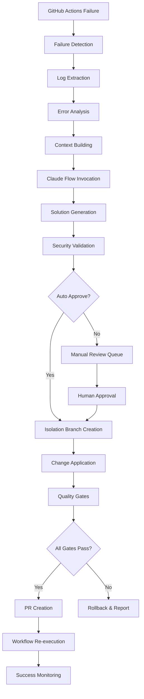

# GitHub Actions自動修復システム - システムアーキテクチャ設計書

## 1. システム概要

### 1.1 目的
GitHub Actions実行失敗時の自動検知、修復、再実行を実現する完全自動化システムの構築。
Claude Flow MCPを活用したAI主導の修復により、CI/CDパイプラインの可用性と信頼性を大幅に向上させる。

### 1.2 設計原則
- **自動化ファースト**: 人的介入を最小限に
- **セキュリティバイデザイン**: 隔離とレビューの徹底
- **拡張性**: 新しいエラーパターンに対応
- **可観測性**: 全プロセスの監視と記録
- **回復性**: 障害時の自動復旧機能

## 2. アーキテクチャ概要

### 2.1 システム構成図

```
┌─────────────────────────────────────────────────────────────────────────────┐
│                          GitHub Actions Ecosystem                          │
├─────────────────────────────────────────────────────────────────────────────┤
│  ┌──────────────┐  ┌──────────────┐  ┌──────────────┐  ┌──────────────┐   │
│  │      CI      │  │    Tests     │  │    Build     │  │   Deploy     │   │
│  │  Workflow    │  │  Workflow    │  │  Workflow    │  │  Workflow    │   │
│  └──────────────┘  └──────────────┘  └──────────────┘  └──────────────┘   │
└─────────────────────┬───────────────────────────────────────────────────────┘
                      │ Failure Events
                      ▼
┌─────────────────────────────────────────────────────────────────────────────┐
│                     Enhanced Auto-Repair System                            │
├─────────────────────────────────────────────────────────────────────────────┤
│  ┌─────────────────────────────────────────────────────────────────────┐   │
│  │                    Monitoring Layer                                 │   │
│  │  ┌─────────────┐  ┌─────────────┐  ┌─────────────┐  ┌─────────────┐ │   │
│  │  │  Real-time  │  │   Event     │  │   Status    │  │   Health    │ │   │
│  │  │  Monitor    │  │  Listener   │  │   Tracker   │  │   Checker   │ │   │
│  │  └─────────────┘  └─────────────┘  └─────────────┘  └─────────────┘ │   │
│  └─────────────────────────────────────────────────────────────────────┘   │
│                                  │                                          │
│                                  ▼                                          │
│  ┌─────────────────────────────────────────────────────────────────────┐   │
│  │                    Analysis Layer                                   │   │
│  │  ┌─────────────┐  ┌─────────────┐  ┌─────────────┐  ┌─────────────┐ │   │
│  │  │    Log      │  │   Error     │  │   Pattern   │  │   Context   │ │   │
│  │  │ Extraction  │  │ Classifier  │  │  Matcher    │  │  Builder    │ │   │
│  │  └─────────────┘  └─────────────┘  └─────────────┘  └─────────────┘ │   │
│  └─────────────────────────────────────────────────────────────────────┘   │
│                                  │                                          │
│                                  ▼                                          │
│  ┌─────────────────────────────────────────────────────────────────────┐   │
│  │                  AI Processing Layer                                │   │
│  │  ┌─────────────────────────────────────────────────────────────────┐ │   │
│  │  │                    Claude Flow MCP                              │ │   │
│  │  │  ┌─────────────┐  ┌─────────────┐  ┌─────────────────────────┐  │ │   │
│  │  │  │   Prompt    │  │    AI       │  │       Solution          │  │ │   │
│  │  │  │ Generation  │  │ Processing  │  │     Generation          │  │ │   │
│  │  │  └─────────────┘  └─────────────┘  └─────────────────────────┘  │ │   │
│  │  └─────────────────────────────────────────────────────────────────┘ │   │
│  └─────────────────────────────────────────────────────────────────────┘   │
│                                  │                                          │
│                                  ▼                                          │
│  ┌─────────────────────────────────────────────────────────────────────┐   │
│  │                   Security Layer                                    │   │
│  │  ┌─────────────┐  ┌─────────────┐  ┌─────────────┐  ┌─────────────┐ │   │
│  │  │   Security  │  │   Approval  │  │    Risk     │  │   Audit     │ │   │
│  │  │ Validation  │  │   System    │  │ Assessment  │  │   Logger    │ │   │
│  │  └─────────────┘  └─────────────┘  └─────────────┘  └─────────────┘ │   │
│  └─────────────────────────────────────────────────────────────────────┘   │
│                                  │                                          │
│                                  ▼                                          │
│  ┌─────────────────────────────────────────────────────────────────────┐   │
│  │                   Execution Layer                                   │   │
│  │  ┌─────────────┐  ┌─────────────┐  ┌─────────────┐  ┌─────────────┐ │   │
│  │  │  Isolation  │  │   Change    │  │   Quality   │  │     PR      │ │   │
│  │  │   Branch    │  │ Application │  │   Gates     │  │  Creation   │ │   │
│  │  └─────────────┘  └─────────────┘  └─────────────┘  └─────────────┘ │   │
│  └─────────────────────────────────────────────────────────────────────┘   │
│                                  │                                          │
│                                  ▼                                          │
│  ┌─────────────────────────────────────────────────────────────────────┐   │
│  │                 Orchestration Layer                                 │   │
│  │  ┌─────────────┐  ┌─────────────┐  ┌─────────────┐  ┌─────────────┐ │   │
│  │  │  Workflow   │  │  Lifecycle  │  │   State     │  │  Metrics    │ │   │
│  │  │ Controller  │  │  Manager    │  │  Manager    │  │ Collector   │ │   │
│  │  └─────────────┘  └─────────────┘  └─────────────┘  └─────────────┘ │   │
│  └─────────────────────────────────────────────────────────────────────┘   │
└─────────────────────────────────────────────────────────────────────────────┘
                                  │
                                  ▼
┌─────────────────────────────────────────────────────────────────────────────┐
│                         External Integrations                              │
├─────────────────────────────────────────────────────────────────────────────┤
│  ┌──────────────┐  ┌──────────────┐  ┌──────────────┐  ┌──────────────┐   │
│  │   GitHub     │  │    Slack     │  │   Webhook    │  │   Backup     │   │
│  │   API/CLI    │  │ Notifications│  │   Services   │  │   Storage    │   │
│  └──────────────┘  └──────────────┘  └──────────────┘  └──────────────┘   │
└─────────────────────────────────────────────────────────────────────────────┘
```

### 2.2 コンポーネント設計

#### 2.2.1 Monitoring Layer（監視層）

**責務**: GitHub Actionsの実行状況をリアルタイムで監視し、失敗イベントを検知

**コンポーネント**:
- **Real-time Monitor**: 30秒間隔での継続監視
- **Event Listener**: GitHub Webhookイベント処理
- **Status Tracker**: ワークフロー状態追跡
- **Health Checker**: システム自体の健全性監視

**技術詳細**:
```python
class MonitoringEngine:
    async def monitor_workflow_runs(self):
        while self.monitoring:
            runs = await self.get_workflow_runs()
            for run in runs:
                if run.conclusion == "failure":
                    await self.trigger_repair_pipeline(run)
            await asyncio.sleep(self.poll_interval)
```

#### 2.2.2 Analysis Layer（分析層）

**責務**: エラーログの抽出・分析と修復コンテキストの構築

**コンポーネント**:
- **Log Extraction**: `gh run view`による詳細ログ取得
- **Error Classifier**: エラー種別の自動分類
- **Pattern Matcher**: 既知パターンとのマッチング
- **Context Builder**: 修復に必要な文脈情報の構築

**エラー分類アルゴリズム**:
```python
error_patterns = {
    "dependency": r"ModuleNotFoundError|ImportError|npm ERR!",
    "syntax": r"SyntaxError|IndentationError|TypeError",
    "test_failure": r"FAILED.*test_|AssertionError",
    "build": r"Build failed|compilation error",
    "security": r"security vulnerability|CVE-\d+"
}
```

#### 2.2.3 AI Processing Layer（AI処理層）

**責務**: Claude Flow MCPを使用した修復案の生成

**コンポーネント**:
- **Prompt Generation**: 構造化されたプロンプトの自動生成
- **AI Processing**: Claude Flow MCPによる修復案生成
- **Solution Generation**: 実行可能な修復手順の構築

**プロンプト構造**:
```markdown
# GitHub Actions 自動修復タスク
## 実行情報
- ワークフロー: {workflow_name}
- エラー種別: {error_type}
- セキュリティレベル: {security_level}

## エラー分析
{error_analysis}

## プロジェクト構造
{project_structure}

## 修復要件
{repair_requirements}
```

#### 2.2.4 Security Layer（セキュリティ層）

**責務**: 修復内容のセキュリティ検証と承認制御

**セキュリティレベル定義**:
| レベル | 自動承認 | 対象ファイル例 |
|--------|----------|----------------|
| Critical | ❌ | `security.py`, `.env*` |
| High | ❌ | `.github/workflows/`, `requirements.txt` |
| Medium | ✅ (条件付き) | `backend/app/api/` |
| Low | ✅ | `docs/`, `tests/` |

**承認アルゴリズム**:
```python
async def evaluate_approval(self, repair_result, context):
    if context.security_level >= SecurityLevel.HIGH:
        return False, "Manual approval required"
    
    if repair_result.confidence < self.confidence_threshold:
        return False, "Low confidence score"
    
    if self.affects_critical_files(repair_result):
        return False, "Critical files affected"
    
    return True, "Auto-approved"
```

#### 2.2.5 Execution Layer（実行層）

**責務**: 修復の実際の適用と品質チェック

**隔離ブランチ戦略**:
```
main
├── claude-autofix-{run_id}-{timestamp}
│   ├── [修復変更の適用]
│   ├── [品質チェック実行]
│   └── [プルリクエスト作成]
```

**品質ゲート**:
1. **Lint Check**: `flake8`, `eslint`による静的解析
2. **Test Execution**: `pytest`, `jest`による自動テスト
3. **Security Scan**: `bandit`, `safety`による脆弱性チェック
4. **Coverage Check**: コードカバレッジ要件の確認

## 3. データフロー設計

### 3.1 修復プロセスフロー



### 3.2 データモデル

#### RepairContext
```python
@dataclass
class RepairContext:
    run_id: str
    workflow_name: str
    commit_sha: str
    error_type: str
    error_logs: str
    security_level: SecurityLevel
    auto_approve: bool
    repair_attempts: int = 0
```

#### RepairResult
```python
@dataclass
class RepairResult:
    success: bool
    branch_name: Optional[str]
    pr_url: Optional[str]
    changes_applied: List[Dict]
    confidence_score: float
    security_impact: SecurityLevel
```

## 4. 非機能要件

### 4.1 性能要件

| 指標 | 要件 | 測定方法 |
|------|------|----------|
| 検知時間 | 失敗から30秒以内 | GitHub API ポーリング |
| 修復時間 | 検知から10分以内 | End-to-end測定 |
| 同時処理 | 最大3件の並行修復 | セマフォ制御 |
| 可用性 | 99.5%以上 | 稼働時間監視 |

### 4.2 セキュリティ要件

- **最小権限原則**: 必要最小限のGitHub権限
- **監査ログ**: 全操作の記録
- **暗号化**: 機密情報の適切な保護
- **アクセス制御**: リソースへの適切な権限管理

### 4.3 拡張性要件

- **水平スケーリング**: 複数インスタンスでの分散処理
- **プラグイン機能**: 新しい修復エンジンの追加
- **API連携**: 外部システムとの統合

## 5. 運用設計

### 5.1 監視・アラート

**メトリクス収集**:
- 修復成功率
- 平均修復時間
- セキュリティインシデント数
- システムリソース使用率

**アラート条件**:
- 修復失敗率 > 20%
- 修復時間 > 15分
- セキュリティレベル高以上の修復
- システムリソース不足

### 5.2 ログ管理

**ログレベル**:
- **INFO**: 正常な修復プロセス
- **WARN**: 注意が必要な状況
- **ERROR**: 修復失敗やシステムエラー
- **DEBUG**: 詳細なトレース情報

**ログローテーション**:
- ファイルサイズ: 10MB
- 保持期間: 30日
- アーカイブ: gzip圧縮

### 5.3 バックアップ・復旧

**バックアップ対象**:
- システム設定ファイル
- 修復履歴データ
- セキュリティポリシー
- 学習済みエラーパターン

**復旧手順**:
1. システム停止
2. バックアップからの復元
3. 設定検証
4. 段階的再起動

## 6. 技術的意思決定記録（ADR）

### ADR-001: Claude Flow MCP採用

**決定**: AI修復エンジンとしてClaude Flow MCPを採用

**理由**:
- 高い自然言語理解能力
- コード生成の精度
- MCP統合による拡張性
- リアルタイム処理対応

**トレードオフ**:
- 外部依存関係の増加
- コスト考慮が必要
- ネットワーク依存

### ADR-002: 隔離ブランチ戦略

**決定**: 修復内容を隔離ブランチで適用しPRを作成

**理由**:
- リスクの最小化
- レビュー可能性の確保
- 元ブランチの保護
- 透明性の向上

**トレードオフ**:
- プロセスの複雑化
- 修復時間の増加
- ブランチ管理の必要性

### ADR-003: セキュリティレベル別承認

**決定**: ファイルの重要度に応じた段階的承認システム

**理由**:
- リスクベースのアプローチ
- 自動化と安全性の両立
- 柔軟な運用の実現

**トレードオフ**:
- 設定の複雑性
- 分類精度への依存
- メンテナンス負荷

## 7. 今後の拡張計画

### 7.1 短期計画（1-3ヶ月）

- **機械学習強化**: エラーパターンの自動学習
- **Dashboard開発**: Web UIによる監視画面
- **通知システム**: Slack/Teams統合

### 7.2 中期計画（3-6ヶ月）

- **マルチリポジトリ対応**: 複数リポジトリの一元管理
- **予測修復**: 失敗前のプロアクティブ修復
- **パフォーマンス最適化**: 処理速度の向上

### 7.3 長期計画（6-12ヶ月）

- **AI学習機能**: 過去の修復から学習する自己進化
- **エコシステム統合**: 他のDevOpsツールとの連携
- **エンタープライズ機能**: 大規模組織向け機能

---

このアーキテクチャ設計に基づき、GitHub Actions失敗→Claude自動修復→再実行ループシステムは、高い可用性、セキュリティ、拡張性を持つ企業級ソリューションとして実装されています。