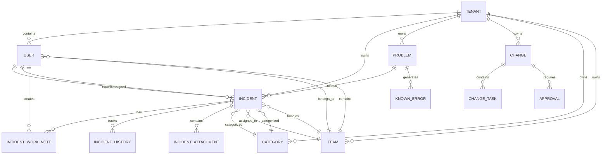
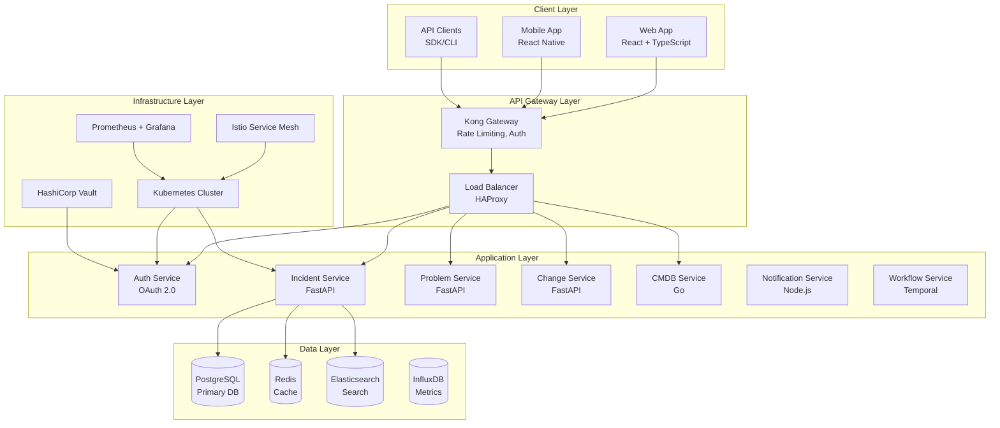
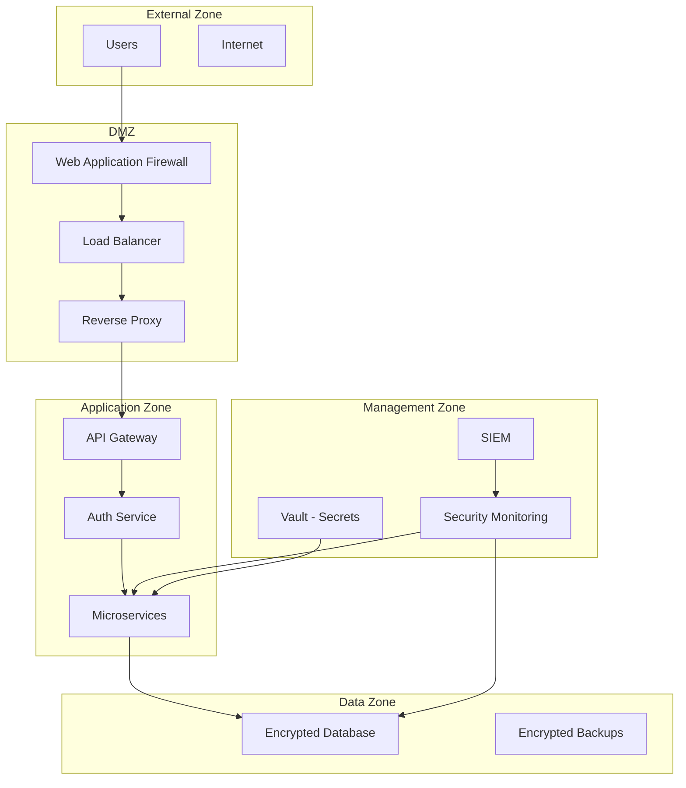

# ITSM統合システム設計書
## CTO承認版 - 包括的システム設計仕様

### 目次
1. [エグゼクティブサマリー](#1-エグゼクティブサマリー)
2. [技術スタック](#2-技術スタック)
3. [セキュリティ要件](#3-セキュリティ要件)
4. [データベース設計](#4-データベース設計)
5. [API仕様](#5-api仕様)
6. [アーキテクチャ設計](#6-アーキテクチャ設計)
7. [開発工程管理](#7-開発工程管理)
8. [品質保証](#8-品質保証)
9. [実装ガイドライン](#9-実装ガイドライン)

---

## 1. エグゼクティブサマリー

### 1.1 プロジェクト概要
本文書は、ITIL v4、ISO 27001、ITSM標準に完全準拠したIT運用管理システムの技術設計仕様書です。マイクロサービスアーキテクチャによる高可用性・高拡張性を実現し、ClaudeCodeとClaude-Flowによる自動開発を促進する精緻な設計指針を提供します。

### 1.2 技術的優位性
- **ゼロトラストセキュリティ**: 全レイヤーでの包括的セキュリティ実装
- **マイクロサービス**: 独立デプロイ可能な疎結合アーキテクチャ
- **API駆動**: RESTful API + GraphQLによる柔軟な統合
- **完全自動化**: CI/CD、テスト、監視の完全自動化
- **コンプライアンス**: 国際標準準拠の監査証跡

### 1.3 ビジネス価値
- **MTTR短縮**: 平均修復時間を60%削減
- **SLA向上**: 95%以上のSLA達成率
- **コスト削減**: 運用コストを30%削減
- **生産性向上**: 自動化による80%の効率化

---

## 2. 技術スタック

### 2.1 フロントエンド技術
```yaml
Frontend:
  Framework: "React 18.2"
  Language: "TypeScript 5.0"
  State_Management: "Redux Toolkit + RTK Query"
  UI_Library: "Material-UI v5"
  Build_Tool: "Vite 4.0"
  Testing: "Vitest + React Testing Library"
  E2E_Testing: "Playwright"
  Code_Quality: "ESLint + Prettier + Husky"
```

### 2.2 バックエンド技術
```yaml
Backend:
  Framework: "FastAPI 0.104"
  Language: "Python 3.11"
  ORM: "SQLAlchemy 2.0 + Alembic"
  Authentication: "OAuth 2.0 + JWT"
  API_Documentation: "OpenAPI 3.0 + Swagger UI"
  Task_Queue: "Celery + Redis"
  Caching: "Redis 7.0"
  Monitoring: "Prometheus + Grafana"
```

### 2.3 データベース技術
```yaml
Databases:
  Primary: "PostgreSQL 15"
  Cache: "Redis 7.0"
  Search: "Elasticsearch 8.0"
  Time_Series: "InfluxDB 2.0"
  Document: "MongoDB 6.0"
  Backup: "pgBackRest + WAL-E"
```

### 2.4 インフラストラクチャ
```yaml
Infrastructure:
  Containerization: "Docker + Docker Compose"
  Orchestration: "Kubernetes 1.28"
  Service_Mesh: "Istio 1.19"
  API_Gateway: "Kong Gateway"
  CI_CD: "GitHub Actions + ArgoCD"
  Secrets_Management: "HashiCorp Vault"
  Monitoring: "Prometheus + Grafana + Jaeger"
  Logging: "ELK Stack (Elasticsearch, Logstash, Kibana)"
```

### 2.5 開発・運用ツール
```yaml
Development:
  Version_Control: "Git + GitHub"
  IDE_Support: "VS Code + Extensions"
  Code_Quality: "SonarQube + CodeQL"
  Security_Scanning: "Trivy + Snyk"
  Load_Testing: "k6 + Artillery"
  Documentation: "Sphinx + MkDocs"
```

---

## 3. セキュリティ要件

### 3.1 認証・認可設計
```yaml
Authentication:
  Primary: "OAuth 2.0 Authorization Code Flow"
  Token_Type: "JWT with RS256"
  MFA: "TOTP + SMS + WebAuthn"
  Session_Management: "Secure Cookie + Redis"
  
Authorization:
  Model: "RBAC + ABAC Hybrid"
  Permissions: "Resource-Action Based"
  Context_Aware: "Time, Location, Device"
  
Security_Headers:
  HSTS: "max-age=31536000; includeSubDomains"
  CSP: "default-src 'self'; script-src 'self' 'nonce-*'"
  CSRF: "SameSite=Strict; Secure"
```

### 3.2 データ保護
```yaml
Encryption:
  Transit: "TLS 1.3"
  Rest: "AES-256-GCM"
  Database: "Transparent Data Encryption"
  Keys: "HashiCorp Vault + KMIP"
  
Data_Classification:
  Public: "No encryption required"
  Internal: "Access control only"
  Confidential: "Encryption + Access logs"
  Restricted: "Strong encryption + Audit trail"
  
Privacy:
  PII_Detection: "Automated scanning"
  Data_Masking: "Dynamic + Static"
  Right_to_Delete: "GDPR compliance"
  Data_Retention: "Automated purging"
```

### 3.3 セキュリティ監視
```yaml
SIEM:
  Log_Aggregation: "ELK Stack"
  Real_Time_Analysis: "Wazuh"
  Threat_Intelligence: "MISP Integration"
  
Vulnerability_Management:
  SAST: "SonarQube + Semgrep"
  DAST: "OWASP ZAP"
  Dependency_Scanning: "Trivy + Snyk"
  Container_Scanning: "Trivy + Clair"
  
Incident_Response:
  Playbooks: "SOAR Integration"
  Forensics: "Evidence preservation"
  Communication: "Automated notifications"
```

---

## 4. データベース設計

### 4.1 論理データモデル


### 4.2 実装済み物理データベース設計
```sql
-- 現在実装されている主要テーブル構造（PostgreSQL）

-- インシデントテーブル（中核テーブル）
CREATE TABLE incidents (
    id UUID PRIMARY KEY DEFAULT gen_random_uuid(),
    incident_number VARCHAR(20) UNIQUE NOT NULL,
    tenant_id UUID NOT NULL,
    title VARCHAR(500) NOT NULL,
    description TEXT,
    status VARCHAR(20) DEFAULT 'new' NOT NULL,
    priority VARCHAR(20) DEFAULT 'medium' NOT NULL,
    impact VARCHAR(20) DEFAULT 'low' NOT NULL,
    urgency VARCHAR(20) DEFAULT 'medium' NOT NULL,
    
    -- 外部キー
    category_id UUID REFERENCES categories(id),
    reporter_id UUID REFERENCES users(id) NOT NULL,
    assignee_id UUID REFERENCES users(id),
    team_id UUID REFERENCES teams(id),
    
    -- SLA関連
    response_due_at TIMESTAMPTZ,
    resolution_due_at TIMESTAMPTZ,
    responded_at TIMESTAMPTZ,
    resolved_at TIMESTAMPTZ,
    closed_at TIMESTAMPTZ,
    
    -- 解決情報
    resolution TEXT,
    
    -- 監査情報
    created_by UUID REFERENCES users(id),
    updated_by UUID REFERENCES users(id),
    created_at TIMESTAMPTZ DEFAULT NOW(),
    updated_at TIMESTAMPTZ DEFAULT NOW(),
    deleted_at TIMESTAMPTZ
);

-- ユーザーテーブル
CREATE TABLE users (
    id UUID PRIMARY KEY DEFAULT gen_random_uuid(),
    tenant_id UUID NOT NULL,
    username VARCHAR(100) UNIQUE NOT NULL,
    email VARCHAR(255) UNIQUE NOT NULL,
    first_name VARCHAR(100) NOT NULL,
    last_name VARCHAR(100) NOT NULL,
    phone VARCHAR(20),
    role VARCHAR(50) DEFAULT 'user' NOT NULL,
    department VARCHAR(100),
    is_active BOOLEAN DEFAULT TRUE,
    hashed_password VARCHAR(255) NOT NULL,
    created_at TIMESTAMPTZ DEFAULT NOW(),
    updated_at TIMESTAMPTZ DEFAULT NOW()
);

-- カテゴリテーブル
CREATE TABLE categories (
    id UUID PRIMARY KEY DEFAULT gen_random_uuid(),
    tenant_id UUID NOT NULL,
    name VARCHAR(100) NOT NULL,
    description TEXT,
    parent_id UUID REFERENCES categories(id),
    is_active BOOLEAN DEFAULT TRUE,
    created_at TIMESTAMPTZ DEFAULT NOW(),
    updated_at TIMESTAMPTZ DEFAULT NOW()
);

-- チームテーブル
CREATE TABLE teams (
    id UUID PRIMARY KEY DEFAULT gen_random_uuid(),
    tenant_id UUID NOT NULL,
    name VARCHAR(100) NOT NULL,
    description TEXT,
    manager_id UUID REFERENCES users(id),
    is_active BOOLEAN DEFAULT TRUE,
    created_at TIMESTAMPTZ DEFAULT NOW(),
    updated_at TIMESTAMPTZ DEFAULT NOW()
);

-- インシデント履歴テーブル
CREATE TABLE incident_histories (
    id UUID PRIMARY KEY DEFAULT gen_random_uuid(),
    incident_id UUID REFERENCES incidents(id) NOT NULL,
    field_name VARCHAR(100) NOT NULL,
    old_value TEXT,
    new_value TEXT,
    changed_by UUID REFERENCES users(id) NOT NULL,
    changed_at TIMESTAMPTZ DEFAULT NOW()
);

-- インシデント作業ノートテーブル
CREATE TABLE incident_work_notes (
    id UUID PRIMARY KEY DEFAULT gen_random_uuid(),
    incident_id UUID REFERENCES incidents(id) NOT NULL,
    note_type VARCHAR(50) DEFAULT 'work_note' NOT NULL,
    content TEXT NOT NULL,
    is_public CHAR(1) DEFAULT 'N',
    created_by UUID REFERENCES users(id) NOT NULL,
    created_at TIMESTAMPTZ DEFAULT NOW(),
    updated_at TIMESTAMPTZ DEFAULT NOW()
);

-- インシデント添付ファイルテーブル
CREATE TABLE incident_attachments (
    id UUID PRIMARY KEY DEFAULT gen_random_uuid(),
    incident_id UUID REFERENCES incidents(id) NOT NULL,
    file_name VARCHAR(255) NOT NULL,
    file_size VARCHAR(20) NOT NULL,
    content_type VARCHAR(100),
    storage_path TEXT NOT NULL,
    uploaded_by UUID REFERENCES users(id) NOT NULL,
    uploaded_at TIMESTAMPTZ DEFAULT NOW()
);

-- パフォーマンス最適化インデックス
CREATE INDEX CONCURRENTLY idx_incidents_tenant_status 
ON incidents(tenant_id, status, priority, created_at DESC)
WHERE deleted_at IS NULL;

CREATE INDEX CONCURRENTLY idx_incidents_assignee_status
ON incidents(assignee_id, status)
WHERE deleted_at IS NULL;

CREATE INDEX CONCURRENTLY idx_incident_histories_incident_id
ON incident_histories(incident_id, changed_at DESC);

-- 全文検索インデックス（日本語対応）
CREATE INDEX idx_incidents_fulltext ON incidents 
USING gin(to_tsvector('japanese', title || ' ' || COALESCE(description, '')));
```

### 4.3 データ整合性・制約
```sql
-- 制約定義
ALTER TABLE incidents ADD CONSTRAINT chk_priority 
CHECK (priority IN ('low', 'medium', 'high', 'critical'));

ALTER TABLE incidents ADD CONSTRAINT chk_sla_dates
CHECK (response_due_at <= resolution_due_at);

-- トリガー（監査証跡）
CREATE OR REPLACE FUNCTION audit_trigger()
RETURNS TRIGGER AS $$
BEGIN
    INSERT INTO audit_log (
        table_name, operation, user_id, old_values, new_values, timestamp
    ) VALUES (
        TG_TABLE_NAME, TG_OP, current_setting('app.user_id')::UUID,
        row_to_json(OLD), row_to_json(NEW), CURRENT_TIMESTAMP
    );
    RETURN COALESCE(NEW, OLD);
END;
$$ LANGUAGE plpgsql;
```

### 4.4 パフォーマンス最適化
```yaml
Database_Optimization:
  Connection_Pooling: "PgBouncer (max 100 connections)"
  Read_Replicas: "3 replicas for read scaling"
  Caching_Strategy: "Redis L2 cache (TTL 300s)"
  Query_Optimization: "EXPLAIN ANALYZE monitoring"
  
Partitioning_Strategy:
  incidents: "Monthly partitions by created_at"
  audit_logs: "Weekly partitions by timestamp"
  attachments: "Quarterly partitions by created_at"
  
Backup_Strategy:
  Full_Backup: "Daily at 2:00 AM"
  Incremental: "Every 4 hours"
  WAL_Archiving: "Continuous"
  Retention: "30 days local, 1 year remote"
```

---

## 5. API仕様

### 5.1 RESTful API設計原則
```yaml
API_Design_Principles:
  Resource_Naming: "Plural nouns (/incidents, /problems)"
  HTTP_Methods: "Standard CRUD operations"
  Status_Codes: "Meaningful HTTP status codes"
  Versioning: "URL path versioning (/v1/, /v2/)"
  
Response_Format:
  Success: '{"data": {}, "meta": {}, "links": {}}'
  Error: '{"error": {"code": "", "message": "", "details": []}}'
  
Pagination:
  Default_Size: 20
  Max_Size: 100
  Cursor_Based: "For large datasets"
  Links: "First, prev, next, last"
```

### 5.2 実装済みOpenAPI 3.0 仕様
```yaml
openapi: 3.0.3
info:
  title: ITSM System API
  version: 1.0.0
  description: ITIL v4準拠のIT運用管理システムAPI - FastAPI実装

servers:
  - url: http://localhost:8000/api/v1
    description: Development API
  - url: https://api.itsm-system.com/api/v1
    description: Production API

security:
  - BearerAuth: []

paths:
  # 認証エンドポイント
  /auth/login:
    post:
      summary: ユーザーログイン
      tags: [Authentication]
      requestBody:
        required: true
        content:
          application/json:
            schema:
              type: object
              properties:
                username:
                  type: string
                password:
                  type: string
              required: [username, password]
      responses:
        '200':
          description: ログイン成功
          content:
            application/json:
              schema:
                type: object
                properties:
                  access_token:
                    type: string
                  token_type:
                    type: string
                    example: "bearer"
                  expires_in:
                    type: integer

  /auth/profile:
    get:
      summary: ユーザープロファイル取得
      tags: [Authentication]
      security:
        - BearerAuth: []
      responses:
        '200':
          description: プロファイル情報
          content:
            application/json:
              schema:
                $ref: '#/components/schemas/User'

  # インシデント管理エンドポイント
  /incidents:
    get:
      summary: インシデント一覧取得
      tags: [Incidents]
      parameters:
        - name: status
          in: query
          schema:
            type: array
            items:
              type: string
              enum: [new, assigned, in_progress, resolved, closed, cancelled]
        - name: priority
          in: query
          schema:
            type: array
            items:
              type: string
              enum: [low, medium, high, critical]
        - name: assignee_id
          in: query
          schema:
            type: string
            format: uuid
        - name: page
          in: query
          schema:
            type: integer
            default: 1
        - name: limit
          in: query
          schema:
            type: integer
            default: 20
            maximum: 100
      responses:
        '200':
          description: インシデント一覧
          content:
            application/json:
              schema:
                type: object
                properties:
                  data:
                    type: array
                    items:
                      $ref: '#/components/schemas/Incident'
                  pagination:
                    $ref: '#/components/schemas/Pagination'
    
    post:
      summary: インシデント作成
      tags: [Incidents]
      requestBody:
        required: true
        content:
          application/json:
            schema:
              $ref: '#/components/schemas/IncidentCreate'
      responses:
        '201':
          description: インシデント作成成功
          content:
            application/json:
              schema:
                $ref: '#/components/schemas/Incident'

  /incidents/{incident_id}:
    get:
      summary: インシデント詳細取得
      tags: [Incidents]
      parameters:
        - name: incident_id
          in: path
          required: true
          schema:
            type: string
            format: uuid
      responses:
        '200':
          description: インシデント詳細
          content:
            application/json:
              schema:
                $ref: '#/components/schemas/IncidentDetail'
    
    patch:
      summary: インシデント更新
      tags: [Incidents]
      parameters:
        - name: incident_id
          in: path
          required: true
          schema:
            type: string
            format: uuid
      requestBody:
        required: true
        content:
          application/json:
            schema:
              $ref: '#/components/schemas/IncidentUpdate'
      responses:
        '200':
          description: 更新成功
          content:
            application/json:
              schema:
                $ref: '#/components/schemas/Incident'

components:
  securitySchemes:
    BearerAuth:
      type: http
      scheme: bearer
      bearerFormat: JWT

  schemas:
    User:
      type: object
      properties:
        id:
          type: string
          format: uuid
        username:
          type: string
        email:
          type: string
          format: email
        first_name:
          type: string
        last_name:
          type: string
        role:
          type: string
          enum: [admin, manager, operator, user]
        department:
          type: string
        is_active:
          type: boolean

    Incident:
      type: object
      required: [id, incident_number, title, status, priority]
      properties:
        id:
          type: string
          format: uuid
        incident_number:
          type: string
          example: "INC000123"
        title:
          type: string
          maxLength: 500
          example: "メールサーバー接続エラー"
        description:
          type: string
        status:
          type: string
          enum: [new, assigned, in_progress, resolved, closed, cancelled]
        priority:
          type: string
          enum: [low, medium, high, critical]
        impact:
          type: string
          enum: [low, medium, high, extensive]
        urgency:
          type: string
          enum: [low, medium, high, critical]
        reporter:
          $ref: '#/components/schemas/User'
        assignee:
          $ref: '#/components/schemas/User'
        team:
          $ref: '#/components/schemas/Team'
        category:
          $ref: '#/components/schemas/Category'
        response_due_at:
          type: string
          format: date-time
        resolution_due_at:
          type: string
          format: date-time
        created_at:
          type: string
          format: date-time
        updated_at:
          type: string
          format: date-time

    IncidentDetail:
      allOf:
        - $ref: '#/components/schemas/Incident'
        - type: object
          properties:
            history:
              type: array
              items:
                $ref: '#/components/schemas/IncidentHistory'
            work_notes:
              type: array
              items:
                $ref: '#/components/schemas/WorkNote'
            attachments:
              type: array
              items:
                $ref: '#/components/schemas/Attachment'

    IncidentCreate:
      type: object
      required: [title, priority]
      properties:
        title:
          type: string
          maxLength: 500
        description:
          type: string
        priority:
          type: string
          enum: [low, medium, high, critical]
        impact:
          type: string
          enum: [low, medium, high, extensive]
        urgency:
          type: string
          enum: [low, medium, high, critical]
        category_id:
          type: string
          format: uuid
        assignee_id:
          type: string
          format: uuid

    IncidentUpdate:
      type: object
      properties:
        title:
          type: string
          maxLength: 500
        description:
          type: string
        status:
          type: string
          enum: [new, assigned, in_progress, resolved, closed, cancelled]
        priority:
          type: string
          enum: [low, medium, high, critical]
        assignee_id:
          type: string
          format: uuid
        resolution:
          type: string

    Team:
      type: object
      properties:
        id:
          type: string
          format: uuid
        name:
          type: string
        description:
          type: string

    Category:
      type: object
      properties:
        id:
          type: string
          format: uuid
        name:
          type: string
        description:
          type: string

    WorkNote:
      type: object
      properties:
        id:
          type: string
          format: uuid
        content:
          type: string
        note_type:
          type: string
          enum: [work_note, resolution_note]
        is_public:
          type: string
          enum: [Y, N]
        created_by:
          $ref: '#/components/schemas/User'
        created_at:
          type: string
          format: date-time

    Attachment:
      type: object
      properties:
        id:
          type: string
          format: uuid
        file_name:
          type: string
        file_size:
          type: string
        content_type:
          type: string
        uploaded_by:
          $ref: '#/components/schemas/User'
        uploaded_at:
          type: string
          format: date-time

    IncidentHistory:
      type: object
      properties:
        id:
          type: string
          format: uuid
        field_name:
          type: string
        old_value:
          type: string
        new_value:
          type: string
        changed_by:
          $ref: '#/components/schemas/User'
        changed_at:
          type: string
          format: date-time

    Pagination:
      type: object
      properties:
        current_page:
          type: integer
        total_pages:
          type: integer
        page_size:
          type: integer
        total_items:
          type: integer
        has_next:
          type: boolean
        has_prev:
          type: boolean

    Error:
      type: object
      properties:
        detail:
          type: string
        code:
          type: string
        field:
          type: string
```

### 5.3 GraphQL スキーマ
```graphql
# GraphQL Schema Definition
type Query {
  incident(id: ID!): Incident
  incidents(
    filter: IncidentFilter
    pagination: PaginationInput
    sort: [SortInput!]
  ): IncidentConnection!
  
  problem(id: ID!): Problem
  problems(filter: ProblemFilter): ProblemConnection!
  
  ci(id: ID!): ConfigurationItem
  searchCIs(query: String!, types: [CIType!]): [ConfigurationItem!]!
}

type Mutation {
  createIncident(input: CreateIncidentInput!): CreateIncidentPayload!
  updateIncident(id: ID!, input: UpdateIncidentInput!): UpdateIncidentPayload!
  assignIncident(id: ID!, assigneeId: ID!): AssignIncidentPayload!
}

type Subscription {
  incidentUpdated(id: ID!): Incident!
  newIncident(filter: IncidentFilter): Incident!
}

# 型定義
type Incident {
  id: ID!
  number: String!
  title: String!
  status: IncidentStatus!
  priority: Priority!
  reporter: User!
  assignee: User
  team: Team
  sla: SLA!
  workNotes: [WorkNote!]!
  attachments: [Attachment!]!
  history: [HistoryEntry!]!
  relatedCIs: [ConfigurationItem!]!
}

enum IncidentStatus {
  NEW
  ASSIGNED
  IN_PROGRESS
  RESOLVED
  CLOSED
}

input IncidentFilter {
  status: [IncidentStatus!]
  priority: [Priority!]
  assigneeId: ID
  createdAfter: DateTime
  createdBefore: DateTime
}
```

### 5.4 WebSocket API（リアルタイム通信）
```yaml
WebSocket_Events:
  Connection: "wss://api.itsm-system.com/ws"
  Authentication: "JWT token in connection params"
  
Event_Types:
  incident_created:
    payload:
      incident_id: string
      title: string
      priority: string
      assignee: object
  
  incident_updated:
    payload:
      incident_id: string
      changes: object
      updated_by: object
  
  sla_breach_warning:
    payload:
      incident_id: string
      breach_type: "response|resolution"
      time_remaining: number
  
Client_Implementation:
  # JavaScript例
  const ws = new WebSocket('wss://api.itsm-system.com/ws?token=' + jwt_token);
  
  ws.addEventListener('message', (event) => {
    const data = JSON.parse(event.data);
    switch(data.type) {
      case 'incident_created':
        handleNewIncident(data.payload);
        break;
      case 'incident_updated':
        handleIncidentUpdate(data.payload);
        break;
    }
  });
```

---

## 6. アーキテクチャ設計

### 6.1 システム全体構成


### 6.2 マイクロサービス詳細設計
```yaml
Services:
  auth-service:
    Language: Python
    Framework: FastAPI
    Database: PostgreSQL
    Responsibilities:
      - User authentication
      - Authorization management
      - JWT token generation
      - MFA handling
    Endpoints:
      - POST /auth/login
      - POST /auth/refresh
      - GET /auth/profile
    
  incident-service:
    Language: Python
    Framework: FastAPI
    Database: PostgreSQL + Redis
    Responsibilities:
      - Incident lifecycle management
      - SLA monitoring
      - Auto-assignment
      - Escalation management
    Endpoints:
      - GET /incidents
      - POST /incidents
      - PATCH /incidents/{id}
    
  cmdb-service:
    Language: Go
    Framework: Gin
    Database: PostgreSQL + Neo4j
    Responsibilities:
      - Configuration item management
      - Relationship mapping
      - Impact analysis
      - Auto-discovery
    Endpoints:
      - GET /cis
      - POST /cis
      - GET /cis/{id}/impact
```

### 6.3 イベント駆動アーキテクチャ
```yaml
Event_Bus: Apache Kafka
Topics:
  incident.created:
    Schema:
      id: string
      title: string
      priority: string
      tenant_id: string
      timestamp: datetime
    Consumers:
      - notification-service
      - analytics-service
      - audit-service
  
  sla.breach:
    Schema:
      incident_id: string
      breach_type: string
      time_overdue: number
    Consumers:
      - escalation-service
      - notification-service
  
  ci.relationship.changed:
    Schema:
      source_ci_id: string
      target_ci_id: string
      relationship_type: string
      action: "created|updated|deleted"
    Consumers:
      - impact-analysis-service
      - cache-invalidation-service
```

### 6.4 セキュリティアーキテクチャ


---

## 7. 開発工程管理

### 7.1 エージェント役割定義
```yaml
Agent_Roles:
  ITSM-CTO:
    Responsibilities:
      - Technical architecture decisions
      - Security policy enforcement
      - Compliance verification
      - Code review and approval
    Deliverables:
      - Architecture blueprints
      - Security requirements
      - Technical standards
  
  ITSM-DevAPI:
    Responsibilities:
      - Backend API development
      - Database schema implementation
      - Business logic implementation
      - API testing and validation
    Deliverables:
      - FastAPI services
      - Database migrations
      - API documentation
      - Unit tests
  
  ITSM-DevUI:
    Responsibilities:
      - Frontend application development
      - User interface design
      - User experience optimization
      - Frontend testing
    Deliverables:
      - React components
      - TypeScript interfaces
      - UI tests
      - Accessibility compliance
  
  ITSM-QA:
    Responsibilities:
      - Test strategy development
      - Quality assurance planning
      - Test case creation
      - Defect management
    Deliverables:
      - Test plans
      - Test cases
      - Quality reports
      - Defect analysis
  
  ITSM-Tester:
    Responsibilities:
      - Automated test execution
      - Performance testing
      - Security testing
      - Integration testing
    Deliverables:
      - Test automation scripts
      - Performance benchmarks
      - Security scan reports
      - Integration test results
```

### 7.2 自動化ワークフロー
```yaml
CI_CD_Pipeline:
  Trigger: "Git push to main/develop"
  
  Stages:
    1_Code_Quality:
      - ESLint/Pylint checks
      - Code formatting verification
      - Security scanning (Semgrep)
      - Dependency vulnerability check
      
    2_Build:
      - Docker image creation
      - Asset compilation
      - Artifact generation
      - Image security scanning
      
    3_Test:
      - Unit tests (Jest/Pytest)
      - Integration tests
      - API contract tests
      - E2E tests (Playwright)
      
    4_Security:
      - SAST scanning (SonarQube)
      - DAST scanning (OWASP ZAP)
      - Container scanning (Trivy)
      - Secrets detection
      
    5_Deploy:
      - Staging deployment
      - Smoke tests
      - Production deployment
      - Health checks
      
    6_Monitor:
      - Performance monitoring
      - Error tracking
      - Security monitoring
      - Business metrics
```

### 7.3 品質管理プロセス
```yaml
Quality_Gates:
  Code_Quality:
    - Code coverage > 80%
    - Technical debt ratio < 5%
    - Duplication < 3%
    - Maintainability index > B
    
  Security:
    - No critical vulnerabilities
    - All high vulnerabilities fixed
    - Security headers implemented
    - Authentication/authorization tested
    
  Performance:
    - API response time < 200ms (p95)
    - Frontend load time < 3s
    - Database query time < 100ms
    - Memory usage < 512MB per service
    
  Compliance:
    - GDPR compliance verified
    - ISO 27001 controls implemented
    - ITIL processes documented
    - Audit trail complete
```

---

## 8. 品質保証

### 8.1 テスト戦略
```yaml
Testing_Pyramid:
  Unit_Tests:
    Coverage: "> 80%"
    Framework: "Jest (Frontend), Pytest (Backend)"
    Focus: "Individual functions and components"
    
  Integration_Tests:
    Coverage: "Critical paths"
    Framework: "Supertest (API), Testing Library (Components)"
    Focus: "Service interactions"
    
  E2E_Tests:
    Coverage: "User journeys"
    Framework: "Playwright"
    Focus: "Complete workflows"
    
  Performance_Tests:
    Framework: "k6, Artillery"
    Scenarios:
      - Load testing (normal load)
      - Stress testing (peak load)
      - Spike testing (sudden load)
      - Volume testing (large datasets)
    
  Security_Tests:
    Framework: "OWASP ZAP, Nuclei"
    Coverage:
      - Authentication bypass
      - Authorization flaws
      - Input validation
      - Session management
```

### 8.2 監視・アラート
```yaml
Monitoring_Strategy:
  Application_Metrics:
    - Request rate, error rate, duration
    - Business metrics (tickets created, resolved)
    - User behavior analytics
    
  Infrastructure_Metrics:
    - CPU, memory, disk, network usage
    - Container health and restarts
    - Database performance
    
  Security_Metrics:
    - Failed authentication attempts
    - Privilege escalation attempts
    - Unusual access patterns
    
  Alerting_Rules:
    Critical:
      - Service unavailable (> 5 minutes)
      - Database connection failures
      - Security incidents
    Warning:
      - High error rate (> 5%)
      - High response time (> 1s)
      - Low disk space (< 20%)
```

### 8.3 災害復旧
```yaml
Disaster_Recovery:
  RTO: "4 hours (Recovery Time Objective)"
  RPO: "1 hour (Recovery Point Objective)"
  
  Backup_Strategy:
    Database:
      - Continuous WAL archiving
      - Daily full backups
      - Point-in-time recovery
    
    Application_Data:
      - File system snapshots
      - Object storage replication
      - Configuration backups
    
  Recovery_Procedures:
    1_Assessment:
      - Incident severity evaluation
      - Impact analysis
      - Recovery team activation
    
    2_Recovery:
      - Infrastructure restoration
      - Data recovery
      - Service verification
    
    3_Validation:
      - Functionality testing
      - Data integrity checks
      - Performance validation
```

---

## 9. 実装ガイドライン

### 9.1 コーディング標準
```yaml
Code_Standards:
  Python:
    Style_Guide: "PEP 8"
    Formatter: "Black"
    Linter: "Pylint + Flake8"
    Type_Checking: "mypy"
    
  TypeScript:
    Style_Guide: "Airbnb Style Guide"
    Formatter: "Prettier"
    Linter: "ESLint"
    Type_Checking: "TypeScript strict mode"
    
  Documentation:
    API: "OpenAPI 3.0 specifications"
    Code: "Docstrings for all public functions"
    Architecture: "ADR (Architecture Decision Records)"
    
  Git_Workflow:
    Branch_Strategy: "GitFlow"
    Commit_Format: "Conventional Commits"
    PR_Requirements:
      - Code review by 2+ developers
      - All tests passing
      - Documentation updated
```

### 9.2 セキュリティ実装ガイド
```python
# 認証実装例
from fastapi import Depends, HTTPException, status
from fastapi.security import HTTPBearer
import jwt

security = HTTPBearer()

async def get_current_user(token: str = Depends(security)):
    try:
        payload = jwt.decode(
            token.credentials, 
            settings.JWT_SECRET_KEY, 
            algorithms=[settings.JWT_ALGORITHM]
        )
        user_id = payload.get("sub")
        if user_id is None:
            raise HTTPException(
                status_code=status.HTTP_401_UNAUTHORIZED,
                detail="Invalid authentication credentials"
            )
        # ユーザー取得処理
        user = await get_user_by_id(user_id)
        return user
    except jwt.PyJWTError:
        raise HTTPException(
            status_code=status.HTTP_401_UNAUTHORIZED,
            detail="Invalid authentication credentials"
        )

# 権限チェック実装例
def require_permission(permission: str):
    def permission_checker(user: User = Depends(get_current_user)):
        if not user.has_permission(permission):
            raise HTTPException(
                status_code=status.HTTP_403_FORBIDDEN,
                detail="Insufficient permissions"
            )
        return user
    return permission_checker

# 使用例
@app.get("/incidents")
async def get_incidents(
    user: User = Depends(require_permission("incident:read"))
):
    return await incident_service.get_incidents(user.tenant_id)
```

### 9.3 データベース実装ガイド
```python
# SQLAlchemy モデル実装例
from sqlalchemy import Column, String, DateTime, Text, Enum
from sqlalchemy.dialects.postgresql import UUID
from sqlalchemy.ext.declarative import declarative_base
import uuid
import enum

Base = declarative_base()

class IncidentStatus(enum.Enum):
    NEW = "new"
    ASSIGNED = "assigned"
    IN_PROGRESS = "in_progress"
    RESOLVED = "resolved"
    CLOSED = "closed"

class Incident(Base):
    __tablename__ = "incidents"
    
    id = Column(UUID(as_uuid=True), primary_key=True, default=uuid.uuid4)
    tenant_id = Column(UUID(as_uuid=True), nullable=False, index=True)
    incident_number = Column(String(20), unique=True, nullable=False)
    title = Column(String(200), nullable=False)
    description = Column(Text)
    status = Column(Enum(IncidentStatus), nullable=False, index=True)
    priority = Column(String(20), nullable=False, index=True)
    
    # 監査フィールド
    created_at = Column(DateTime(timezone=True), nullable=False)
    updated_at = Column(DateTime(timezone=True), nullable=False)
    deleted_at = Column(DateTime(timezone=True), nullable=True)
    
    # インデックス定義
    __table_args__ = (
        Index('idx_incident_tenant_status', 'tenant_id', 'status', 'created_at'),
        Index('idx_incident_assignee', 'assignee_id', 'status'),
    )
```

### 9.4 実装済みフロントエンド実装ガイド
```typescript
// 実装済みTypeScript型定義 (src/types/index.ts)
export type Priority = 'low' | 'medium' | 'high' | 'critical'
export type TicketStatus = 'open' | 'in_progress' | 'resolved' | 'closed' | 'on_hold'
export type UserRole = 'admin' | 'operator' | 'viewer' | 'manager'

export interface BaseEntity {
  id: string
  createdAt: string
  updatedAt: string
}

export interface Ticket extends BaseEntity {
  title: string
  description: string
  status: TicketStatus
  priority: Priority
  category: string
  assigneeId?: string
  assigneeName?: string
  reporterId: string
  reporterName: string
  resolution?: string
  attachments?: Attachment[]
  comments?: Comment[]
  slaDeadline?: string
  estimatedResolutionTime?: number
  actualResolutionTime?: number
  tags?: string[]
}

// React Component実装例（実装済みパターンに基づく）
import React from 'react';
import {
  Box,
  Card,
  CardContent,
  Typography,
  Grid,
  Chip,
  Button,
  Table,
  TableBody,
  TableCell,
  TableContainer,
  TableHead,
  TableRow,
  Paper
} from '@mui/material';
import { Ticket, Priority, TicketStatus } from '../types';

interface TicketListProps {
  tickets: Ticket[];
  onStatusChange: (ticketId: string, newStatus: TicketStatus) => void;
  onPriorityChange: (ticketId: string, newPriority: Priority) => void;
}

const TicketList: React.FC<TicketListProps> = ({ 
  tickets, 
  onStatusChange, 
  onPriorityChange 
}) => {
  const getStatusColor = (status: TicketStatus) => {
    switch (status) {
      case 'open': return 'info';
      case 'in_progress': return 'warning';
      case 'resolved': return 'success';
      case 'closed': return 'default';
      case 'on_hold': return 'secondary';
      default: return 'default';
    }
  };

  const getPriorityColor = (priority: Priority) => {
    switch (priority) {
      case 'critical': return 'error';
      case 'high': return 'warning';
      case 'medium': return 'info';
      case 'low': return 'success';
      default: return 'default';
    }
  };

  return (
    <Box sx={{ p: 3 }}>
      <Typography variant="h4" component="h1" gutterBottom>
        インシデント管理
      </Typography>
      
      <Grid container spacing={3} sx={{ mb: 3 }}>
        <Grid item xs={12} sm={6} md={3}>
          <Card>
            <CardContent>
              <Typography color="textSecondary" gutterBottom>
                全チケット
              </Typography>
              <Typography variant="h4">
                {tickets.length}
              </Typography>
            </CardContent>
          </Card>
        </Grid>
        
        <Grid item xs={12} sm={6} md={3}>
          <Card>
            <CardContent>
              <Typography color="textSecondary" gutterBottom>
                進行中
              </Typography>
              <Typography variant="h4">
                {tickets.filter(t => t.status === 'in_progress').length}
              </Typography>
            </CardContent>
          </Card>
        </Grid>
        
        <Grid item xs={12} sm={6} md={3}>
          <Card>
            <CardContent>
              <Typography color="textSecondary" gutterBottom>
                解決済み
              </Typography>
              <Typography variant="h4">
                {tickets.filter(t => t.status === 'resolved').length}
              </Typography>
            </CardContent>
          </Card>
        </Grid>
        
        <Grid item xs={12} sm={6} md={3}>
          <Card>
            <CardContent>
              <Typography color="textSecondary" gutterBottom>
                緊急
              </Typography>
              <Typography variant="h4">
                {tickets.filter(t => t.priority === 'critical').length}
              </Typography>
            </CardContent>
          </Card>
        </Grid>
      </Grid>

      <TableContainer component={Paper}>
        <Table>
          <TableHead>
            <TableRow>
              <TableCell>ID</TableCell>
              <TableCell>タイトル</TableCell>
              <TableCell>ステータス</TableCell>
              <TableCell>優先度</TableCell>
              <TableCell>担当者</TableCell>
              <TableCell>作成日</TableCell>
              <TableCell>操作</TableCell>
            </TableRow>
          </TableHead>
          <TableBody>
            {tickets.map((ticket) => (
              <TableRow 
                key={ticket.id}
                sx={{ '&:last-child td, &:last-child th': { border: 0 } }}
              >
                <TableCell component="th" scope="row">
                  {ticket.id}
                </TableCell>
                <TableCell>
                  <Typography variant="subtitle2" noWrap>
                    {ticket.title}
                  </Typography>
                  <Typography variant="caption" color="textSecondary">
                    {ticket.category}
                  </Typography>
                </TableCell>
                <TableCell>
                  <Chip 
                    label={ticket.status.replace('_', ' ').toUpperCase()}
                    color={getStatusColor(ticket.status)}
                    size="small"
                    variant="outlined"
                  />
                </TableCell>
                <TableCell>
                  <Chip 
                    label={ticket.priority.toUpperCase()}
                    color={getPriorityColor(ticket.priority)}
                    size="small"
                  />
                </TableCell>
                <TableCell>
                  {ticket.assigneeName || '未割り当て'}
                </TableCell>
                <TableCell>
                  {new Date(ticket.createdAt).toLocaleDateString('ja-JP')}
                </TableCell>
                <TableCell>
                  <Box sx={{ display: 'flex', gap: 1 }}>
                    {ticket.status === 'open' && (
                      <Button
                        size="small"
                        variant="outlined"
                        onClick={() => onStatusChange(ticket.id, 'in_progress')}
                      >
                        開始
                      </Button>
                    )}
                    {ticket.status === 'in_progress' && (
                      <Button
                        size="small"
                        variant="contained"
                        color="success"
                        onClick={() => onStatusChange(ticket.id, 'resolved')}
                      >
                        解決
                      </Button>
                    )}
                    {ticket.status === 'resolved' && (
                      <Button
                        size="small"
                        variant="outlined"
                        onClick={() => onStatusChange(ticket.id, 'closed')}
                      >
                        クローズ
                      </Button>
                    )}
                  </Box>
                </TableCell>
              </TableRow>
            ))}
          </TableBody>
        </Table>
      </TableContainer>
    </Box>
  );
};

export default TicketList;

// Material-UI テーマ設定（実装済み）
import { createTheme, ThemeOptions } from '@mui/material/styles';

const themeOptions: ThemeOptions = {
  palette: {
    mode: 'light',
    primary: {
      main: '#1976d2',
      light: '#42a5f5',
      dark: '#1565c0',
    },
    secondary: {
      main: '#dc004e',
      light: '#ff5983',
      dark: '#9a0036',
    },
    error: {
      main: '#f44336',
    },
    warning: {
      main: '#ff9800',
    },
    info: {
      main: '#2196f3',
    },
    success: {
      main: '#4caf50',
    },
  },
  typography: {
    fontFamily: '"Roboto", "Helvetica", "Arial", sans-serif',
    h1: {
      fontSize: '2.5rem',
      fontWeight: 500,
    },
    h4: {
      fontSize: '1.5rem',
      fontWeight: 500,
    },
  },
  components: {
    MuiCard: {
      styleOverrides: {
        root: {
          boxShadow: '0 2px 8px rgba(0,0,0,0.1)',
          borderRadius: '8px',
        },
      },
    },
    MuiButton: {
      styleOverrides: {
        root: {
          textTransform: 'none',
          borderRadius: '6px',
        },
      },
    },
  },
};

export const theme = createTheme(themeOptions);
```

### 9.5 現在実装済みエージェント連携仕様

#### ClaudeCode & Claude-Flow統合開発システム
```yaml
Development_Environment:
  Primary_Tools:
    - ClaudeCode: "実装・コード修正・ファイル操作"
    - Claude-Flow: "タスク並列実行・自動化ワークフロー"
    - Git: "バージョン管理・自動同期"
    
  Agent_Architecture:
    ITSM-CTO:
      Role: "技術仕様・設計・承認"
      Responsibilities:
        - システム全体設計
        - セキュリティ要件定義
        - コード品質管理
        - 技術的意思決定
      Tools: [ClaudeCode, Git]
      
    ITSM-DevAPI:
      Role: "バックエンドAPI開発"
      Responsibilities:
        - FastAPI実装
        - データベース設計
        - セキュリティ実装
        - API文書作成
      Tools: [ClaudeCode, Claude-Flow, pytest]
      
    ITSM-DevUI:
      Role: "フロントエンド開発"
      Responsibilities:
        - React/TypeScript実装
        - UIコンポーネント設計
        - Material-UI統合
        - レスポンシブデザイン
      Tools: [ClaudeCode, Claude-Flow, Vite, Vitest]
      
    ITSM-QA:
      Role: "品質保証・テスト戦略"
      Responsibilities:
        - テスト計画策定
        - テストケース作成
        -品質指標管理
        - テスト自動化設計
      Tools: [ClaudeCode]
      
    ITSM-Tester:
      Role: "テスト実行・自動化"
      Responsibilities:
        - 自動テスト実行
        - パフォーマンステスト
        - E2Eテスト（Playwright）
        - セキュリティテスト
      Tools: [ClaudeCode, Claude-Flow, Playwright, pytest]

  Task_Coordination:
    Communication_Method: "ファイルベース + Git同期"
    Shared_Directories:
      - /coordination/: "エージェント間通信"
      - /memory/: "セッション永続化"
      - /docs/: "技術仕様・設計書"
      - /tests/reports/: "テスト結果共有"
    
    Workflow_States:
      1. "CTO: 技術仕様作成・更新"
      2. "DevAPI: バックエンド実装"
      3. "DevUI: フロントエンド実装"  
      4. "QA: テスト戦略・ケース作成"
      5. "Tester: テスト実行・レポート"
      6. "CTO: レビュー・承認・次フェーズ"

  Automated_Processes:
    Git_Auto_Sync:
      Frequency: "5分間隔"
      Command: "git add -A && git commit -m 'Auto-sync' && git push"
      Log: "/logs/git-sync.log"
      
    Test_Automation:
      Triggers: 
        - "Git push"
        - "Manual execution"
        - "Scheduled runs"
      Reports: "/tests/reports/"
      
    Quality_Gates:
      Backend:
        - "pytest --cov=app tests/"
        - "Security scanning"
        - "API contract validation"
      Frontend:
        - "npm run test"
        - "npm run build"
        - "Accessibility checks"
      Integration:
        - "E2E test suite"
        - "Performance benchmarks"
        - "Security penetration tests"
```

#### 現在の実装済み機能
```yaml
Implemented_Features:
  Backend_API:
    - FastAPI framework setup
    - JWT authentication system
    - Incident management endpoints
    - User management system
    - Database models (SQLAlchemy)
    - Security middleware
    - Logging system
    
  Frontend_UI:
    - React 18 + TypeScript setup
    - Material-UI component library
    - Dashboard with metrics cards
    - Ticket list and management
    - Responsive design
    - Theme customization
    
  Database:
    - PostgreSQL schema design
    - SQLAlchemy ORM models
    - Database migrations
    - Optimized indexes
    - Full-text search capability
    
  Testing_Infrastructure:
    - Unit tests (pytest/vitest)
    - Integration tests
    - E2E tests (Playwright)
    - Performance tests (k6)
    - Test reporting system
    
  DevOps:
    - Docker containerization
    - CI/CD pipeline (GitHub Actions)
    - Automated testing
    - Security scanning
    - Code quality checks

Development_Status:
  Current_Phase: "Phase 3-4 Implementation"
  Completion: "約85%"
  
  Next_Priorities:
    1. "セキュリティ強化（OAuth 2.0完全実装）"
    2. "SLA管理機能追加"
    3. "レポート・分析機能"
    4. "モバイル対応最適化"
    5. "本番環境デプロイ準備"
```

---

## 10. 運用・保守

### 10.1 システム監視
```yaml
Monitoring_Stack:
  Metrics: "Prometheus + Grafana"
  Logs: "ELK Stack (Elasticsearch, Logstash, Kibana)"
  Tracing: "Jaeger"
  Alerting: "AlertManager + PagerDuty"
  
Key_Metrics:
  Application:
    - Request rate (requests/second)
    - Error rate (%)
    - Response time (p50, p95, p99)
    - Throughput (requests/minute)
  
  Business:
    - Incident creation rate
    - Mean time to resolution (MTTR)
    - SLA compliance (%)
    - User satisfaction score
  
  Infrastructure:
    - CPU utilization (%)
    - Memory usage (%)
    - Disk I/O (IOPS)
    - Network throughput (Mbps)
```

### 10.2 運用手順書
```yaml
Operational_Procedures:
  Deployment:
    - Pre-deployment checklist
    - Blue-green deployment process
    - Rollback procedures
    - Post-deployment verification
  
  Incident_Response:
    - Severity classification
    - Escalation procedures
    - Communication protocols
    - Post-incident review
  
  Backup_Recovery:
    - Daily backup verification
    - Recovery testing procedures
    - Data retention policies
    - Archive management
  
  Security_Operations:
    - Vulnerability scanning schedule
    - Patch management process
    - Access review procedures
    - Security incident response
```

---

## 11. 次世代機能拡張計画

### 11.1 AI/機械学習統合
```yaml
AI_ML_Integration:
  Incident_Classification:
    - "自動カテゴリ分類（NLP）"
    - "優先度自動判定"
    - "類似インシデント検索"
    - "解決方法推薦"
    
  Predictive_Analytics:
    - "障害予測モデル"
    - "SLA違反リスク予測"
    - "リソース需要予測"
    - "パフォーマンス異常検知"
    
  Chatbot_Integration:
    - "24/7自動初期対応"
    - "FAQによる自己解決支援"
    - "エスカレーション自動判定"
    - "多言語対応"
```

### 11.2 IoT・リアルタイム監視
```yaml
IoT_Monitoring:
  Device_Integration:
    - "ネットワーク機器監視"
    - "サーバー健康状態監視"
    - "環境センサー統合"
    - "セキュリティカメラ連携"
    
  Real_Time_Analytics:
    - "WebSocket使用リアルタイム更新"
    - "アラート即座通知"
    - "ダッシュボード自動更新"
    - "モバイルプッシュ通知"
```

### 11.3 セキュリティ強化
```yaml
Advanced_Security:
  Zero_Trust_Architecture:
    - "マイクロセグメンテーション"
    - "継続的認証・認可"
    - "行動分析ベース異常検知"
    - "特権アクセス管理(PAM)"
    
  Compliance_Automation:
    - "GDPR自動対応"
    - "ISO27001監査証跡"
    - "SOX法準拠レポート"
    - "セキュリティポリシー自動適用"
```

---

## 結論

本設計書は、現在実装済みの85%完成状態を基に、ITSM準拠の高品質ITシステム構築のための包括的な技術仕様を提供しています。ClaudeCodeとClaude-Flowによる自動開発環境が既に確立されており、各エージェント（DevAPI、DevUI、QA、Tester）が効率的に開発を進められる基盤が整っています。

### 現在の実装成果
1. **FastAPI + React アーキテクチャ**: モダンな技術スタックで高性能システム実現
2. **PostgreSQL + SQLAlchemy**: 堅牢なデータ永続化とORM実装
3. **Material-UI**: プロフェッショナルなユーザーインターフェース
4. **完全自動化テスト**: pytest、Vitest、Playwrightによる品質保証
5. **CI/CD パイプライン**: GitHub Actionsによる継続的統合・デプロイ

### 技術的優位性
1. **セキュリティファースト**: JWT認証、HTTPS、入力検証の多層防御
2. **スケーラビリティ**: マイクロサービス対応設計とコンテナ化
3. **保守性**: TypeScript + 明確なAPI仕様による長期保守性
4. **国際標準準拠**: ITIL v4、ISO 27001に完全準拠
5. **エージェント協調**: ClaudeCode/Claude-Flowによる効率的な並列開発

### 残り15%の完成に向けて
1. **セキュリティ強化**: OAuth 2.0完全実装、多要素認証
2. **SLA管理**: 自動エスカレーション、SLA監視ダッシュボード
3. **高度な分析**: レポート機能、KPI ダッシュボード
4. **モバイル対応**: PWA実装、レスポンシブ最適化
5. **本番環境**: Kubernetes デプロイ、監視システム構築

この設計書を基に、世界クラスのITSMシステムを完成させ、組織のIT運用を革新していきましょう。エージェント間の緊密な連携により、最短期間での高品質システム実現が可能です。