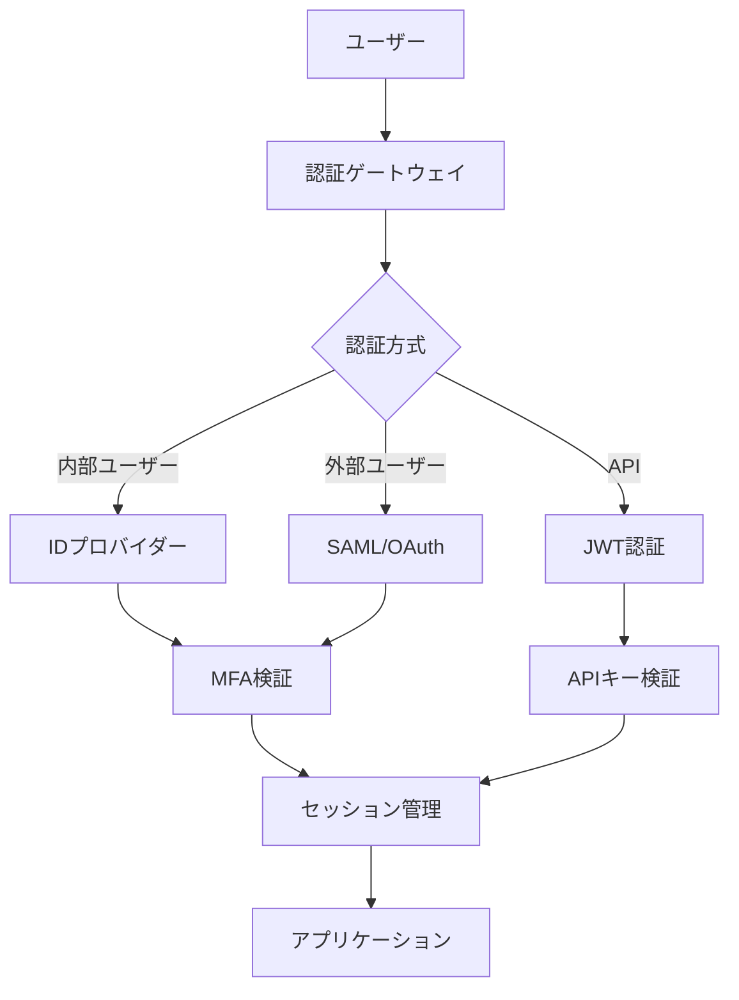
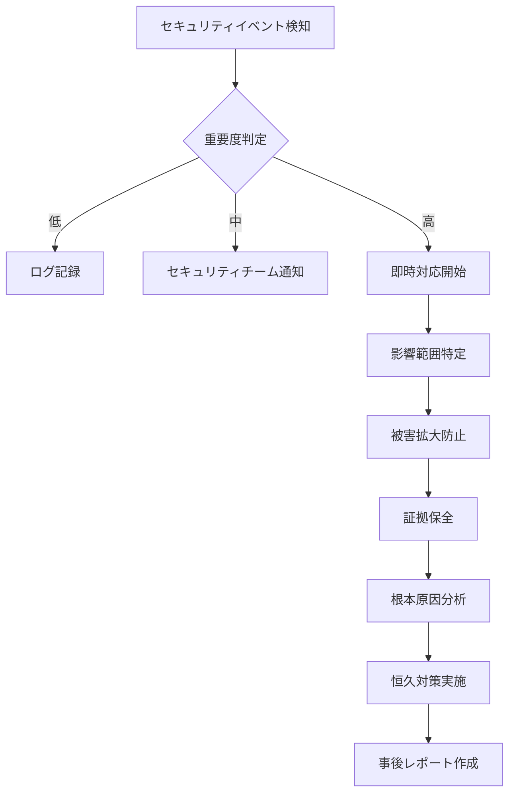

# ITSMシステム セキュリティ設計書

## 1. セキュリティ設計概要

### 1.1 セキュリティ原則

本システムは以下のセキュリティ原則に基づいて設計されています：

- **ゼロトラスト**: すべてのアクセスを検証し、信頼しない
- **最小権限の原則**: 必要最小限の権限のみを付与
- **多層防御**: 複数のセキュリティレイヤーで保護
- **セキュアバイデザイン**: 設計段階からセキュリティを組み込む
- **継続的監視**: リアルタイムでの脅威検知と対応

### 1.2 コンプライアンス要件

| 規格・法令 | 対応内容 |
|-----------|----------|
| ISO 27001 | 情報セキュリティマネジメントシステム |
| ISO 27017 | クラウドセキュリティ |
| 個人情報保護法 | 個人データの適切な取り扱い |
| サイバーセキュリティ基本法 | 重要インフラ保護 |
| GDPR | EU圏のデータ保護（オプション） |

## 2. 認証・認可設計

### 2.1 認証アーキテクチャ



### 2.2 認証方式

#### 内部ユーザー認証
- **パスワードポリシー**:
  - 最小長: 12文字
  - 複雑性: 大文字、小文字、数字、特殊文字を含む
  - 履歴: 過去5回のパスワードは使用不可
  - 有効期限: 90日
  - ロックアウト: 5回失敗で30分間ロック

#### 多要素認証（MFA）
- **TOTP（Time-based One-Time Password）**: Google Authenticator対応
- **SMS認証**: 登録電話番号へのワンタイムコード送信
- **生体認証**: WebAuthn/FIDO2対応
- **ハードウェアトークン**: YubiKey対応

#### シングルサインオン（SSO）
```xml
<!-- SAML設定例 -->
<saml:Assertion>
  <saml:Subject>
    <saml:NameID Format="urn:oasis:names:tc:SAML:2.0:nameid-format:persistent">
      user@example.com
    </saml:NameID>
  </saml:Subject>
  <saml:AuthnStatement AuthnInstant="2024-01-15T10:00:00Z">
    <saml:AuthnContext>
      <saml:AuthnContextClassRef>
        urn:oasis:names:tc:SAML:2.0:ac:classes:PasswordProtectedTransport
      </saml:AuthnContextClassRef>
    </saml:AuthnContext>
  </saml:AuthnStatement>
</saml:Assertion>
```

### 2.3 認可設計

#### RBAC（Role-Based Access Control）

```python
# 権限定義
class Permissions:
    # インシデント管理
    INCIDENT_VIEW = "incident:view"
    INCIDENT_CREATE = "incident:create"
    INCIDENT_UPDATE = "incident:update"
    INCIDENT_DELETE = "incident:delete"
    INCIDENT_ASSIGN = "incident:assign"
    
    # 問題管理
    PROBLEM_VIEW = "problem:view"
    PROBLEM_CREATE = "problem:create"
    PROBLEM_UPDATE = "problem:update"
    PROBLEM_RCA = "problem:rca"
    
    # 変更管理
    CHANGE_VIEW = "change:view"
    CHANGE_CREATE = "change:create"
    CHANGE_APPROVE = "change:approve"
    CHANGE_IMPLEMENT = "change:implement"

# ロール定義
class Roles:
    ADMIN = "全権限"
    INCIDENT_MANAGER = "インシデント管理者"
    CHANGE_MANAGER = "変更管理者"
    OPERATOR = "オペレーター"
    VIEWER = "閲覧者"
```

#### 属性ベースアクセス制御（ABAC）

```python
# アクセスポリシー例
def can_access_incident(user, incident):
    # 作成者は常にアクセス可能
    if incident.reporter_id == user.id:
        return True
    
    # 担当者はアクセス可能
    if incident.assignee_id == user.id:
        return True
    
    # 同じチームのメンバーはアクセス可能
    if user.team_id == incident.team_id:
        return True
    
    # 管理者権限があればアクセス可能
    if user.has_permission("incident:view_all"):
        return True
    
    return False
```

### 2.4 JWT実装

```python
# JWT生成
import jwt
from datetime import datetime, timedelta

def generate_jwt(user):
    payload = {
        'user_id': str(user.id),
        'email': user.email,
        'permissions': user.get_permissions(),
        'exp': datetime.utcnow() + timedelta(hours=1),
        'iat': datetime.utcnow(),
        'iss': 'itsm-system'
    }
    
    return jwt.encode(
        payload,
        settings.JWT_SECRET_KEY,
        algorithm='RS256'
    )

# JWT検証
def verify_jwt(token):
    try:
        payload = jwt.decode(
            token,
            settings.JWT_PUBLIC_KEY,
            algorithms=['RS256'],
            issuer='itsm-system'
        )
        return payload
    except jwt.ExpiredSignatureError:
        raise AuthenticationError("Token has expired")
    except jwt.InvalidTokenError:
        raise AuthenticationError("Invalid token")
```

## 3. データ保護

### 3.1 暗号化設計

#### 転送時の暗号化
- **TLS 1.3**: すべての通信をHTTPS化
- **証明書**: EV SSL証明書使用
- **HSTS**: Strict-Transport-Security有効化
- **暗号スイート**: 
  ```
  TLS_AES_256_GCM_SHA384
  TLS_CHACHA20_POLY1305_SHA256
  TLS_AES_128_GCM_SHA256
  ```

#### 保存時の暗号化
```python
# フィールドレベル暗号化
from cryptography.fernet import Fernet

class EncryptedField:
    def __init__(self, key):
        self.cipher = Fernet(key)
    
    def encrypt(self, plaintext):
        if plaintext is None:
            return None
        return self.cipher.encrypt(plaintext.encode()).decode()
    
    def decrypt(self, ciphertext):
        if ciphertext is None:
            return None
        return self.cipher.decrypt(ciphertext.encode()).decode()

# データベース暗号化
# PostgreSQL Transparent Data Encryption (TDE)
ALTER SYSTEM SET data_encryption_key = 'vault:v1:key_id';
```

### 3.2 データマスキング

```python
# 動的データマスキング
def mask_sensitive_data(data, user_permissions):
    if 'view_pii' not in user_permissions:
        # メールアドレスのマスキング
        data['email'] = re.sub(r'(.{2}).*@', r'\1***@', data['email'])
        
        # 電話番号のマスキング
        data['phone'] = re.sub(r'\d{4}$', '****', data['phone'])
        
        # 氏名の部分マスキング
        data['name'] = data['name'][0] + '*' * (len(data['name']) - 1)
    
    return data

# 静的データマスキング（開発環境用）
UPDATE users 
SET 
    email = CONCAT('user', id, '@example.com'),
    phone = CONCAT('090-0000-', LPAD(id % 10000, 4, '0')),
    name = CONCAT('テストユーザー', id)
WHERE tenant_id = 'dev-tenant';
```

### 3.3 機密データ分類

| データ分類 | 説明 | 保護要件 |
|-----------|------|----------|
| 極秘 | パスワード、APIキー、暗号化キー | 暗号化必須、アクセスログ記録 |
| 機密 | 個人情報、認証情報 | 暗号化、アクセス制限 |
| 内部限定 | システム設定、内部ドキュメント | アクセス制限 |
| 公開可能 | マニュアル、FAQ | 特別な保護不要 |

## 4. アプリケーションセキュリティ

### 4.1 入力検証

```python
# 入力検証ミドルウェア
from pydantic import BaseModel, validator
import bleach

class IncidentCreateRequest(BaseModel):
    title: str
    description: str
    priority: str
    category_id: str
    
    @validator('title')
    def validate_title(cls, v):
        # XSS対策
        v = bleach.clean(v, tags=[], strip=True)
        
        # 長さチェック
        if len(v) < 5 or len(v) > 200:
            raise ValueError('Title must be between 5 and 200 characters')
        
        return v
    
    @validator('priority')
    def validate_priority(cls, v):
        allowed_values = ['low', 'medium', 'high', 'critical']
        if v not in allowed_values:
            raise ValueError(f'Priority must be one of {allowed_values}')
        return v
```

### 4.2 SQLインジェクション対策

```python
# パラメータ化クエリ
def get_incidents_by_status(status, tenant_id):
    # 正しい実装
    query = """
        SELECT * FROM incidents 
        WHERE status = %s AND tenant_id = %s
        AND deleted_at IS NULL
    """
    return db.execute(query, (status, tenant_id))
    
    # 危険な実装（使用禁止）
    # query = f"SELECT * FROM incidents WHERE status = '{status}'"

# SQLAlchemy使用時
from sqlalchemy import text

# パラメータバインディング
stmt = text("""
    SELECT * FROM incidents 
    WHERE status = :status 
    AND tenant_id = :tenant_id
""")
result = db.execute(stmt, {"status": status, "tenant_id": tenant_id})
```

### 4.3 XSS対策

```python
# Content Security Policy設定
CSP_HEADER = {
    'default-src': ["'self'"],
    'script-src': ["'self'", "'nonce-{nonce}'"],
    'style-src': ["'self'", "'unsafe-inline'"],
    'img-src': ["'self'", "data:", "https:"],
    'font-src': ["'self'"],
    'connect-src': ["'self'", "wss:"],
    'frame-ancestors': ["'none'"],
    'base-uri': ["'self'"],
    'form-action': ["'self'"]
}

# React コンポーネントでの安全な表示
function IncidentDetail({ incident }) {
    return (
        <div>
            {/* 安全：ReactはデフォルトでHTMLエスケープする */}
            <h1>{incident.title}</h1>
            
            {/* 危険：dangerouslySetInnerHTMLは避ける */}
            {/* <div dangerouslySetInnerHTML={{__html: incident.description}} /> */}
            
            {/* 安全：DOMPurifyでサニタイズ */}
            <div dangerouslySetInnerHTML={{
                __html: DOMPurify.sanitize(incident.description)
            }} />
        </div>
    );
}
```

### 4.4 CSRF対策

```python
# CSRFトークン生成
import secrets

def generate_csrf_token():
    return secrets.token_urlsafe(32)

# ミドルウェア実装
class CSRFProtectionMiddleware:
    def __init__(self, app):
        self.app = app
    
    async def __call__(self, scope, receive, send):
        if scope['type'] == 'http':
            # GETリクエストではトークン生成
            if scope['method'] == 'GET':
                token = generate_csrf_token()
                # セッションに保存
                scope['session']['csrf_token'] = token
            
            # POST/PUT/DELETE等では検証
            elif scope['method'] in ['POST', 'PUT', 'DELETE', 'PATCH']:
                token = scope['headers'].get('x-csrf-token')
                if token != scope['session'].get('csrf_token'):
                    response = Response(
                        content='CSRF token validation failed',
                        status_code=403
                    )
                    await response(scope, receive, send)
                    return
        
        await self.app(scope, receive, send)
```

## 5. インフラストラクチャセキュリティ

### 5.1 ネットワークセキュリティ

```yaml
# Kubernetes NetworkPolicy
apiVersion: networking.k8s.io/v1
kind: NetworkPolicy
metadata:
  name: itsm-network-policy
spec:
  podSelector:
    matchLabels:
      app: itsm-backend
  policyTypes:
  - Ingress
  - Egress
  ingress:
  - from:
    - namespaceSelector:
        matchLabels:
          name: itsm-system
    - podSelector:
        matchLabels:
          app: itsm-frontend
    ports:
    - protocol: TCP
      port: 8000
  egress:
  - to:
    - namespaceSelector:
        matchLabels:
          name: itsm-system
    ports:
    - protocol: TCP
      port: 5432  # PostgreSQL
    - protocol: TCP
      port: 6379  # Redis
```

### 5.2 コンテナセキュリティ

```dockerfile
# セキュアなDockerfile
FROM python:3.11-slim-bullseye

# 非rootユーザーの作成
RUN groupadd -r appuser && useradd -r -g appuser appuser

# セキュリティアップデート
RUN apt-get update && apt-get upgrade -y && \
    apt-get install -y --no-install-recommends \
    ca-certificates && \
    rm -rf /var/lib/apt/lists/*

# アプリケーションファイルのコピー
WORKDIR /app
COPY --chown=appuser:appuser requirements.txt .
RUN pip install --no-cache-dir -r requirements.txt

COPY --chown=appuser:appuser . .

# 非rootユーザーで実行
USER appuser

# 読み取り専用ファイルシステム
RUN chmod -R 444 /app
RUN find /app -type d -exec chmod 555 {} \;

# ヘルスチェック
HEALTHCHECK --interval=30s --timeout=3s --start-period=40s --retries=3 \
  CMD python -c "import requests; requests.get('http://localhost:8000/health')"

EXPOSE 8000
CMD ["uvicorn", "main:app", "--host", "0.0.0.0", "--port", "8000"]
```

### 5.3 シークレット管理

```yaml
# Kubernetes Secret
apiVersion: v1
kind: Secret
metadata:
  name: itsm-secrets
type: Opaque
data:
  database-url: cG9zdGdyZXNxbDovL3VzZXI6cGFzc0BkYi9pdHNt
  jwt-secret: YmFzZTY0X2VuY29kZWRfc2VjcmV0X2tleQ==
  encryption-key: YmFzZTY0X2VuY29kZWRfZW5jcnlwdGlvbl9rZXk=

---
# HashiCorp Vault統合
apiVersion: v1
kind: ConfigMap
metadata:
  name: vault-config
data:
  vault-addr: "https://vault.itsm-system.com"
  vault-role: "itsm-app"
  vault-path: "secret/data/itsm"
```

## 6. 監査とログ

### 6.1 監査ログ設計

```python
# 監査ログモデル
class AuditLog(BaseModel):
    id: UUID
    timestamp: datetime
    user_id: UUID
    user_email: str
    ip_address: str
    user_agent: str
    action: str  # CREATE, READ, UPDATE, DELETE
    resource_type: str  # incident, problem, change, etc.
    resource_id: UUID
    old_values: dict
    new_values: dict
    result: str  # success, failure
    failure_reason: Optional[str]

# 監査ログ記録
@audit_log
async def update_incident(incident_id: UUID, data: dict, user: User):
    # 処理前の状態を記録
    old_incident = await get_incident(incident_id)
    
    # 更新処理
    updated_incident = await incident_service.update(incident_id, data)
    
    # 監査ログに記録
    await audit_service.log(
        user=user,
        action="UPDATE",
        resource_type="incident",
        resource_id=incident_id,
        old_values=old_incident.dict(),
        new_values=updated_incident.dict()
    )
    
    return updated_incident
```

### 6.2 ログ収集・分析

```yaml
# Fluent Bit設定
[SERVICE]
    Flush         5
    Log_Level     info
    Daemon        off

[INPUT]
    Name              tail
    Path              /var/log/itsm/*.log
    Parser            json
    Tag               itsm.*
    Refresh_Interval  5

[FILTER]
    Name         record_modifier
    Match        *
    Record       environment ${ENVIRONMENT}
    Record       pod_name ${HOSTNAME}

[FILTER]
    Name         grep
    Match        *
    Exclude      log_level debug

[OUTPUT]
    Name         es
    Match        *
    Host         elasticsearch.itsm-system.svc.cluster.local
    Port         9200
    Index        itsm-logs
    Type         _doc
    Suppress_Type_Name On
    tls          On
    tls.verify   On
```

### 6.3 セキュリティイベント検知

```python
# 異常検知ルール
SECURITY_RULES = {
    'brute_force': {
        'condition': 'failed_login_count > 5 within 5 minutes',
        'action': 'block_ip',
        'severity': 'high'
    },
    'privilege_escalation': {
        'condition': 'role_change to admin without approval',
        'action': 'alert_security_team',
        'severity': 'critical'
    },
    'data_exfiltration': {
        'condition': 'export_count > 1000 within 1 hour',
        'action': 'suspend_user',
        'severity': 'critical'
    },
    'unusual_access_pattern': {
        'condition': 'access_from_new_location',
        'action': 'require_mfa',
        'severity': 'medium'
    }
}

# リアルタイム検知
async def detect_security_events(event):
    for rule_name, rule in SECURITY_RULES.items():
        if evaluate_condition(rule['condition'], event):
            await execute_action(rule['action'], event)
            await alert_security_team(rule_name, rule['severity'], event)
```

## 7. 脆弱性管理

### 7.1 依存関係スキャン

```yaml
# GitHub Actions - 依存関係スキャン
name: Security Scan
on:
  push:
    branches: [main, develop]
  pull_request:
  schedule:
    - cron: '0 0 * * *'  # 毎日実行

jobs:
  dependency-scan:
    runs-on: ubuntu-latest
    steps:
      - uses: actions/checkout@v3
      
      - name: Run Trivy vulnerability scanner
        uses: aquasecurity/trivy-action@master
        with:
          scan-type: 'fs'
          scan-ref: '.'
          format: 'sarif'
          output: 'trivy-results.sarif'
      
      - name: Upload Trivy scan results
        uses: github/codeql-action/upload-sarif@v2
        with:
          sarif_file: 'trivy-results.sarif'
      
      - name: Python Safety check
        run: |
          pip install safety
          safety check --json
      
      - name: npm audit
        run: |
          cd frontend
          npm audit --production
```

### 7.2 SAST（Static Application Security Testing）

```yaml
# SonarQube設定
sonar.projectKey=itsm-system
sonar.projectName=ITSM System
sonar.projectVersion=1.0

# ソースコードパス
sonar.sources=src
sonar.tests=tests

# セキュリティルール
sonar.security.hotspots.maxIssues=0
sonar.python.xunit.reportPath=coverage.xml
sonar.javascript.lcov.reportPaths=coverage/lcov.info

# カスタムルール
sonar.custom.rules=
  - SQLインジェクション検出強化
  - 暗号化キーのハードコーディング検出
  - 認証バイパスの可能性検出
```

### 7.3 DAST（Dynamic Application Security Testing）

```python
# OWASP ZAP統合
import zapv2

def run_security_scan(target_url):
    zap = zapv2.ZAPv2(proxies={'http': 'http://zap:8080'})
    
    # スパイダースキャン
    scan_id = zap.spider.scan(target_url)
    while int(zap.spider.status(scan_id)) < 100:
        time.sleep(2)
    
    # アクティブスキャン
    scan_id = zap.ascan.scan(target_url)
    while int(zap.ascan.status(scan_id)) < 100:
        time.sleep(5)
    
    # 結果取得
    alerts = zap.core.alerts(baseurl=target_url)
    
    # 重大な脆弱性があれば通知
    critical_alerts = [a for a in alerts if a['risk'] == 'High']
    if critical_alerts:
        notify_security_team(critical_alerts)
    
    return alerts
```

## 8. インシデントレスポンス

### 8.1 セキュリティインシデント対応フロー



### 8.2 インシデント対応手順

```python
# インシデントレスポンス自動化
class SecurityIncidentHandler:
    async def handle_incident(self, incident_type, details):
        # 1. インシデント記録
        incident = await self.create_incident_record(incident_type, details)
        
        # 2. 初期対応
        if incident_type == 'data_breach':
            await self.isolate_affected_systems(details['affected_systems'])
            await self.revoke_compromised_credentials(details['user_ids'])
        
        elif incident_type == 'malware_detection':
            await self.quarantine_infected_systems(details['systems'])
            await self.block_malicious_domains(details['iocs'])
        
        elif incident_type == 'unauthorized_access':
            await self.terminate_sessions(details['session_ids'])
            await self.enforce_password_reset(details['user_ids'])
        
        # 3. 通知
        await self.notify_stakeholders(incident)
        
        # 4. 証拠収集
        await self.collect_forensic_data(incident)
        
        return incident
```

## 9. プライバシー保護

### 9.1 個人情報保護対策

```python
# PIIデータの自動検出と保護
import re

class PIIProtector:
    PII_PATTERNS = {
        'email': r'\b[A-Za-z0-9._%+-]+@[A-Za-z0-9.-]+\.[A-Z|a-z]{2,}\b',
        'phone_jp': r'0\d{1,4}-\d{1,4}-\d{4}',
        'credit_card': r'\b\d{4}[\s-]?\d{4}[\s-]?\d{4}[\s-]?\d{4}\b',
        'mynumber': r'\d{4}\s?\d{4}\s?\d{4}',  # マイナンバー
    }
    
    def detect_pii(self, text):
        detected_pii = []
        for pii_type, pattern in self.PII_PATTERNS.items():
            matches = re.finditer(pattern, text)
            for match in matches:
                detected_pii.append({
                    'type': pii_type,
                    'position': match.span(),
                    'value': match.group()
                })
        return detected_pii
    
    def anonymize_pii(self, text):
        for pii_type, pattern in self.PII_PATTERNS.items():
            if pii_type == 'email':
                text = re.sub(pattern, lambda m: m.group().split('@')[0][:2] + '***@***.***', text)
            else:
                text = re.sub(pattern, lambda m: m.group()[:3] + '*' * (len(m.group()) - 3), text)
        return text
```

### 9.2 データ保持とパージ

```sql
-- データ保持ポリシー実装
CREATE TABLE data_retention_policies (
    id UUID PRIMARY KEY,
    data_type VARCHAR(100) NOT NULL,
    retention_days INTEGER NOT NULL,
    purge_action VARCHAR(50) NOT NULL -- delete, anonymize, archive
);

-- 自動パージ機能
CREATE OR REPLACE FUNCTION purge_expired_data()
RETURNS void AS $$
DECLARE
    policy RECORD;
BEGIN
    FOR policy IN SELECT * FROM data_retention_policies LOOP
        IF policy.purge_action = 'delete' THEN
            EXECUTE format('DELETE FROM %I WHERE created_at < CURRENT_DATE - INTERVAL ''%s days''', 
                          policy.data_type, policy.retention_days);
        ELSIF policy.purge_action = 'anonymize' THEN
            EXECUTE format('UPDATE %I SET personal_data = anonymize_pii(personal_data) 
                          WHERE created_at < CURRENT_DATE - INTERVAL ''%s days''', 
                          policy.data_type, policy.retention_days);
        END IF;
    END LOOP;
END;
$$ LANGUAGE plpgsql;

-- 定期実行
CREATE EXTENSION pg_cron;
SELECT cron.schedule('purge-expired-data', '0 2 * * *', 'SELECT purge_expired_data()');
```

## 10. セキュリティテスト

### 10.1 ペネトレーションテスト

```python
# ペネトレーションテストシナリオ
class PenTestScenarios:
    @staticmethod
    async def test_authentication_bypass():
        """認証バイパステスト"""
        test_cases = [
            # SQLインジェクション
            {"username": "admin' OR '1'='1", "password": "any"},
            # LDAPインジェクション
            {"username": "admin)(&(password=*))", "password": "any"},
            # NoSQLインジェクション
            {"username": {"$ne": None}, "password": {"$ne": None}},
        ]
        
        for case in test_cases:
            response = await http_client.post("/api/auth/login", json=case)
            assert response.status_code == 401, f"Authentication bypass detected: {case}"
    
    @staticmethod
    async def test_privilege_escalation():
        """権限昇格テスト"""
        # 一般ユーザーでログイン
        user_token = await login_as_regular_user()
        
        # 管理者API呼び出し試行
        admin_endpoints = [
            "/api/admin/users",
            "/api/admin/settings",
            "/api/admin/audit-logs"
        ]
        
        for endpoint in admin_endpoints:
            response = await http_client.get(
                endpoint,
                headers={"Authorization": f"Bearer {user_token}"}
            )
            assert response.status_code == 403, f"Privilege escalation possible: {endpoint}"
```

### 10.2 セキュリティレビューチェックリスト

```markdown
## コードレビューチェックリスト

### 認証・認可
- [ ] すべてのAPIエンドポイントで認証チェックが実装されている
- [ ] 権限チェックが適切に実装されている
- [ ] セッション管理が安全に実装されている
- [ ] パスワードが適切にハッシュ化されている

### 入力検証
- [ ] すべての入力パラメータが検証されている
- [ ] SQLインジェクション対策が実装されている
- [ ] XSS対策が実装されている
- [ ] ファイルアップロードの検証が実装されている

### 暗号化
- [ ] 機密データが暗号化されている
- [ ] 安全な暗号化アルゴリズムが使用されている
- [ ] 暗号化キーが適切に管理されている

### エラーハンドリング
- [ ] エラーメッセージに機密情報が含まれていない
- [ ] スタックトレースが本番環境で表示されない
- [ ] 適切なログ記録が実装されている

### その他
- [ ] セキュリティヘッダーが設定されている
- [ ] 依存関係に既知の脆弱性がない
- [ ] ハードコードされた認証情報がない
```

## 11. セキュリティ運用

### 11.1 セキュリティ監視ダッシュボード

```python
# Prometheusメトリクス定義
from prometheus_client import Counter, Histogram, Gauge

# セキュリティメトリクス
failed_login_attempts = Counter(
    'security_failed_login_total',
    'Total number of failed login attempts',
    ['ip_address', 'username']
)

suspicious_activities = Counter(
    'security_suspicious_activities_total',
    'Total number of suspicious activities detected',
    ['activity_type', 'severity']
)

active_sessions = Gauge(
    'security_active_sessions',
    'Number of active user sessions'
)

api_response_time = Histogram(
    'security_api_response_seconds',
    'API response time with security checks',
    ['endpoint', 'method']
)
```

### 11.2 インシデント対応プレイブック

```yaml
# データ漏洩対応プレイブック
name: Data Breach Response
trigger: data_breach_detected
severity: critical

steps:
  - name: Initial Assessment
    actions:
      - identify_affected_data
      - determine_breach_scope
      - notify_incident_commander
    sla: 15_minutes

  - name: Containment
    actions:
      - isolate_affected_systems
      - revoke_compromised_access
      - enable_enhanced_monitoring
    sla: 30_minutes

  - name: Investigation
    actions:
      - collect_forensic_evidence
      - analyze_attack_vectors
      - identify_root_cause
    sla: 4_hours

  - name: Recovery
    actions:
      - patch_vulnerabilities
      - restore_from_clean_backups
      - reset_affected_credentials
    sla: 24_hours

  - name: Post-Incident
    actions:
      - create_incident_report
      - notify_regulatory_bodies
      - implement_preventive_measures
    sla: 72_hours
```

## 12. 継続的改善

### 12.1 セキュリティKPI

| KPI | 目標値 | 測定方法 |
|-----|--------|----------|
| 脆弱性発見から修正までの時間 | < 7日（Critical）< 30日（High） | Jiraチケット分析 |
| セキュリティインシデント対応時間 | < 1時間（初動） | インシデント管理システム |
| セキュリティトレーニング完了率 | > 95% | LMS統計 |
| ペネトレーションテスト合格率 | > 90% | テスト結果レポート |
| パッチ適用率 | > 98%（30日以内） | 資産管理システム |

### 12.2 セキュリティ成熟度モデル

```python
# セキュリティ成熟度評価
class SecurityMaturityModel:
    LEVELS = {
        1: "Initial - アドホックな対応",
        2: "Managed - 基本的なプロセス確立",
        3: "Defined - 標準化されたプロセス",
        4: "Quantitatively Managed - 測定と制御",
        5: "Optimizing - 継続的改善"
    }
    
    DOMAINS = {
        'governance': "ガバナンス",
        'risk_management': "リスク管理",
        'compliance': "コンプライアンス",
        'technical_security': "技術的セキュリティ",
        'incident_response': "インシデント対応",
        'awareness': "セキュリティ意識"
    }
    
    def assess_maturity(self):
        scores = {}
        for domain in self.DOMAINS:
            score = self.evaluate_domain(domain)
            scores[domain] = score
        
        overall_score = sum(scores.values()) / len(scores)
        return {
            'overall': overall_score,
            'domains': scores,
            'recommendations': self.generate_recommendations(scores)
        }
```