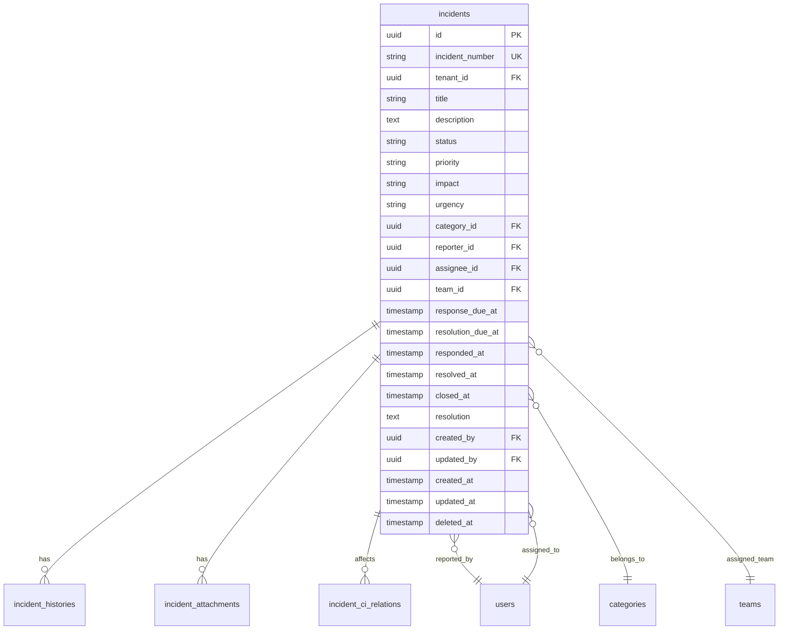
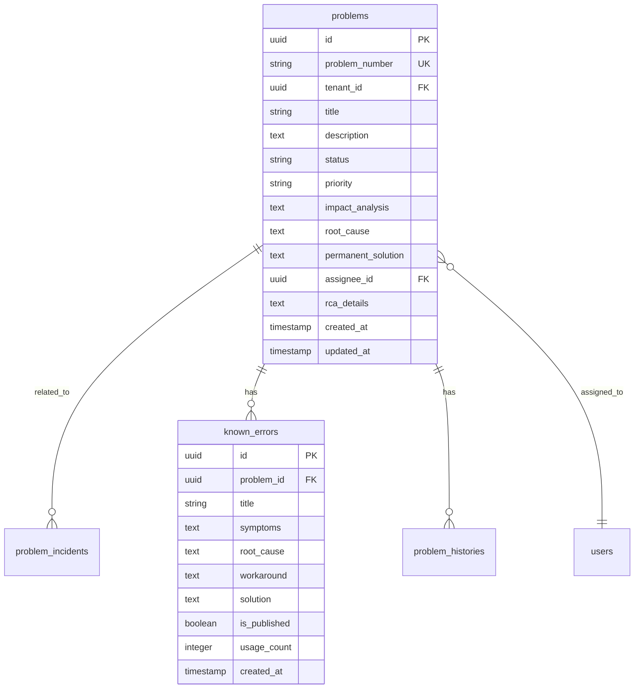
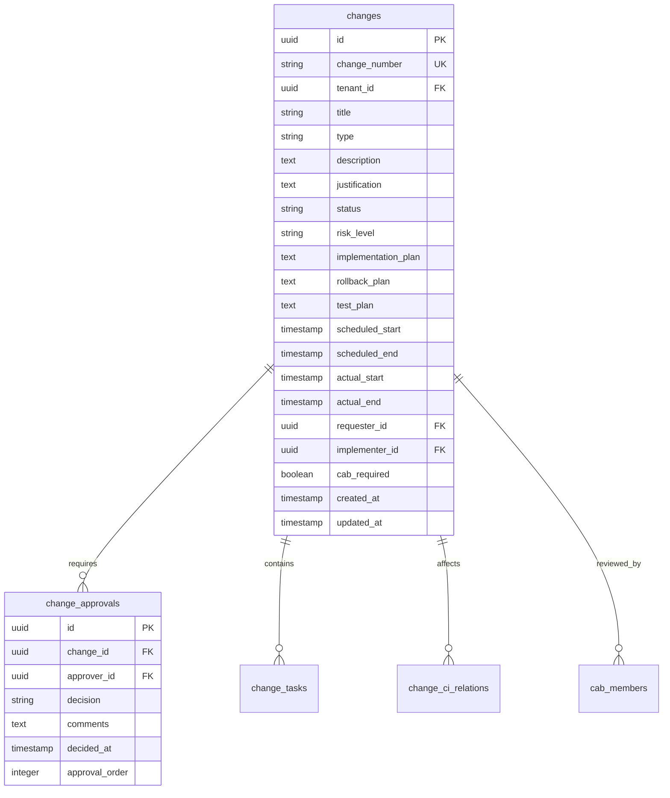
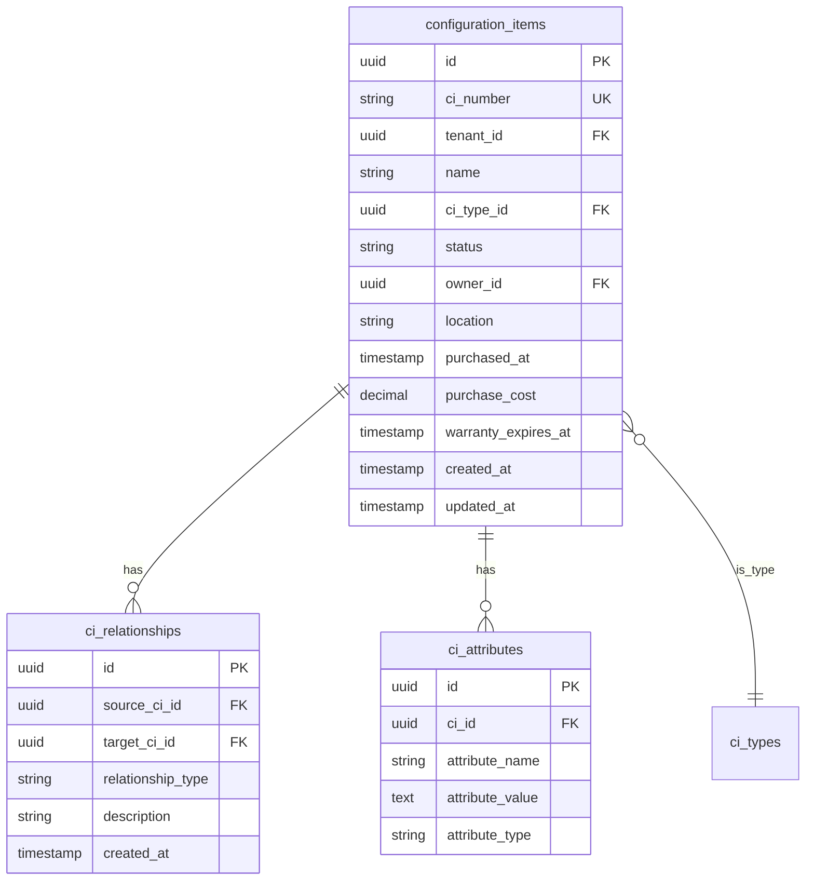

# ITSMシステム データベース設計書

## 1. データベース概要

### 1.1 データベース構成

| データベース | 用途 | 製品 |
|------------|------|------|
| メインDB | トランザクションデータ | PostgreSQL 15 |
| キャッシュDB | セッション、一時データ | Redis 7.0 |
| 検索DB | 全文検索、ログ | Elasticsearch 8.0 |
| 時系列DB | メトリクス、パフォーマンスデータ | InfluxDB 2.0 |
| ドキュメントDB | 非構造化データ | MongoDB 6.0 |

### 1.2 設計方針

- **正規化**: 第三正規形を基本とし、パフォーマンス要件に応じて非正規化
- **マルチテナント**: 論理分離（tenant_id）によるデータ分離
- **監査証跡**: 全テーブルに作成日時、更新日時、更新者を記録
- **論理削除**: deleted_atカラムによるソフトデリート
- **国際化**: タイムゾーン対応、多言語対応

## 2. ER図

### 2.1 インシデント管理



### 2.2 問題管理



### 2.3 変更管理



### 2.4 CMDB（構成管理）



## 3. テーブル定義詳細

### 3.1 ユーザー・組織管理

#### users テーブル
```sql
CREATE TABLE users (
    id UUID PRIMARY KEY DEFAULT gen_random_uuid(),
    tenant_id UUID NOT NULL,
    employee_id VARCHAR(50) UNIQUE NOT NULL,
    email VARCHAR(255) UNIQUE NOT NULL,
    username VARCHAR(100) UNIQUE NOT NULL,
    first_name VARCHAR(100) NOT NULL,
    last_name VARCHAR(100) NOT NULL,
    display_name VARCHAR(200),
    phone VARCHAR(50),
    mobile VARCHAR(50),
    timezone VARCHAR(50) DEFAULT 'Asia/Tokyo',
    locale VARCHAR(10) DEFAULT 'ja_JP',
    is_active BOOLEAN DEFAULT true,
    last_login_at TIMESTAMP WITH TIME ZONE,
    password_hash VARCHAR(255),
    mfa_enabled BOOLEAN DEFAULT false,
    mfa_secret VARCHAR(255),
    created_at TIMESTAMP WITH TIME ZONE DEFAULT CURRENT_TIMESTAMP,
    updated_at TIMESTAMP WITH TIME ZONE DEFAULT CURRENT_TIMESTAMP,
    deleted_at TIMESTAMP WITH TIME ZONE,
    
    INDEX idx_users_tenant (tenant_id),
    INDEX idx_users_email (email),
    INDEX idx_users_active (is_active, deleted_at)
);
```

#### teams テーブル
```sql
CREATE TABLE teams (
    id UUID PRIMARY KEY DEFAULT gen_random_uuid(),
    tenant_id UUID NOT NULL,
    name VARCHAR(100) NOT NULL,
    description TEXT,
    parent_team_id UUID REFERENCES teams(id),
    manager_id UUID REFERENCES users(id),
    is_active BOOLEAN DEFAULT true,
    created_at TIMESTAMP WITH TIME ZONE DEFAULT CURRENT_TIMESTAMP,
    updated_at TIMESTAMP WITH TIME ZONE DEFAULT CURRENT_TIMESTAMP,
    
    UNIQUE KEY uk_team_name (tenant_id, name),
    INDEX idx_teams_manager (manager_id)
);
```

#### user_teams テーブル
```sql
CREATE TABLE user_teams (
    user_id UUID NOT NULL REFERENCES users(id),
    team_id UUID NOT NULL REFERENCES teams(id),
    role VARCHAR(50) DEFAULT 'member',
    joined_at TIMESTAMP WITH TIME ZONE DEFAULT CURRENT_TIMESTAMP,
    
    PRIMARY KEY (user_id, team_id)
);
```

### 3.2 権限管理

#### roles テーブル
```sql
CREATE TABLE roles (
    id UUID PRIMARY KEY DEFAULT gen_random_uuid(),
    tenant_id UUID NOT NULL,
    name VARCHAR(100) NOT NULL,
    description TEXT,
    is_system BOOLEAN DEFAULT false,
    created_at TIMESTAMP WITH TIME ZONE DEFAULT CURRENT_TIMESTAMP,
    
    UNIQUE KEY uk_role_name (tenant_id, name)
);
```

#### permissions テーブル
```sql
CREATE TABLE permissions (
    id UUID PRIMARY KEY DEFAULT gen_random_uuid(),
    resource VARCHAR(100) NOT NULL,
    action VARCHAR(50) NOT NULL,
    description TEXT,
    
    UNIQUE KEY uk_permission (resource, action)
);
```

#### role_permissions テーブル
```sql
CREATE TABLE role_permissions (
    role_id UUID NOT NULL REFERENCES roles(id),
    permission_id UUID NOT NULL REFERENCES permissions(id),
    
    PRIMARY KEY (role_id, permission_id)
);
```

#### user_roles テーブル
```sql
CREATE TABLE user_roles (
    user_id UUID NOT NULL REFERENCES users(id),
    role_id UUID NOT NULL REFERENCES roles(id),
    granted_at TIMESTAMP WITH TIME ZONE DEFAULT CURRENT_TIMESTAMP,
    granted_by UUID REFERENCES users(id),
    
    PRIMARY KEY (user_id, role_id)
);
```

### 3.3 マスターデータ

#### categories テーブル
```sql
CREATE TABLE categories (
    id UUID PRIMARY KEY DEFAULT gen_random_uuid(),
    tenant_id UUID NOT NULL,
    name VARCHAR(100) NOT NULL,
    category_type VARCHAR(50) NOT NULL, -- incident, problem, change
    parent_category_id UUID REFERENCES categories(id),
    description TEXT,
    icon VARCHAR(50),
    display_order INTEGER DEFAULT 0,
    is_active BOOLEAN DEFAULT true,
    created_at TIMESTAMP WITH TIME ZONE DEFAULT CURRENT_TIMESTAMP,
    
    UNIQUE KEY uk_category (tenant_id, category_type, name),
    INDEX idx_category_type (category_type, is_active)
);
```

#### priorities テーブル
```sql
CREATE TABLE priorities (
    id UUID PRIMARY KEY DEFAULT gen_random_uuid(),
    tenant_id UUID NOT NULL,
    name VARCHAR(50) NOT NULL,
    level INTEGER NOT NULL,
    color VARCHAR(7), -- HEXカラーコード
    sla_response_minutes INTEGER,
    sla_resolution_minutes INTEGER,
    is_active BOOLEAN DEFAULT true,
    
    UNIQUE KEY uk_priority (tenant_id, name),
    INDEX idx_priority_level (level)
);
```

### 3.4 インシデント関連

#### incident_histories テーブル
```sql
CREATE TABLE incident_histories (
    id UUID PRIMARY KEY DEFAULT gen_random_uuid(),
    incident_id UUID NOT NULL REFERENCES incidents(id),
    field_name VARCHAR(100) NOT NULL,
    old_value TEXT,
    new_value TEXT,
    changed_by UUID NOT NULL REFERENCES users(id),
    changed_at TIMESTAMP WITH TIME ZONE DEFAULT CURRENT_TIMESTAMP,
    
    INDEX idx_history_incident (incident_id, changed_at DESC)
);
```

#### incident_attachments テーブル
```sql
CREATE TABLE incident_attachments (
    id UUID PRIMARY KEY DEFAULT gen_random_uuid(),
    incident_id UUID NOT NULL REFERENCES incidents(id),
    file_name VARCHAR(255) NOT NULL,
    file_size BIGINT NOT NULL,
    content_type VARCHAR(100),
    storage_path TEXT NOT NULL,
    uploaded_by UUID NOT NULL REFERENCES users(id),
    uploaded_at TIMESTAMP WITH TIME ZONE DEFAULT CURRENT_TIMESTAMP,
    
    INDEX idx_attachment_incident (incident_id)
);
```

#### incident_work_notes テーブル
```sql
CREATE TABLE incident_work_notes (
    id UUID PRIMARY KEY DEFAULT gen_random_uuid(),
    incident_id UUID NOT NULL REFERENCES incidents(id),
    note_type VARCHAR(50) NOT NULL, -- work_note, resolution_note
    content TEXT NOT NULL,
    is_public BOOLEAN DEFAULT false,
    created_by UUID NOT NULL REFERENCES users(id),
    created_at TIMESTAMP WITH TIME ZONE DEFAULT CURRENT_TIMESTAMP,
    updated_at TIMESTAMP WITH TIME ZONE DEFAULT CURRENT_TIMESTAMP,
    
    INDEX idx_work_note_incident (incident_id, created_at DESC)
);
```

### 3.5 ワークフロー関連

#### workflows テーブル
```sql
CREATE TABLE workflows (
    id UUID PRIMARY KEY DEFAULT gen_random_uuid(),
    tenant_id UUID NOT NULL,
    name VARCHAR(200) NOT NULL,
    description TEXT,
    workflow_type VARCHAR(50) NOT NULL,
    is_active BOOLEAN DEFAULT true,
    definition JSONB NOT NULL, -- ワークフロー定義
    created_by UUID NOT NULL REFERENCES users(id),
    created_at TIMESTAMP WITH TIME ZONE DEFAULT CURRENT_TIMESTAMP,
    updated_at TIMESTAMP WITH TIME ZONE DEFAULT CURRENT_TIMESTAMP,
    
    INDEX idx_workflow_type (workflow_type, is_active)
);
```

#### workflow_instances テーブル
```sql
CREATE TABLE workflow_instances (
    id UUID PRIMARY KEY DEFAULT gen_random_uuid(),
    workflow_id UUID NOT NULL REFERENCES workflows(id),
    entity_type VARCHAR(50) NOT NULL,
    entity_id UUID NOT NULL,
    status VARCHAR(50) NOT NULL,
    current_step VARCHAR(100),
    context JSONB,
    started_at TIMESTAMP WITH TIME ZONE DEFAULT CURRENT_TIMESTAMP,
    completed_at TIMESTAMP WITH TIME ZONE,
    
    INDEX idx_instance_entity (entity_type, entity_id),
    INDEX idx_instance_status (status, started_at DESC)
);
```

### 3.6 通知関連

#### notifications テーブル
```sql
CREATE TABLE notifications (
    id UUID PRIMARY KEY DEFAULT gen_random_uuid(),
    tenant_id UUID NOT NULL,
    recipient_id UUID NOT NULL REFERENCES users(id),
    notification_type VARCHAR(50) NOT NULL,
    title VARCHAR(255) NOT NULL,
    message TEXT NOT NULL,
    entity_type VARCHAR(50),
    entity_id UUID,
    is_read BOOLEAN DEFAULT false,
    read_at TIMESTAMP WITH TIME ZONE,
    created_at TIMESTAMP WITH TIME ZONE DEFAULT CURRENT_TIMESTAMP,
    
    INDEX idx_notification_recipient (recipient_id, is_read, created_at DESC),
    INDEX idx_notification_entity (entity_type, entity_id)
);
```

#### notification_settings テーブル
```sql
CREATE TABLE notification_settings (
    id UUID PRIMARY KEY DEFAULT gen_random_uuid(),
    user_id UUID NOT NULL REFERENCES users(id),
    channel VARCHAR(50) NOT NULL, -- email, sms, push, in_app
    event_type VARCHAR(100) NOT NULL,
    is_enabled BOOLEAN DEFAULT true,
    
    UNIQUE KEY uk_notification_setting (user_id, channel, event_type)
);
```

## 4. インデックス戦略

### 4.1 主要インデックス

```sql
-- インシデント検索用複合インデックス
CREATE INDEX idx_incident_search 
ON incidents(tenant_id, status, priority, created_at DESC)
WHERE deleted_at IS NULL;

-- SLA監視用インデックス
CREATE INDEX idx_incident_sla 
ON incidents(response_due_at, resolution_due_at)
WHERE status NOT IN ('resolved', 'closed') AND deleted_at IS NULL;

-- 担当者別インデックス
CREATE INDEX idx_incident_assignee 
ON incidents(assignee_id, status, priority)
WHERE deleted_at IS NULL;

-- カテゴリ別統計用インデックス
CREATE INDEX idx_incident_stats 
ON incidents(category_id, created_at, status)
WHERE deleted_at IS NULL;
```

### 4.2 全文検索インデックス

```sql
-- インシデント全文検索
CREATE INDEX idx_incident_fulltext 
ON incidents 
USING gin(to_tsvector('japanese', title || ' ' || description));

-- ナレッジベース全文検索
CREATE INDEX idx_knowledge_fulltext 
ON knowledge_articles 
USING gin(to_tsvector('japanese', title || ' ' || content));
```

## 5. パーティショニング

### 5.1 インシデントテーブルのパーティショニング

```sql
-- 月次パーティション
CREATE TABLE incidents_2024_01 PARTITION OF incidents
FOR VALUES FROM ('2024-01-01') TO ('2024-02-01');

CREATE TABLE incidents_2024_02 PARTITION OF incidents
FOR VALUES FROM ('2024-02-01') TO ('2024-03-01');

-- 自動パーティション作成関数
CREATE OR REPLACE FUNCTION create_monthly_partition()
RETURNS void AS $$
DECLARE
    start_date date;
    end_date date;
    partition_name text;
BEGIN
    start_date := date_trunc('month', CURRENT_DATE + interval '1 month');
    end_date := start_date + interval '1 month';
    partition_name := 'incidents_' || to_char(start_date, 'YYYY_MM');
    
    EXECUTE format('CREATE TABLE IF NOT EXISTS %I PARTITION OF incidents FOR VALUES FROM (%L) TO (%L)',
        partition_name, start_date, end_date);
END;
$$ LANGUAGE plpgsql;
```

## 6. トリガー・関数

### 6.1 更新日時自動更新

```sql
CREATE OR REPLACE FUNCTION update_updated_at()
RETURNS TRIGGER AS $$
BEGIN
    NEW.updated_at = CURRENT_TIMESTAMP;
    RETURN NEW;
END;
$$ LANGUAGE plpgsql;

CREATE TRIGGER update_incidents_updated_at
BEFORE UPDATE ON incidents
FOR EACH ROW
EXECUTE FUNCTION update_updated_at();
```

### 6.2 履歴自動記録

```sql
CREATE OR REPLACE FUNCTION record_incident_history()
RETURNS TRIGGER AS $$
BEGIN
    -- ステータス変更の記録
    IF OLD.status != NEW.status THEN
        INSERT INTO incident_histories (incident_id, field_name, old_value, new_value, changed_by)
        VALUES (NEW.id, 'status', OLD.status, NEW.status, NEW.updated_by);
    END IF;
    
    -- 優先度変更の記録
    IF OLD.priority != NEW.priority THEN
        INSERT INTO incident_histories (incident_id, field_name, old_value, new_value, changed_by)
        VALUES (NEW.id, 'priority', OLD.priority, NEW.priority, NEW.updated_by);
    END IF;
    
    -- 担当者変更の記録
    IF OLD.assignee_id IS DISTINCT FROM NEW.assignee_id THEN
        INSERT INTO incident_histories (incident_id, field_name, old_value, new_value, changed_by)
        VALUES (NEW.id, 'assignee_id', OLD.assignee_id::text, NEW.assignee_id::text, NEW.updated_by);
    END IF;
    
    RETURN NEW;
END;
$$ LANGUAGE plpgsql;

CREATE TRIGGER record_incident_changes
AFTER UPDATE ON incidents
FOR EACH ROW
EXECUTE FUNCTION record_incident_history();
```

### 6.3 インシデント番号自動採番

```sql
CREATE SEQUENCE incident_number_seq;

CREATE OR REPLACE FUNCTION generate_incident_number()
RETURNS TRIGGER AS $$
BEGIN
    NEW.incident_number := 'INC' || LPAD(nextval('incident_number_seq')::text, 6, '0');
    RETURN NEW;
END;
$$ LANGUAGE plpgsql;

CREATE TRIGGER generate_incident_number_trigger
BEFORE INSERT ON incidents
FOR EACH ROW
EXECUTE FUNCTION generate_incident_number();
```

## 7. ビュー定義

### 7.1 インシデントサマリービュー

```sql
CREATE VIEW v_incident_summary AS
SELECT 
    i.id,
    i.incident_number,
    i.title,
    i.status,
    i.priority,
    c.name as category_name,
    u1.display_name as reporter_name,
    u2.display_name as assignee_name,
    t.name as team_name,
    i.created_at,
    i.updated_at,
    CASE 
        WHEN i.response_due_at < CURRENT_TIMESTAMP AND i.responded_at IS NULL THEN true
        ELSE false
    END as response_sla_breached,
    CASE 
        WHEN i.resolution_due_at < CURRENT_TIMESTAMP AND i.resolved_at IS NULL THEN true
        ELSE false
    END as resolution_sla_breached
FROM incidents i
LEFT JOIN categories c ON i.category_id = c.id
LEFT JOIN users u1 ON i.reporter_id = u1.id
LEFT JOIN users u2 ON i.assignee_id = u2.id
LEFT JOIN teams t ON i.team_id = t.id
WHERE i.deleted_at IS NULL;
```

### 7.2 SLAパフォーマンスビュー

```sql
CREATE VIEW v_sla_performance AS
SELECT 
    DATE_TRUNC('month', created_at) as month,
    COUNT(*) as total_incidents,
    COUNT(CASE WHEN responded_at <= response_due_at THEN 1 END) as response_met,
    COUNT(CASE WHEN resolved_at <= resolution_due_at THEN 1 END) as resolution_met,
    ROUND(COUNT(CASE WHEN responded_at <= response_due_at THEN 1 END)::numeric / COUNT(*) * 100, 2) as response_sla_percentage,
    ROUND(COUNT(CASE WHEN resolved_at <= resolution_due_at THEN 1 END)::numeric / NULLIF(COUNT(CASE WHEN resolved_at IS NOT NULL THEN 1 END), 0) * 100, 2) as resolution_sla_percentage
FROM incidents
WHERE deleted_at IS NULL
GROUP BY DATE_TRUNC('month', created_at)
ORDER BY month DESC;
```

## 8. セキュリティ

### 8.1 行レベルセキュリティ（RLS）

```sql
-- テナント分離のためのRLS
ALTER TABLE incidents ENABLE ROW LEVEL SECURITY;

CREATE POLICY tenant_isolation_policy ON incidents
FOR ALL
USING (tenant_id = current_setting('app.current_tenant')::uuid);

-- ユーザー権限に基づくアクセス制御
CREATE POLICY user_access_policy ON incidents
FOR SELECT
USING (
    assignee_id = current_setting('app.current_user')::uuid
    OR reporter_id = current_setting('app.current_user')::uuid
    OR EXISTS (
        SELECT 1 FROM user_roles ur
        JOIN role_permissions rp ON ur.role_id = rp.role_id
        JOIN permissions p ON rp.permission_id = p.id
        WHERE ur.user_id = current_setting('app.current_user')::uuid
        AND p.resource = 'incident'
        AND p.action = 'view_all'
    )
);
```

### 8.2 データ暗号化

```sql
-- 機密フィールドの暗号化
CREATE EXTENSION IF NOT EXISTS pgcrypto;

-- 暗号化関数
CREATE OR REPLACE FUNCTION encrypt_sensitive_data(data text)
RETURNS text AS $$
BEGIN
    RETURN encode(
        encrypt(
            data::bytea, 
            current_setting('app.encryption_key')::bytea, 
            'aes'
        ), 
        'base64'
    );
END;
$$ LANGUAGE plpgsql;

-- 復号化関数
CREATE OR REPLACE FUNCTION decrypt_sensitive_data(encrypted_data text)
RETURNS text AS $$
BEGIN
    RETURN convert_from(
        decrypt(
            decode(encrypted_data, 'base64'), 
            current_setting('app.encryption_key')::bytea, 
            'aes'
        ), 
        'UTF8'
    );
END;
$$ LANGUAGE plpgsql;
```

## 9. パフォーマンスチューニング

### 9.1 統計情報の更新

```sql
-- 自動VACUUM設定
ALTER TABLE incidents SET (autovacuum_vacuum_scale_factor = 0.1);
ALTER TABLE incidents SET (autovacuum_analyze_scale_factor = 0.05);

-- 統計情報の手動更新
ANALYZE incidents;
ANALYZE incident_histories;
```

### 9.2 クエリ最適化

```sql
-- 実行計画の確認
EXPLAIN (ANALYZE, BUFFERS) 
SELECT * FROM incidents 
WHERE tenant_id = '...' 
AND status = 'open' 
AND priority IN ('high', 'critical')
ORDER BY created_at DESC 
LIMIT 20;

-- スロークエリログの有効化
ALTER SYSTEM SET log_min_duration_statement = '1000';
```

## 10. バックアップ・リカバリ

### 10.1 バックアップ戦略

```bash
# 日次フルバックアップ
pg_dump -h localhost -U itsm_user -d itsm_db -f /backup/daily/itsm_$(date +%Y%m%d).sql

# 継続的アーカイブ（WAL）
archive_mode = on
archive_command = 'test ! -f /archive/%f && cp %p /archive/%f'

# ポイントインタイムリカバリ設定
restore_command = 'cp /archive/%f %p'
recovery_target_time = '2024-01-15 12:00:00'
```

### 10.2 レプリケーション設定

```sql
-- プライマリサーバー設定
ALTER SYSTEM SET wal_level = 'replica';
ALTER SYSTEM SET max_wal_senders = 3;
ALTER SYSTEM SET wal_keep_segments = 64;

-- レプリケーションスロット作成
SELECT pg_create_physical_replication_slot('replica1');
```

## 11. 監視・メンテナンス

### 11.1 監視クエリ

```sql
-- アクティブなコネクション数
SELECT count(*) FROM pg_stat_activity;

-- 長時間実行クエリ
SELECT pid, now() - query_start AS duration, query 
FROM pg_stat_activity 
WHERE state = 'active' 
AND now() - query_start > interval '5 minutes';

-- テーブルサイズ
SELECT 
    schemaname,
    tablename,
    pg_size_pretty(pg_total_relation_size(schemaname||'.'||tablename)) AS size
FROM pg_tables
WHERE schemaname = 'public'
ORDER BY pg_total_relation_size(schemaname||'.'||tablename) DESC;

-- インデックス使用状況
SELECT 
    schemaname,
    tablename,
    indexname,
    idx_scan,
    idx_tup_read,
    idx_tup_fetch
FROM pg_stat_user_indexes
ORDER BY idx_scan DESC;
```

### 11.2 定期メンテナンス

```sql
-- 古いデータのアーカイブ
INSERT INTO incidents_archive 
SELECT * FROM incidents 
WHERE created_at < CURRENT_DATE - INTERVAL '2 years';

DELETE FROM incidents 
WHERE created_at < CURRENT_DATE - INTERVAL '2 years';

-- インデックスの再構築
REINDEX TABLE incidents;
REINDEX TABLE incident_histories;

-- 統計情報の更新
VACUUM ANALYZE;
```