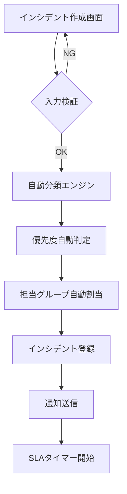
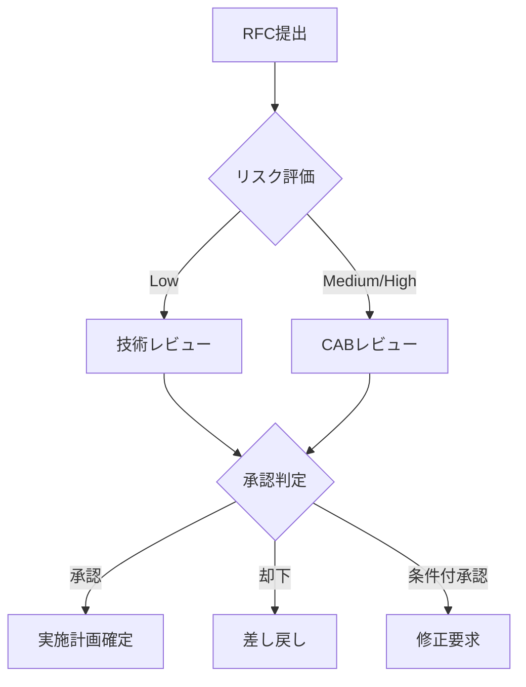

# ITSMシステム 機能仕様書

## 1. インシデント管理機能

### 1.1 インシデント作成

#### 機能概要
ITシステムの障害や問題を記録し、追跡するための機能です。

#### 入力項目

| 項目名 | 必須 | 型 | 説明 | 検証ルール |
|--------|------|-----|------|------------|
| タイトル | ○ | 文字列 | インシデントの概要 | 最大200文字 |
| 説明 | ○ | テキスト | 詳細な問題の説明 | 最大5000文字 |
| カテゴリ | ○ | 選択 | インシデントの分類 | マスタから選択 |
| 優先度 | ○ | 選択 | Low/Medium/High/Critical | デフォルト: Medium |
| 影響範囲 | ○ | 選択 | 単一ユーザー/部門/全社 | - |
| 報告者 | ○ | 自動設定 | ログインユーザー | - |
| 影響を受けるCI | - | 複数選択 | CMDBから選択 | - |
| 添付ファイル | - | ファイル | スクリーンショット等 | 最大10MB×5ファイル |

#### 処理フロー



### 1.2 インシデント一覧・検索

#### 検索条件
- ステータス（新規/割当済/作業中/保留/解決済/クローズ）
- 優先度
- カテゴリ
- 担当者/担当グループ
- 作成日時範囲
- 更新日時範囲
- フリーワード検索（タイトル、説明）

#### 一覧表示項目
- インシデント番号
- タイトル
- ステータス
- 優先度（色分け表示）
- 担当者
- 作成日時
- 最終更新日時
- SLA残時間

#### ソート機能
- 優先度順
- 作成日時順
- 更新日時順
- SLA期限順

### 1.3 インシデント詳細・更新

#### 表示項目
- 基本情報（作成時の全項目）
- ステータス履歴
- 作業ログ
- 関連インシデント
- 関連する問題/変更
- 影響を受けるサービス
- 解決策/回避策

#### 更新可能項目
- ステータス
- 優先度
- 担当者/担当グループ
- カテゴリ
- 解決策
- 作業ログ追加

#### ステータス遷移ルール
```
新規 → 割当済 → 作業中 → 解決済 → クローズ
         ↓         ↓
       保留 ←────→ 保留
```

### 1.4 エスカレーション機能

#### 自動エスカレーション条件
- SLA違反前警告（30分前）
- SLA違反時
- 高優先度インシデントの未対応
- 再オープン回数超過

#### エスカレーション先
- 上位担当グループ
- マネージャー
- 24時間サポートチーム

### 1.5 SLA管理

#### SLA定義
| 優先度 | 初回応答時間 | 解決目標時間 |
|--------|-------------|-------------|
| Critical | 15分 | 2時間 |
| High | 1時間 | 8時間 |
| Medium | 4時間 | 24時間 |
| Low | 8時間 | 72時間 |

#### SLA計算ルール
- 営業時間内のみカウント（平日9:00-18:00）
- 祝日・年末年始を除外
- 保留時間を除外

## 2. 問題管理機能

### 2.1 問題作成

#### 自動作成条件
- 同一カテゴリのインシデントが閾値超過
- 重大インシデントからの昇格
- 定期レビューでの発見

#### 入力項目
| 項目名 | 必須 | 型 | 説明 |
|--------|------|-----|------|
| 問題タイトル | ○ | 文字列 | 問題の概要 |
| 問題の説明 | ○ | テキスト | 詳細説明 |
| 関連インシデント | ○ | 複数選択 | インシデント番号 |
| 影響分析 | ○ | テキスト | ビジネスへの影響 |
| 根本原因 | - | テキスト | RCA結果 |
| 恒久対策 | - | テキスト | 解決策 |

### 2.2 根本原因分析（RCA）

#### RCAテンプレート
- 5 Why分析
- 魚骨図（特性要因図）
- 故障の木解析（FTA）
- イベント相関分析

#### RCAワークフロー
1. 問題の定義
2. データ収集
3. 原因分析
4. 解決策の立案
5. 実施計画策定
6. 効果測定

### 2.3 既知エラーデータベース（KEDB）

#### KEDB登録項目
- エラー症状
- 影響を受けるシステム/サービス
- 根本原因
- 回避策
- 恒久対策
- 関連ドキュメント

#### KEDB検索機能
- 症状からの検索
- システム/サービスからの検索
- AIによる類似エラー提案

## 3. 変更管理機能

### 3.1 変更要求（RFC）作成

#### RFC種別
- 標準変更：事前承認済みの定型変更
- 通常変更：CAB承認が必要
- 緊急変更：事後承認可能

#### 入力項目
| 項目名 | 必須 | 型 | 説明 |
|--------|------|-----|------|
| 変更タイトル | ○ | 文字列 | 変更の概要 |
| 変更理由 | ○ | テキスト | ビジネス上の理由 |
| 変更内容 | ○ | テキスト | 技術的な詳細 |
| リスク評価 | ○ | 選択 | Low/Medium/High |
| 影響範囲 | ○ | 複数選択 | 影響を受けるCI |
| 実施予定日時 | ○ | 日時 | 開始・終了予定 |
| ロールバック計画 | ○ | テキスト | 切り戻し手順 |
| テスト計画 | ○ | テキスト | 検証内容 |

### 3.2 変更諮問委員会（CAB）

#### CABメンバー構成
- IT部門責任者
- 業務部門代表
- セキュリティ責任者
- インフラ責任者
- 外部ベンダー（必要時）

#### 承認ワークフロー


### 3.3 変更カレンダー

#### カレンダー機能
- 月次/週次/日次ビュー
- 変更ウィンドウ管理
- ブラックアウト期間設定
- リソース競合チェック

#### 表示情報
- 変更タイトル
- 実施時間帯
- リスクレベル（色分け）
- 担当者
- 影響サービス

### 3.4 変更実施管理

#### 実施チェックリスト
- [ ] 事前通知完了
- [ ] バックアップ取得
- [ ] 実施環境準備
- [ ] 関係者スタンバイ
- [ ] ロールバック準備

#### 実施中管理
- リアルタイムステータス更新
- 作業ログ記録
- 問題発生時のエスカレーション
- 進捗率表示

## 4. 構成管理データベース（CMDB）

### 4.1 構成アイテム（CI）管理

#### CI種別
- ハードウェア（サーバー、ネットワーク機器、ストレージ）
- ソフトウェア（OS、ミドルウェア、アプリケーション）
- ドキュメント（手順書、設計書、契約書）
- サービス（ビジネスサービス、技術サービス）

#### CI属性
| 属性カテゴリ | 属性例 |
|-------------|--------|
| 基本情報 | CI名、種別、説明、オーナー |
| 技術情報 | モデル、バージョン、設定情報 |
| 場所情報 | データセンター、ラック、U位置 |
| 財務情報 | 購入日、価格、減価償却 |
| ライフサイクル | ステータス、導入日、廃棄予定日 |

### 4.2 関係性管理

#### 関係種別
- 依存関係（depends on）
- 構成関係（contains/part of）
- 接続関係（connects to）
- 実行関係（runs on）

#### インパクト分析
- 上位影響分析（このCIが停止した場合の影響）
- 下位影響分析（依存CIが停止した場合の影響）
- 変更影響分析（変更時の影響範囲）

### 4.3 自動ディスカバリー

#### ディスカバリー対象
- ネットワーク機器（SNMP）
- サーバー（エージェント/エージェントレス）
- 仮想マシン（vCenter API）
- クラウドリソース（AWS/Azure/GCP API）
- コンテナ（Kubernetes API）

#### ディスカバリー情報
- ハードウェア構成
- ソフトウェアインベントリ
- ネットワーク接続
- 実行中サービス
- リソース使用状況

## 5. サービスカタログ管理

### 5.1 サービスカタログ定義

#### カタログ項目
| カテゴリ | サービス例 |
|----------|-----------|
| インフラ | サーバー構築、ネットワーク設定変更 |
| アプリケーション | アカウント作成、権限変更 |
| サポート | ソフトウェアインストール、データ復旧 |
| 情報提供 | 利用方法問い合わせ、障害情報照会 |

#### サービス定義項目
- サービス名・説明
- 提供条件（対象者、前提条件）
- SLA（提供時間）
- 料金（内部課金）
- 承認フロー
- 実行フォーム

### 5.2 セルフサービスポータル

#### ポータル機能
- サービスカタログ閲覧
- サービス要求作成
- 承認状況確認
- 履歴照会
- FAQ検索

#### 動的フォーム生成
- 条件分岐
- 入力検証
- 依存関係制御
- ファイルアップロード
- 電子署名

### 5.3 承認ワークフロー

#### 承認パターン
- 直列承認（順次承認）
- 並列承認（全員承認）
- 条件分岐承認
- 代理承認
- 自動承認

#### 承認ルール設定
- 金額による承認者変更
- 部門による承認ルート
- サービス種別による承認
- 緊急度による特別承認

## 6. ナレッジ管理

### 6.1 ナレッジ記事作成

#### 記事種別
- FAQ（よくある質問）
- How-to（操作手順）
- トラブルシューティング
- ベストプラクティス
- 技術情報

#### 記事構成
- タイトル
- 概要
- 症状/質問
- 原因
- 解決策/回答
- 関連情報
- 添付ファイル

### 6.2 ナレッジ検索

#### 検索機能
- 全文検索
- タグ検索
- カテゴリ検索
- 類似記事提案
- 人気記事表示

#### AI支援機能
- 自然言語クエリ対応
- 検索結果の関連度スコアリング
- 閲覧履歴に基づく推奨
- 記事の自動要約

### 6.3 ナレッジ評価・改善

#### 評価指標
- 閲覧数
- 役立ち度評価（5段階）
- 解決率
- フィードバックコメント

#### 改善サイクル
- 低評価記事の特定
- 更新が必要な記事の検出
- エキスパートレビュー
- 定期的な精度向上

## 7. レポート・分析機能

### 7.1 ダッシュボード

#### 運用ダッシュボード
- 本日のインシデント状況
- SLA遵守率
- 未解決チケット数
- チーム別負荷状況
- リアルタイムアラート

#### 管理ダッシュボード
- 月次インシデント傾向
- 問題解決率
- 変更成功率
- MTTR推移
- コスト分析

### 7.2 定型レポート

#### レポート種別
| レポート名 | 頻度 | 内容 |
|-----------|------|------|
| インシデント分析 | 週次 | カテゴリ別発生状況、解決時間 |
| SLAレポート | 月次 | SLA達成率、違反詳細 |
| 変更実施報告 | 週次 | 実施結果、失敗分析 |
| キャパシティレポート | 月次 | リソース使用率、予測 |
| コンプライアンスレポート | 四半期 | 監査対応状況 |

### 7.3 アドホック分析

#### 分析ツール
- ピボットテーブル
- グラフ作成（棒、折れ線、円）
- ドリルダウン分析
- 時系列分析
- 相関分析

#### エクスポート機能
- Excel形式
- PDF形式
- CSV形式
- API経由でのデータ取得

## 8. 統合・連携機能

### 8.1 監視ツール連携

#### 連携可能ツール
- Zabbix
- Nagios
- Prometheus + Grafana
- Datadog
- New Relic

#### 連携内容
- アラート自動チケット化
- ステータス同期
- メトリクス表示
- トポロジーマップ連携

### 8.2 コミュニケーションツール連携

#### 連携ツール
- Slack
- Microsoft Teams
- メール（SMTP/IMAP）
- SMS
- 電話（CTI連携）

#### 通知設定
- チケット作成/更新通知
- SLA警告
- 承認依頼
- ステータス変更
- @メンション対応

### 8.3 開発ツール連携

#### 連携ツール
- GitHub/GitLab
- Jira
- Jenkins
- Ansible/Terraform

#### 連携機能
- コード変更との紐付け
- 自動デプロイ連携
- 構成情報の自動更新
- CI/CDパイプライン統合

## 9. モバイル対応

### 9.1 モバイルアプリ機能

#### 基本機能
- チケット一覧表示
- チケット作成/更新
- 承認処理
- プッシュ通知
- オフライン対応

#### 拡張機能
- 音声入力
- カメラ撮影添付
- GPS位置情報
- QRコード読み取り
- 生体認証

### 9.2 レスポンシブWeb

#### 対応デバイス
- スマートフォン（iOS/Android）
- タブレット
- デスクトップ

#### UI最適化
- タッチ操作対応
- 画面サイズ別レイアウト
- 高速表示（遅延読み込み）
- オフライン表示（PWA）

## 10. 管理機能

### 10.1 ユーザー管理

#### ユーザー属性
- 基本情報（氏名、メール、電話）
- 組織情報（部門、役職、上司）
- 権限情報（ロール、グループ）
- 認証情報（パスワード、MFA）

#### 一括管理機能
- CSV一括登録/更新
- LDAP/AD同期
- SCIM対応
- 組織改編対応

### 10.2 マスタ管理

#### 管理対象マスタ
- カテゴリマスタ
- 優先度マスタ
- ステータスマスタ
- SLA定義
- 承認ルール
- 通知テンプレート

#### マスタ管理機能
- 履歴管理
- 承認フロー
- インポート/エクスポート
- 環境間同期

### 10.3 システム設定

#### 設定項目
- メール設定
- 認証設定（SSO、SAML）
- ストレージ設定
- バックアップ設定
- ログ設定
- パフォーマンス設定

#### 運用管理
- ライセンス管理
- 使用量モニタリング
- システムヘルスチェック
- 診断ツール