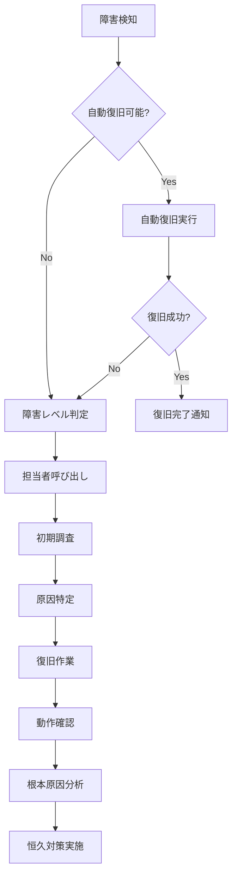
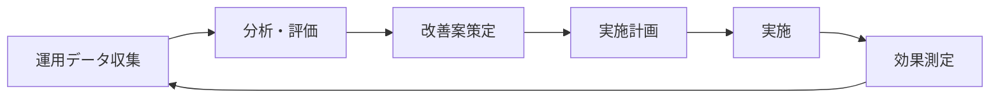

# ITSMシステム 運用マニュアル

## 1. システム運用概要

### 1.1 運用体制

| 役割 | 責務 | 対応時間 |
|------|------|----------|
| システム管理者 | システム全体の管理、設定変更 | 平日 9:00-18:00 |
| 運用オペレーター | 日常監視、一次対応 | 24時間365日 |
| データベース管理者 | DB運用、パフォーマンス管理 | 平日 9:00-18:00 |
| セキュリティ管理者 | セキュリティ監視、インシデント対応 | 24時間365日 |
| アプリケーション保守 | バグ修正、機能改善 | 平日 9:00-18:00 |

### 1.2 サービスレベル目標

| 項目 | 目標値 |
|------|--------|
| システム可用性 | 99.9%（年間ダウンタイム8.76時間以内） |
| 応答時間 | 画面表示3秒以内、API応答200ms以内 |
| 障害復旧時間 | Critical: 2時間以内、High: 4時間以内 |
| バックアップ成功率 | 100% |
| セキュリティインシデント対応 | 初動15分以内 |

## 2. 日常運用作業

### 2.1 システム起動・停止手順

#### システム起動手順

```bash
# 1. データベースサービス起動
sudo systemctl start postgresql
sudo systemctl start redis

# 2. メッセージキューサービス起動
sudo systemctl start rabbitmq-server

# 3. 検索エンジン起動
sudo systemctl start elasticsearch

# 4. アプリケーションサービス起動
cd /opt/itsm-system
docker-compose up -d

# 5. 起動確認
./scripts/health-check.sh
```

#### システム停止手順

```bash
# 1. アプリケーションサービス停止
cd /opt/itsm-system
docker-compose down

# 2. メッセージキュー停止
sudo systemctl stop rabbitmq-server

# 3. 検索エンジン停止
sudo systemctl stop elasticsearch

# 4. データベースサービス停止
sudo systemctl stop redis
sudo systemctl stop postgresql

# 5. 停止確認
./scripts/status-check.sh
```

### 2.2 監視項目と閾値

#### システムリソース監視

| 監視項目 | 警告閾値 | 危険閾値 | 監視間隔 |
|----------|----------|----------|----------|
| CPU使用率 | 70% | 85% | 1分 |
| メモリ使用率 | 80% | 90% | 1分 |
| ディスク使用率 | 70% | 85% | 5分 |
| ネットワーク帯域 | 70% | 85% | 1分 |
| DB接続数 | 80% | 90% | 1分 |

#### アプリケーション監視

```yaml
# Prometheus監視設定
global:
  scrape_interval: 15s
  evaluation_interval: 15s

scrape_configs:
  - job_name: 'itsm-backend'
    static_configs:
      - targets: ['backend:8000']
    metrics_path: '/metrics'
  
  - job_name: 'postgres'
    static_configs:
      - targets: ['postgres-exporter:9187']
  
  - job_name: 'redis'
    static_configs:
      - targets: ['redis-exporter:9121']
```

### 2.3 ログ管理

#### ログ種別と保存期間

| ログ種別 | ファイルパス | 保存期間 | ローテーション |
|----------|-------------|----------|---------------|
| アプリケーションログ | /var/log/itsm/app.log | 90日 | 日次 |
| アクセスログ | /var/log/itsm/access.log | 365日 | 日次 |
| エラーログ | /var/log/itsm/error.log | 180日 | 日次 |
| 監査ログ | /var/log/itsm/audit.log | 7年 | 月次 |
| セキュリティログ | /var/log/itsm/security.log | 3年 | 週次 |

#### ログローテーション設定

```bash
# /etc/logrotate.d/itsm
/var/log/itsm/*.log {
    daily
    missingok
    rotate 90
    compress
    delaycompress
    notifempty
    create 0640 itsm itsm
    sharedscripts
    postrotate
        docker exec itsm-backend kill -USR1 1
    endscript
}
```

## 3. バックアップとリストア

### 3.1 バックアップ計画

| バックアップ対象 | 種別 | 頻度 | 保存期間 | 保存先 |
|----------------|------|------|----------|--------|
| データベース（フル） | フルバックアップ | 週次（日曜日） | 3ヶ月 | S3/Glacier |
| データベース（差分） | 差分バックアップ | 日次 | 1ヶ月 | S3 |
| データベース（トランザクション） | ログバックアップ | 15分毎 | 7日 | S3 |
| アプリケーションファイル | フルバックアップ | 日次 | 7日 | S3 |
| 設定ファイル | フルバックアップ | 変更時 | 無期限 | Git/S3 |

### 3.2 バックアップ手順

#### データベースバックアップスクリプト

```bash
#!/bin/bash
# /opt/itsm-system/scripts/backup-db.sh

# 設定
BACKUP_DIR="/backup/postgres"
S3_BUCKET="s3://itsm-backup/postgres"
DATE=$(date +%Y%m%d_%H%M%S)
RETENTION_DAYS=30

# バックアップ実行
echo "Starting database backup at $(date)"

# フルバックアップ（日曜日）
if [ $(date +%w) -eq 0 ]; then
    BACKUP_FILE="$BACKUP_DIR/full_backup_$DATE.sql.gz"
    pg_dump -h localhost -U itsm_user -d itsm_db | gzip > $BACKUP_FILE
    
    # S3へアップロード
    aws s3 cp $BACKUP_FILE $S3_BUCKET/full/
    
    # 古いバックアップ削除
    find $BACKUP_DIR -name "full_backup_*.sql.gz" -mtime +90 -delete
else
    # 差分バックアップ
    BACKUP_FILE="$BACKUP_DIR/diff_backup_$DATE.sql.gz"
    pg_dump -h localhost -U itsm_user -d itsm_db --data-only | gzip > $BACKUP_FILE
    
    # S3へアップロード
    aws s3 cp $BACKUP_FILE $S3_BUCKET/diff/
    
    # 古いバックアップ削除
    find $BACKUP_DIR -name "diff_backup_*.sql.gz" -mtime +$RETENTION_DAYS -delete
fi

# バックアップ検証
if [ $? -eq 0 ]; then
    echo "Backup completed successfully"
    # 成功通知
    curl -X POST $SLACK_WEBHOOK -d "{\"text\":\"Database backup completed: $BACKUP_FILE\"}"
else
    echo "Backup failed"
    # エラー通知
    curl -X POST $SLACK_WEBHOOK -d "{\"text\":\"@channel Database backup FAILED!\"}"
    exit 1
fi
```

### 3.3 リストア手順

#### データベースリストア

```bash
#!/bin/bash
# /opt/itsm-system/scripts/restore-db.sh

# パラメータチェック
if [ $# -ne 1 ]; then
    echo "Usage: $0 <backup_file>"
    exit 1
fi

BACKUP_FILE=$1

# 1. サービス停止
echo "Stopping application services..."
docker-compose stop

# 2. データベース接続を切断
psql -U postgres -c "SELECT pg_terminate_backend(pid) FROM pg_stat_activity WHERE datname = 'itsm_db' AND pid <> pg_backend_pid();"

# 3. データベースバックアップ（現状保存）
pg_dump -U postgres itsm_db > /backup/before_restore_$(date +%Y%m%d_%H%M%S).sql

# 4. データベース削除と再作成
psql -U postgres -c "DROP DATABASE IF EXISTS itsm_db;"
psql -U postgres -c "CREATE DATABASE itsm_db OWNER itsm_user;"

# 5. リストア実行
echo "Restoring database from $BACKUP_FILE..."
if [[ $BACKUP_FILE == *.gz ]]; then
    gunzip -c $BACKUP_FILE | psql -U itsm_user -d itsm_db
else
    psql -U itsm_user -d itsm_db < $BACKUP_FILE
fi

# 6. 権限設定
psql -U postgres -d itsm_db -c "GRANT ALL PRIVILEGES ON ALL TABLES IN SCHEMA public TO itsm_user;"
psql -U postgres -d itsm_db -c "GRANT ALL PRIVILEGES ON ALL SEQUENCES IN SCHEMA public TO itsm_user;"

# 7. データ検証
echo "Verifying restored data..."
psql -U itsm_user -d itsm_db -c "SELECT COUNT(*) FROM incidents;"

# 8. サービス再開
echo "Starting application services..."
docker-compose up -d

# 9. ヘルスチェック
sleep 30
./scripts/health-check.sh

echo "Restore completed at $(date)"
```

## 4. 障害対応

### 4.1 障害レベル定義

| レベル | 説明 | 影響範囲 | 対応時間 |
|--------|------|----------|----------|
| Critical | システム全体停止 | 全ユーザー | 即時対応、2時間以内復旧 |
| High | 主要機能停止 | 多数のユーザー | 30分以内対応、4時間以内復旧 |
| Medium | 一部機能停止 | 一部ユーザー | 2時間以内対応、8時間以内復旧 |
| Low | 軽微な不具合 | 限定的 | 翌営業日対応 |

### 4.2 障害対応フロー



### 4.3 トラブルシューティング

#### よくある障害と対処法

##### データベース接続エラー

```bash
# 症状: "could not connect to database"

# 1. PostgreSQLサービス確認
sudo systemctl status postgresql

# 2. 接続数確認
psql -U postgres -c "SELECT count(*) FROM pg_stat_activity;"

# 3. 接続数上限に達している場合
psql -U postgres -c "ALTER SYSTEM SET max_connections = 500;"
sudo systemctl restart postgresql

# 4. ログ確認
tail -f /var/log/postgresql/postgresql-15-main.log
```

##### メモリ不足エラー

```bash
# 症状: OutOfMemoryError

# 1. メモリ使用状況確認
free -h
docker stats

# 2. 不要なプロセス確認
ps aux | sort -k 4 -r | head -20

# 3. Dockerコンテナのメモリ制限調整
docker-compose down
# docker-compose.ymlのmemory limitを調整
docker-compose up -d

# 4. スワップ領域追加（緊急時）
sudo dd if=/dev/zero of=/swapfile bs=1G count=4
sudo chmod 600 /swapfile
sudo mkswap /swapfile
sudo swapon /swapfile
```

##### ディスク容量不足

```bash
# 症状: "No space left on device"

# 1. ディスク使用状況確認
df -h
du -sh /* | sort -rh | head -20

# 2. 不要なログファイル削除
find /var/log/itsm -name "*.log" -mtime +30 -delete
docker system prune -a

# 3. 古いバックアップ削除
find /backup -name "*.gz" -mtime +30 -delete

# 4. データベースVACUUM実行
psql -U itsm_user -d itsm_db -c "VACUUM FULL;"
```

## 5. 定期メンテナンス

### 5.1 日次メンテナンス

```bash
#!/bin/bash
# /opt/itsm-system/scripts/daily-maintenance.sh

echo "=== Daily Maintenance Started at $(date) ==="

# 1. ログローテーション
/usr/sbin/logrotate -f /etc/logrotate.d/itsm

# 2. 一時ファイルクリーンアップ
find /tmp -name "itsm_*" -mtime +1 -delete
find /var/tmp -name "upload_*" -mtime +1 -delete

# 3. データベース統計情報更新
psql -U itsm_user -d itsm_db -c "ANALYZE;"

# 4. キャッシュクリア（古いエントリ）
redis-cli --scan --pattern "cache:*" | while read key; do
    ttl=$(redis-cli ttl "$key")
    if [ $ttl -lt 0 ]; then
        redis-cli del "$key"
    fi
done

# 5. ヘルスチェック
./health-check.sh

echo "=== Daily Maintenance Completed at $(date) ==="
```

### 5.2 週次メンテナンス

```bash
#!/bin/bash
# /opt/itsm-system/scripts/weekly-maintenance.sh

echo "=== Weekly Maintenance Started at $(date) ==="

# 1. データベースフルバックアップ
./backup-db.sh

# 2. システムアップデート確認
apt update
apt list --upgradable

# 3. Docker イメージ更新確認
docker images | grep itsm

# 4. ディスク使用量レポート
df -h > /tmp/disk_usage_$(date +%Y%m%d).txt
du -sh /var/log/* >> /tmp/disk_usage_$(date +%Y%m%d).txt

# 5. パフォーマンスレポート生成
./generate-performance-report.sh

# 6. セキュリティスキャン
./security-scan.sh

echo "=== Weekly Maintenance Completed at $(date) ==="
```

### 5.3 月次メンテナンス

| 作業項目 | 実施内容 | 所要時間 |
|----------|----------|----------|
| パッチ適用 | OS、ミドルウェアのセキュリティパッチ | 2時間 |
| 証明書更新確認 | SSL証明書の有効期限確認 | 30分 |
| ユーザー棚卸し | 不要アカウントの削除 | 1時間 |
| 容量計画見直し | リソース使用傾向分析 | 1時間 |
| DR訓練 | 障害復旧手順の確認 | 4時間 |

## 6. パフォーマンスチューニング

### 6.1 データベースチューニング

#### PostgreSQL設定最適化

```sql
-- postgresql.conf の推奨設定

-- メモリ関連
shared_buffers = 8GB                    # 物理メモリの25%
effective_cache_size = 24GB             # 物理メモリの75%
work_mem = 64MB                         # ソート・集計用
maintenance_work_mem = 2GB              # VACUUM, CREATE INDEX用

-- 接続関連
max_connections = 500
max_prepared_transactions = 100

-- チェックポイント関連
checkpoint_timeout = 15min
checkpoint_completion_target = 0.9
max_wal_size = 4GB
min_wal_size = 1GB

-- ログ関連
log_min_duration_statement = 1000       # 1秒以上のクエリをログ
log_checkpoints = on
log_connections = on
log_disconnections = on
log_lock_waits = on
log_temp_files = 0

-- 自動VACUUM
autovacuum = on
autovacuum_max_workers = 4
autovacuum_naptime = 30s
```

#### インデックス最適化

```sql
-- 未使用インデックスの検出
SELECT 
    schemaname,
    tablename,
    indexname,
    idx_scan,
    idx_tup_read,
    idx_tup_fetch
FROM pg_stat_user_indexes
WHERE idx_scan = 0
AND schemaname NOT IN ('pg_catalog', 'information_schema')
ORDER BY schemaname, tablename;

-- 断片化したインデックスの再構築
REINDEX TABLE CONCURRENTLY incidents;
REINDEX TABLE CONCURRENTLY incident_histories;

-- 新規インデックス候補の検出
SELECT 
    schemaname,
    tablename,
    attname,
    n_distinct,
    correlation
FROM pg_stats
WHERE n_distinct > 100
AND correlation < 0.1
ORDER BY n_distinct DESC;
```

### 6.2 アプリケーションチューニング

#### Redisキャッシュ最適化

```python
# キャッシュ戦略の実装
class CacheStrategy:
    # キャッシュ期間設定
    CACHE_DURATIONS = {
        'user_profile': 3600,        # 1時間
        'team_list': 86400,          # 24時間
        'category_list': 604800,     # 7日間
        'incident_stats': 300,       # 5分
        'dashboard_data': 60,        # 1分
    }
    
    @staticmethod
    def get_cache_key(resource_type, identifier):
        return f"cache:{resource_type}:{identifier}"
    
    @staticmethod
    def should_cache(resource_type):
        # キャッシュすべきでないリソース
        no_cache_resources = ['audit_log', 'real_time_status']
        return resource_type not in no_cache_resources
```

#### コネクションプール設定

```python
# データベースコネクションプール
from sqlalchemy.pool import QueuePool

engine = create_engine(
    DATABASE_URL,
    poolclass=QueuePool,
    pool_size=20,          # 常時接続数
    max_overflow=40,       # 最大追加接続数
    pool_timeout=30,       # 接続待機タイムアウト
    pool_recycle=3600,     # 接続リサイクル時間
    pool_pre_ping=True,    # 接続前のヘルスチェック
)

# Redis接続プール
import redis

redis_pool = redis.ConnectionPool(
    host='localhost',
    port=6379,
    max_connections=100,
    decode_responses=True
)
redis_client = redis.Redis(connection_pool=redis_pool)
```

## 7. 監視とアラート

### 7.1 監視ダッシュボード

#### Grafanaダッシュボード設定

```json
{
  "dashboard": {
    "title": "ITSM System Monitoring",
    "panels": [
      {
        "title": "System Overview",
        "targets": [
          {
            "expr": "up{job='itsm-backend'}",
            "legendFormat": "Backend Status"
          },
          {
            "expr": "rate(http_requests_total[5m])",
            "legendFormat": "Request Rate"
          }
        ]
      },
      {
        "title": "Database Performance",
        "targets": [
          {
            "expr": "pg_stat_database_xact_commit{datname='itsm_db'}",
            "legendFormat": "Transactions/sec"
          },
          {
            "expr": "pg_stat_database_blks_hit{datname='itsm_db'} / (pg_stat_database_blks_hit{datname='itsm_db'} + pg_stat_database_blks_read{datname='itsm_db'})",
            "legendFormat": "Cache Hit Ratio"
          }
        ]
      }
    ]
  }
}
```

### 7.2 アラート設定

#### Prometheusアラートルール

```yaml
# /etc/prometheus/alerts/itsm_alerts.yml
groups:
  - name: itsm_critical
    interval: 30s
    rules:
      - alert: SystemDown
        expr: up{job="itsm-backend"} == 0
        for: 2m
        labels:
          severity: critical
          team: ops
        annotations:
          summary: "ITSM Backend is down"
          description: "Backend service has been down for more than 2 minutes"
      
      - alert: HighCPUUsage
        expr: rate(process_cpu_seconds_total[5m]) > 0.8
        for: 5m
        labels:
          severity: warning
        annotations:
          summary: "High CPU usage detected"
          description: "CPU usage is above 80% for 5 minutes"
      
      - alert: DatabaseConnectionPoolExhausted
        expr: pg_stat_database_numbackends{datname="itsm_db"} / pg_settings_max_connections > 0.9
        for: 5m
        labels:
          severity: critical
        annotations:
          summary: "Database connection pool nearly exhausted"
          description: "More than 90% of database connections are in use"
```

### 7.3 通知設定

#### Slack通知設定

```python
# /opt/itsm-system/scripts/alert_notifier.py
import requests
import json

class AlertNotifier:
    def __init__(self, webhook_url):
        self.webhook_url = webhook_url
    
    def send_alert(self, alert_data):
        severity_emoji = {
            'critical': '🚨',
            'warning': '⚠️',
            'info': 'ℹ️'
        }
        
        message = {
            "text": f"{severity_emoji.get(alert_data['severity'], '📢')} *{alert_data['title']}*",
            "attachments": [
                {
                    "color": self.get_color(alert_data['severity']),
                    "fields": [
                        {
                            "title": "Description",
                            "value": alert_data['description'],
                            "short": False
                        },
                        {
                            "title": "Time",
                            "value": alert_data['timestamp'],
                            "short": True
                        },
                        {
                            "title": "Severity",
                            "value": alert_data['severity'],
                            "short": True
                        }
                    ]
                }
            ]
        }
        
        response = requests.post(self.webhook_url, json=message)
        return response.status_code == 200
    
    def get_color(self, severity):
        colors = {
            'critical': '#FF0000',
            'warning': '#FFA500',
            'info': '#0000FF'
        }
        return colors.get(severity, '#808080')
```

## 8. セキュリティ運用

### 8.1 アクセス管理

#### ユーザーアカウント管理

```bash
#!/bin/bash
# /opt/itsm-system/scripts/user-audit.sh

echo "=== User Account Audit Report ==="
echo "Generated at: $(date)"

# 1. 長期間未使用アカウント
echo -e "\n## Inactive Accounts (>90 days):"
psql -U itsm_user -d itsm_db -t -c "
SELECT email, last_login_at 
FROM users 
WHERE last_login_at < CURRENT_DATE - INTERVAL '90 days'
AND is_active = true
ORDER BY last_login_at;"

# 2. 管理者権限保有者
echo -e "\n## Admin Users:"
psql -U itsm_user -d itsm_db -t -c "
SELECT u.email, r.name as role 
FROM users u
JOIN user_roles ur ON u.id = ur.user_id
JOIN roles r ON ur.role_id = r.id
WHERE r.name IN ('admin', 'system_admin')
ORDER BY u.email;"

# 3. パスワード期限切れ間近
echo -e "\n## Password Expiry Warning:"
psql -U itsm_user -d itsm_db -t -c "
SELECT email, password_changed_at 
FROM users 
WHERE password_changed_at < CURRENT_DATE - INTERVAL '75 days'
AND is_active = true
ORDER BY password_changed_at;"
```

### 8.2 セキュリティ監査

#### 定期セキュリティチェック

```bash
#!/bin/bash
# /opt/itsm-system/scripts/security-check.sh

echo "=== Security Audit Checklist ==="
echo "Date: $(date)"

# 1. SSL証明書有効期限確認
echo -e "\n[CHECK] SSL Certificate Expiry:"
echo | openssl s_client -servername itsm.example.com -connect itsm.example.com:443 2>/dev/null | openssl x509 -noout -dates

# 2. 開放ポート確認
echo -e "\n[CHECK] Open Ports:"
netstat -tuln | grep LISTEN

# 3. ファイアウォール設定確認
echo -e "\n[CHECK] Firewall Rules:"
iptables -L -n -v

# 4. 不審なプロセス確認
echo -e "\n[CHECK] Running Processes:"
ps aux | grep -v "root\|itsm\|postgres\|redis" | grep -v grep

# 5. ログイン履歴確認
echo -e "\n[CHECK] Recent Logins:"
last -n 20

# 6. sudo実行履歴
echo -e "\n[CHECK] Recent sudo Commands:"
grep sudo /var/log/auth.log | tail -20
```

### 8.3 インシデント対応記録

```markdown
## セキュリティインシデント対応記録テンプレート

### インシデント情報
- **インシデントID**: SEC-YYYYMMDD-XXX
- **発生日時**: YYYY-MM-DD HH:MM:SS
- **検知方法**: [自動検知/ユーザー報告/定期監査]
- **重要度**: [Critical/High/Medium/Low]

### インシデント詳細
- **概要**: 
- **影響範囲**: 
- **影響を受けたシステム**: 

### 対応記録
| 時刻 | 実施内容 | 担当者 |
|------|----------|--------|
| HH:MM | 初期対応開始 | |
| HH:MM | 影響範囲特定 | |
| HH:MM | 対策実施 | |
| HH:MM | 復旧確認 | |

### 根本原因
- **原因**: 
- **なぜ発生したか**: 

### 恒久対策
- **実施する対策**: 
- **実施予定日**: 
- **効果測定方法**: 

### 教訓
- **学んだこと**: 
- **改善点**: 
```

## 9. 災害復旧計画

### 9.1 復旧優先順位

| 優先度 | システム/機能 | RTO | RPO |
|--------|--------------|-----|-----|
| 1 | データベース | 1時間 | 15分 |
| 2 | 認証システム | 2時間 | 1時間 |
| 3 | インシデント管理 | 2時間 | 1時間 |
| 4 | 変更管理 | 4時間 | 2時間 |
| 5 | レポート機能 | 8時間 | 24時間 |

### 9.2 災害復旧手順

```bash
#!/bin/bash
# /opt/itsm-system/scripts/disaster-recovery.sh

echo "=== Disaster Recovery Procedure Started ==="

# 1. 被害状況確認
echo "[1] Checking system status..."
./health-check.sh > /tmp/dr_status.log

# 2. バックアップからの復旧判断
echo "[2] Evaluating recovery options..."
LAST_BACKUP=$(aws s3 ls s3://itsm-backup/postgres/full/ | tail -1 | awk '{print $4}')
echo "Latest backup: $LAST_BACKUP"

# 3. 復旧環境準備
echo "[3] Preparing recovery environment..."
# 新規サーバーのプロビジョニング（必要な場合）
# terraform apply -auto-approve

# 4. データベース復旧
echo "[4] Restoring database..."
aws s3 cp s3://itsm-backup/postgres/full/$LAST_BACKUP /tmp/
./restore-db.sh /tmp/$LAST_BACKUP

# 5. アプリケーション復旧
echo "[5] Restoring application..."
docker-compose pull
docker-compose up -d

# 6. データ整合性確認
echo "[6] Verifying data integrity..."
./data-integrity-check.sh

# 7. サービス復旧確認
echo "[7] Service recovery verification..."
./post-recovery-test.sh

echo "=== Disaster Recovery Completed ==="
```

### 9.3 復旧後の確認項目

- [ ] すべてのサービスが正常に起動している
- [ ] データベースの整合性が保たれている
- [ ] 認証システムが正常に動作している
- [ ] 主要機能（インシデント作成、更新）が動作する
- [ ] 外部連携が正常に動作している
- [ ] パフォーマンスが許容範囲内である
- [ ] セキュリティ設定が適切である
- [ ] バックアップジョブが再開されている

## 10. 運用改善

### 10.1 KPI管理

| KPI | 目標値 | 測定方法 | 改善アクション |
|-----|--------|----------|---------------|
| システム可用性 | 99.9% | Prometheusメトリクス | 冗長化強化 |
| 平均応答時間 | <200ms | APMツール | キャッシュ最適化 |
| インシデント解決時間 | <4時間 | チケットシステム | 自動化推進 |
| バックアップ成功率 | 100% | 監視ログ | 手順見直し |

### 10.2 継続的改善プロセス



### 10.3 月次運用レビュー

#### レビュー項目
1. **インシデント分析**
   - 発生件数と傾向
   - 解決時間と改善点
   - 再発防止策の効果

2. **パフォーマンス分析**
   - リソース使用状況
   - ボトルネック特定
   - 最適化の機会

3. **セキュリティレビュー**
   - セキュリティインシデント
   - 脆弱性対応状況
   - アクセス権限の妥当性

4. **改善提案**
   - 自動化の機会
   - プロセス改善
   - ツール導入検討

## 付録

### A. 緊急連絡先

| 役割 | 担当者 | 連絡先 | 備考 |
|------|--------|--------|------|
| システム管理者 | 山田太郎 | 090-1234-5678 | 主担当 |
| システム管理者 | 鈴木花子 | 090-2345-6789 | 副担当 |
| DBA | 佐藤次郎 | 090-3456-7890 | DB専門 |
| セキュリティ | 高橋三郎 | 090-4567-8901 | セキュリティ |
| ベンダーサポート | ITSMサポート | 0120-xxx-xxx | 24時間対応 |

### B. 重要なファイルパス

```bash
# 設定ファイル
/opt/itsm-system/config/
/etc/itsm/

# ログファイル
/var/log/itsm/
/var/log/postgresql/
/var/log/nginx/

# バックアップ
/backup/postgres/
/backup/config/

# スクリプト
/opt/itsm-system/scripts/

# ドキュメント
/opt/itsm-system/docs/
```

### C. よく使うコマンド

```bash
# サービス状態確認
docker-compose ps
systemctl status postgresql

# ログ確認
docker-compose logs -f backend
tail -f /var/log/itsm/app.log

# データベース接続
psql -U itsm_user -d itsm_db

# キャッシュクリア
redis-cli FLUSHALL

# ディスク使用量確認
df -h
du -sh /* | sort -rh | head -20

# プロセス確認
ps aux | grep itsm
netstat -tuln | grep LISTEN
```