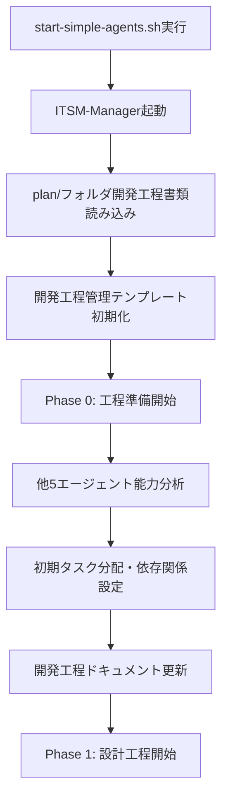

# 🔄 開発工程連携ワークフロー

## 🎯 概要

ITSM-Managerを中心とした6エージェント並列開発における工程駆動型ワークフローを定義します。plan/フォルダ内の開発工程書類に基づいた体系的な開発プロセス制御を実現します。

## 📋 工程駆動型開発フロー

### 1. 開発工程初期化プロセス



### 2. エージェント間連携制御

```yaml
# エージェント連携制御フロー
workflow:
  initialization:
    trigger: "start-simple-agents.sh実行"
    manager_actions:
      - "plan/開発工程書類分析"
      - "エージェント能力評価"
      - "初期タスクマッピング"
      - "工程管理テンプレート準備"
    
  phase_control:
    phase_transition_check:
      frequency: "30分毎"
      criteria:
        - "全必須タスク完了確認"
        - "品質基準クリア確認"
        - "次フェーズ前提条件満足"
        - "エスカレーション基準未達"
    
    agent_coordination:
      frequency: "15分毎"
      actions:
        - "進捗状況収集・分析"
        - "ボトルネック検出・解決"
        - "リソース再配分指示"
        - "品質メトリクス監視"
```

## 🤖 3. エージェント別連携パターン

### ITSM-Manager ↔ ITSM-CTO

```markdown
## 設計工程連携

### Manager → CTO
**Phase 1開始指示**:
```
@ITSM-CTO: Phase 1設計工程を開始してください。

参照ドキュメント:
- plan/24時間自動開発計画.md (Phase 1: 設計・準備)
- plan/開発プロセス.md (Phase 1詳細プロセス)

優先タスク:
1. システムアーキテクチャ設計（2時間以内）
2. API仕様定義（1時間以内）
3. セキュリティ設計（1時間以内）

完了基準:
- システム設計書作成完了
- API仕様書(OpenAPI)作成完了
- セキュリティ設計書作成完了

品質要求:
- ITSM/ITIL v4準拠
- ISO27001セキュリティ基準適合
- 実装可能性検証済み

報告方法: 各タスク完了時に成果物パスと品質確認結果を報告
```

### CTO → Manager
**設計完了報告**:
```
@ITSM-Manager: Phase 1 システム設計タスク完了報告

完了タスク:
✅ システムアーキテクチャ設計完了 (実行時間: 1.5時間)
✅ API仕様定義完了 (実行時間: 45分)
✅ セキュリティ設計完了 (実行時間: 50分)

成果物:
- docs/システム設計書.md (更新済み)
- docs/API仕様書.md (OpenAPI 3.0準拠)
- docs/セキュリティ設計.md (ISO27001準拠)

品質確認:
- ITSM準拠性: ✅ 確認済み
- 実装可能性: ✅ 技術的制約なし
- セキュリティ基準: ✅ ISO27001準拠

次フェーズ準備状況:
- DevAPI向けAPI仕様: ✅ 準備完了
- DevUI向けUI設計: ✅ 準備完了
- Tester向けテスト要件: ✅ 準備完了

Phase 2移行判定要求: 設計工程完了につき次フェーズ移行可否の判定を要求します。
```
```

### ITSM-Manager ↔ ITSM-DevAPI

```markdown
## 実装工程連携

### Manager → DevAPI
**Phase 2実装開始指示**:
```
@ITSM-DevAPI: Phase 2実装工程を開始してください。

前提条件確認:
✅ CTO設計完了確認済み
✅ API仕様書利用可能
✅ データベース設計確定

参照ドキュメント:
- docs/API仕様書.md (実装仕様)
- docs/データベース設計.md (DB設計)
- plan/開発プロセス.md (実装プロセス詳細)

優先実装順序:
1. インシデント管理API（3時間）
2. 問題管理API（2時間）
3. 変更管理API（2時間）
4. 認証・認可システム（1時間）

技術要件:
- FastAPI使用
- SQLAlchemy ORM
- PostgreSQL データベース
- Pydantic バリデーション

品質要求:
- 単体テストカバレッジ ≥ 80%
- OpenAPI仕様準拠
- セキュリティ基準適合
- パフォーマンス目標: API応答 < 200ms

連携必要事項:
- DevUIとのAPI契約調整
- TesterへのAPI仕様共有
- QAへの実装品質報告

中間報告: 各API実装完了時に報告
最終報告: 実装工程完了時に品質メトリクスと共に報告
```

### DevAPI → Manager
**実装進捗報告**:
```
@ITSM-Manager: Phase 2 API実装進捗報告 (中間報告)

進捗状況:
✅ インシデント管理API実装完了 (実行時間: 2.5時間)
🔄 問題管理API実装中 (進捗: 60%, 残り時間: 45分)
⏳ 変更管理API実装待機 (開始予定: 15:30)
⏳ 認証・認可システム実装待機 (開始予定: 17:30)

品質メトリクス:
- 実装済みAPIテストカバレッジ: 85%
- コード品質スコア: A (静的解析)
- API応答時間: 平均 150ms
- セキュリティスキャン: 0 issues

成果物:
- backend/app/api/v1/incidents.py (完成)
- backend/app/services/incident_service.py (完成)
- backend/tests/test_incidents.py (完成, 85%カバレッジ)

連携状況:
- DevUI: インシデント管理API仕様共有済み
- Tester: APIテスト仕様提供済み
- QA: インシデント管理機能レビュー依頼済み

課題・リスク:
- PostgreSQL接続設定でマイナー調整必要 (解決予定: 30分以内)
- 問題管理APIの複雑性が予想より高い (遅延リスク: 30分)

次のアクション:
1. 問題管理API実装継続・完了
2. 変更管理API実装開始
3. DevUIとのAPI統合テスト準備

支援要求: 現在自己解決可能範囲内、追加支援不要
```
```

### ITSM-Manager ↔ 複数エージェント

```markdown
## 統合工程連携

### Manager → All Agents
**Phase 4統合工程開始指示**:
```
@ALL-AGENTS: Phase 4統合工程を開始します。

統合工程概要:
- 開始時刻: 16:00
- 完了予定: 20:00
- 目標: 全成果物統合・品質確認・デプロイ準備完了

各エージェント統合タスク:

@ITSM-CTO:
- 全体アーキテクチャ統合性レビュー
- セキュリティ統合検証
- 技術的整合性最終確認

@ITSM-DevAPI:
- フロントエンドとのAPI統合テスト
- データベース最終マイグレーション
- パフォーマンス最適化

@ITSM-DevUI:
- バックエンドAPI統合確認
- 全画面統合テスト実行
- UX最終調整

@ITSM-QA:
- 統合品質チェック実行
- エンドツーエンド品質確認
- アクセシビリティ最終検証

@ITSM-Tester:
- 統合テストスイート実行
- システム全体E2Eテスト
- パフォーマンス・負荷テスト

統合品質基準:
- 統合テスト成功率 ≥ 95%
- E2Eテスト成功率 ≥ 90%
- パフォーマンス基準クリア
- セキュリティ基準クリア
- 全機能動作確認完了

連携ルール:
- 統合課題発見時は即座に関連エージェントに通知
- 解決困難な課題は30分以内にManagerへエスカレーション
- 2時間毎に統合進捗報告
- Phase 5移行判定は19:30実施予定

統合成功の定義:
全エージェント成果物が品質基準を満たし、システム全体として動作することを確認完了した状態
```

### All Agents → Manager
**統合工程完了報告**:
```
@ITSM-Manager: Phase 4統合工程完了報告 (全エージェント連名)

統合結果サマリー:
✅ 全成果物統合完了
✅ 品質基準クリア
✅ システム全体動作確認完了
✅ デプロイ準備完了

各エージェント最終報告:

🏗️ ITSM-CTO統合確認:
- アーキテクチャ統合性: ✅ 問題なし
- セキュリティ統合: ✅ ISO27001準拠確認
- 技術的整合性: ✅ 全コンポーネント適切

🔧 ITSM-DevAPI統合確認:
- API統合テスト: ✅ 100%成功
- DB統合: ✅ マイグレーション完了
- パフォーマンス: ✅ 目標値クリア (平均応答120ms)

💻 ITSM-DevUI統合確認:
- フロントエンド統合: ✅ 全画面動作確認
- API連携: ✅ 全エンドポイント正常
- UX最終調整: ✅ 完了

🔍 ITSM-QA統合確認:
- 統合品質: ✅ 全基準クリア
- E2E品質: ✅ 97%成功率
- アクセシビリティ: ✅ WCAG 2.1 AA準拠

🧪 ITSM-Tester統合確認:
- 統合テスト: ✅ 98%成功率
- E2Eテスト: ✅ 95%成功率
- 負荷テスト: ✅ 基準値クリア

最終品質メトリクス:
- 総合コードカバレッジ: 87%
- 統合テスト成功率: 98%
- E2Eテスト成功率: 95%
- パフォーマンス: 全基準クリア
- セキュリティ: 脆弱性ゼロ

Phase 5移行判定要求:
全エージェント合意により、Phase 5完了工程への移行準備完了を報告いたします。
デプロイ準備・最終調整フェーズへの移行承認を要求します。
```
```

## 📊 4. 工程管理監視ダッシュボード

### リアルタイム監視項目

```yaml
# ITSM-Manager監視ダッシュボード設定
monitoring_dashboard:
  update_frequency: "5分毎"
  
  phase_progress:
    current_phase: "Phase {X}"
    progress_percentage: "{XX}%"
    estimated_completion: "{時刻}"
    delay_status: "{正常/遅延/要注意}"
  
  agent_status:
    ITSM-CTO:
      current_task: "{現在のタスク}"
      progress: "{XX}%"
      health: "{正常/要注意/問題}"
      last_update: "{最終更新時刻}"
    
    ITSM-DevAPI:
      current_task: "{現在のタスク}"
      progress: "{XX}%"
      health: "{正常/要注意/問題}"
      last_update: "{最終更新時刻}"
    
    # 他エージェントも同様
  
  quality_metrics:
    code_coverage: "{XX}%"
    test_success_rate: "{XX}%"
    bug_density: "{XX} bugs/KLOC"
    security_score: "{スコア}"
  
  alerts:
    critical: []
    warning: []
    info: []
  
  next_actions:
    - action: "{次のアクション}"
      assignee: "{担当エージェント}"
      deadline: "{期限}"
```

## 🚨 5. エスカレーション・例外処理フロー

### 自動エスカレーション条件

```python
# エスカレーション自動判定ロジック
escalation_rules = {
    "phase_delay": {
        "condition": "現在時刻 > 予定完了時刻 + 1時間",
        "action": "プロセス調整・リソース再配分",
        "notification": "全エージェント + 緊急対応要求"
    },
    
    "quality_degradation": {
        "condition": "品質メトリクス < 基準値 for 30分間",
        "action": "品質改善緊急指示",
        "notification": "関連エージェント + 品質集中要求"
    },
    
    "agent_unresponsive": {
        "condition": "エージェント応答なし for 15分間",
        "action": "エージェント再起動・タスク再配分",
        "notification": "システム管理者 + 代替手段実行"
    },
    
    "critical_error": {
        "condition": "セキュリティ問題 or システム障害検出",
        "action": "開発一時停止・緊急対応",
        "notification": "全エージェント + 即座対応要求"
    }
}
```

## 🔄 6. 継続的改善プロセス

### プロセス学習・改善

```markdown
## 開発工程学習サイクル

### 学習データ収集
- 各Phase実行時間実績
- エージェント効率性メトリクス
- 品質問題発生パターン
- エスカレーション頻度・原因

### パターン分析
- 成功パターンの特定・抽出
- 失敗パターンの根本原因分析
- ボトルネック発生予測モデル
- 最適リソース配分パターン

### プロセス最適化
- 開発工程書類の更新・改善
- エージェント連携パターン最適化
- 品質基準・完了基準の調整
- テンプレート・ワークフロー改善

### 次回開発への適用
- 改善されたプロセス適用
- 予測モデルを使った計画立案
- エージェント能力向上反映
- 新たな課題・リスクへの対応準備
```

---

このワークフローにより、ITSM-Managerは開発工程書類に基づいた体系的な工程管理を実現し、6エージェントの並列開発を効率的に統括・制御します。各エージェントは明確な指示と連携ルールに従って作業し、全体として計画的で高品質な開発を達成します。