# 24時間自動開発計画

## 1. 開発計画概要

### 1.1 プロジェクト目標

ITSM（IT Service Management）準拠のIT運用管理システムを、6つのAIエージェントによる並列開発で24時間以内に構築する。各エージェントは専門領域を持ち、自律的に判断・実装を進めながら、相互に連携して統合的なシステムを完成させる。

### 1.2 成果物

- 完全に動作するITSMシステム（バックエンド + フロントエンド）
- 包括的なドキュメント一式
- 自動テストスイート
- CI/CDパイプライン
- 本番環境へのデプロイ準備完了状態

## 2. タイムライン（24時間）

### Phase 1: 設計・準備（0-4時間）

```mermaid
gantt
    title Phase 1: 設計・準備
    dateFormat HH:mm
    section CTO
    システム設計書作成    :00:00, 2h
    技術選定・アーキテクチャ決定    :02:00, 1h
    セキュリティ設計    :03:00, 1h
    
    section Manager
    プロジェクト計画策定    :00:00, 1h
    タスク分解・割当    :01:00, 1h
    リソース調整    :02:00, 2h
    
    section 全エージェント
    キックオフ・情報共有    :03:30, 30m
```



### Phase 2: 基盤構築（4-8時間）

```mermaid
gantt
    title Phase 2: 基盤構築
    dateFormat HH:mm
    section DevAPI
    DBスキーマ設計    :04:00, 1h
    基本APIフレームワーク    :05:00, 2h
    認証・認可実装    :07:00, 1h
    
    section DevUI
    プロジェクト初期設定    :04:00, 1h
    UIフレームワーク構築    :05:00, 2h
    共通コンポーネント    :07:00, 1h
    
    section Tester
    テスト環境構築    :04:00, 2h
    CI/CD基盤設定    :06:00, 2h
```



### Phase 3: 機能実装（8-16時間）


### Phase 4: 統合・テスト（16-20時間）


### Phase 5: 最終調整・デプロイ準備（20-24時間）


## 3. エージェント間の連携フロー

### 3.1 情報共有メカニズム

```yaml
communication_channels:
  - name: design_decisions
    participants: [CTO, DevAPI, DevUI]
    purpose: アーキテクチャ・設計決定事項の共有
    
  - name: api_contracts
    participants: [DevAPI, DevUI, Tester]
    purpose: API仕様・インターフェース定義
    
  - name: quality_feedback
    participants: [QA, DevAPI, DevUI]
    purpose: 品質改善フィードバック
    
  - name: test_results
    participants: [Tester, Manager, 全エージェント]
    purpose: テスト結果・品質メトリクス
    
  - name: progress_tracking
    participants: [Manager, 全エージェント]
    purpose: 進捗状況・ブロッカー共有
```

### 3.2 依存関係マトリックス

| タスク | 依存元 | 依存先 | クリティカルパス |
|--------|--------|--------|-----------------|
| API設計 | CTO設計書 | UI実装 | ○ |
| DB設計 | CTO設計書 | API実装 | ○ |
| 認証実装 | - | 全機能 | ○ |
| UI基盤 | - | 画面実装 | ○ |
| テスト環境 | - | 全テスト | ○ |

## 4. 自動化戦略

### 4.1 コード生成自動化

```python
# エージェントが使用するコード生成テンプレート
class CodeGenerator:
    def generate_api_endpoint(self, resource_name, operations):
        """RESTful APIエンドポイントの自動生成"""
        template = """
@router.{method}("/{resource}")
async def {operation}_{resource}(
    {params}
    db: Session = Depends(get_db),
    current_user: User = Depends(get_current_user)
):
    # 自動生成された{operation}処理
    return {resource}_service.{operation}({args})
"""
        return template.format(...)
    
    def generate_react_component(self, component_name, props):
        """Reactコンポーネントの自動生成"""
        template = """
const {component_name}: React.FC<{props_interface}> = ({{ {props} }}) => {{
    const [state, setState] = useState(initialState);
    
    useEffect(() => {{
        // 自動生成された初期化処理
    }}, []);
    
    return (
        <div className="{component_name}">
            {{/* 自動生成されたUI */}}
        </div>
    );
}};
"""
        return template.format(...)
```

### 4.2 テスト自動生成

```python
# テストケース自動生成
class TestGenerator:
    def generate_api_tests(self, api_spec):
        """OpenAPI仕様からテストケースを自動生成"""
        test_cases = []
        for endpoint in api_spec.endpoints:
            # 正常系テスト
            test_cases.append(self.generate_success_test(endpoint))
            # 異常系テスト
            test_cases.append(self.generate_error_test(endpoint))
            # 境界値テスト
            test_cases.append(self.generate_boundary_test(endpoint))
        return test_cases
    
    def generate_ui_tests(self, component_spec):
        """UIコンポーネントのE2Eテスト自動生成"""
        return self.playwright_test_generator(component_spec)
```

## 5. 品質保証戦略

### 5.1 継続的品質チェック

```yaml
quality_gates:
  - stage: commit
    checks:
      - linting
      - unit_tests
      - security_scan
    threshold: 100%
    
  - stage: integration
    checks:
      - api_tests
      - ui_tests
      - performance_baseline
    threshold: 95%
    
  - stage: deployment
    checks:
      - smoke_tests
      - security_audit
      - accessibility_check
    threshold: 100%
```

### 5.2 自動修復メカニズム

```python
class AutoHealing:
    def detect_and_fix_issues(self, test_results):
        """テスト失敗の自動修復"""
        for failure in test_results.failures:
            if self.is_known_pattern(failure):
                fix = self.get_fix_strategy(failure)
                self.apply_fix(fix)
                self.rerun_tests(failure.test_id)
            else:
                self.escalate_to_developer(failure)
    
    def common_fixes(self):
        return {
            'missing_import': self.add_import,
            'type_mismatch': self.fix_types,
            'null_reference': self.add_null_check,
            'api_contract_mismatch': self.sync_api_contract
        }
```

## 6. リスク管理

### 6.1 想定リスクと対策

| リスク | 確率 | 影響 | 対策 |
|--------|------|------|------|
| API/UI間の仕様不整合 | 高 | 大 | 継続的な契約テスト、自動同期 |
| パフォーマンス問題 | 中 | 大 | 早期性能テスト、自動最適化 |
| セキュリティ脆弱性 | 低 | 大 | 継続的セキュリティスキャン |
| 時間超過 | 中 | 中 | 機能優先順位付け、MVP定義 |
| エージェント間の競合 | 低 | 小 | ロック機構、バージョン管理 |

### 6.2 コンティンジェンシープラン

```python
class ContingencyManager:
    def evaluate_progress(self, current_hour):
        """進捗評価と調整"""
        if current_hour == 12:  # 中間チェックポイント
            completion_rate = self.calculate_completion()
            if completion_rate < 0.5:
                # スコープ調整
                self.adjust_scope_to_mvp()
                self.reallocate_resources()
        
        if current_hour == 20:  # 最終チェックポイント
            if not self.is_core_complete():
                # クリティカル機能に集中
                self.focus_on_critical_features()
```

## 7. 成功基準

### 7.1 必須要件（MVP）

- [ ] インシデント管理機能（作成・更新・検索）
- [ ] 基本的な認証・認可
- [ ] RESTful API（最低限のエンドポイント）
- [ ] Webインターフェース（基本画面）
- [ ] 基本的なテストカバレッジ（70%以上）
- [ ] ローカル環境での動作確認

### 7.2 追加要件（Nice to Have）

- [ ] 問題管理・変更管理機能
- [ ] 高度な検索・フィルタリング
- [ ] ダッシュボード・レポート機能
- [ ] リアルタイム通知
- [ ] モバイル対応
- [ ] 国際化対応

## 8. エージェント間のハンドオフ

### 8.1 成果物の引き継ぎ

```yaml
handoff_protocol:
  from_cto_to_dev:
    artifacts:
      - system_design.md
      - api_specification.yaml
      - database_schema.sql
    validation:
      - design_review_checklist
      - technical_feasibility_check
  
  from_dev_to_qa:
    artifacts:
      - source_code
      - unit_tests
      - api_documentation
    validation:
      - code_quality_metrics
      - test_coverage_report
  
  from_qa_to_dev:
    artifacts:
      - bug_reports
      - improvement_suggestions
      - ui_ux_feedback
    validation:
      - priority_classification
      - reproduction_steps
```

### 8.2 並列作業の調整

```python
class WorkCoordinator:
    def __init__(self):
        self.work_queue = PriorityQueue()
        self.locks = {}
        self.dependencies = DependencyGraph()
    
    def assign_task(self, agent, task):
        """タスクの割り当てと競合回避"""
        if self.can_work_on(agent, task):
            self.acquire_lock(task.resources)
            agent.start_task(task)
        else:
            self.work_queue.put((task.priority, task))
    
    def handle_completion(self, agent, task, artifacts):
        """タスク完了時の処理"""
        self.release_lock(task.resources)
        self.update_dependencies(task)
        self.notify_dependent_agents(task, artifacts)
        self.assign_next_task(agent)
```

## 9. 進捗モニタリング

### 9.1 メトリクス

```python
class ProgressMetrics:
    def __init__(self):
        self.metrics = {
            'lines_of_code': 0,
            'api_endpoints_completed': 0,
            'ui_components_completed': 0,
            'test_cases_written': 0,
            'test_pass_rate': 0.0,
            'code_coverage': 0.0,
            'tasks_completed': 0,
            'blockers': []
        }
    
    def update_dashboard(self):
        """リアルタイムダッシュボード更新"""
        return {
            'overall_progress': self.calculate_overall_progress(),
            'estimated_completion': self.estimate_completion_time(),
            'health_status': self.get_health_status(),
            'alerts': self.get_critical_alerts()
        }
```

### 9.2 アラート条件

| アラート | 条件 | アクション |
|----------|------|-----------|
| 進捗遅延 | 予定より2時間以上遅延 | リソース再配分 |
| 品質低下 | テスト成功率80%未満 | 開発一時停止、修正優先 |
| 依存関係ブロック | 30分以上の待機 | 代替案実行 |
| リソース不足 | CPU/メモリ90%超 | スケールアップ |

## 10. 最終成果物チェックリスト

### 10.1 コード成果物

- [ ] バックエンドAPIコード（Python/FastAPI）
- [ ] フロントエンドコード（React/TypeScript）
- [ ] データベーススキーマ・マイグレーション
- [ ] インフラストラクチャコード（Docker/K8s）
- [ ] CI/CDパイプライン設定

### 10.2 ドキュメント成果物

- [ ] システム設計書
- [ ] API仕様書（OpenAPI）
- [ ] データベース設計書
- [ ] 運用マニュアル
- [ ] デプロイメントガイド

### 10.3 テスト成果物

- [ ] 単体テストスイート
- [ ] 統合テストスイート
- [ ] E2Eテストシナリオ
- [ ] パフォーマンステスト結果
- [ ] セキュリティテスト結果

## 11. 振り返りと改善

### 11.1 自動振り返り

```python
class AutoRetrospective:
    def analyze_development_process(self):
        """開発プロセスの自動分析"""
        return {
            'bottlenecks': self.identify_bottlenecks(),
            'successful_patterns': self.find_success_patterns(),
            'improvement_areas': self.suggest_improvements(),
            'learned_patterns': self.extract_reusable_patterns()
        }
    
    def generate_knowledge_base(self):
        """次回開発のための知識ベース生成"""
        return {
            'code_templates': self.extract_templates(),
            'best_practices': self.identify_best_practices(),
            'anti_patterns': self.identify_anti_patterns(),
            'automation_opportunities': self.find_automation_targets()
        }
```

### 11.2 継続的改善サイクル

このプロジェクトで得られた知見は、次回以降の自動開発プロジェクトに活用され、より効率的で高品質な開発が可能となる。各エージェントは学習し、進化していく。