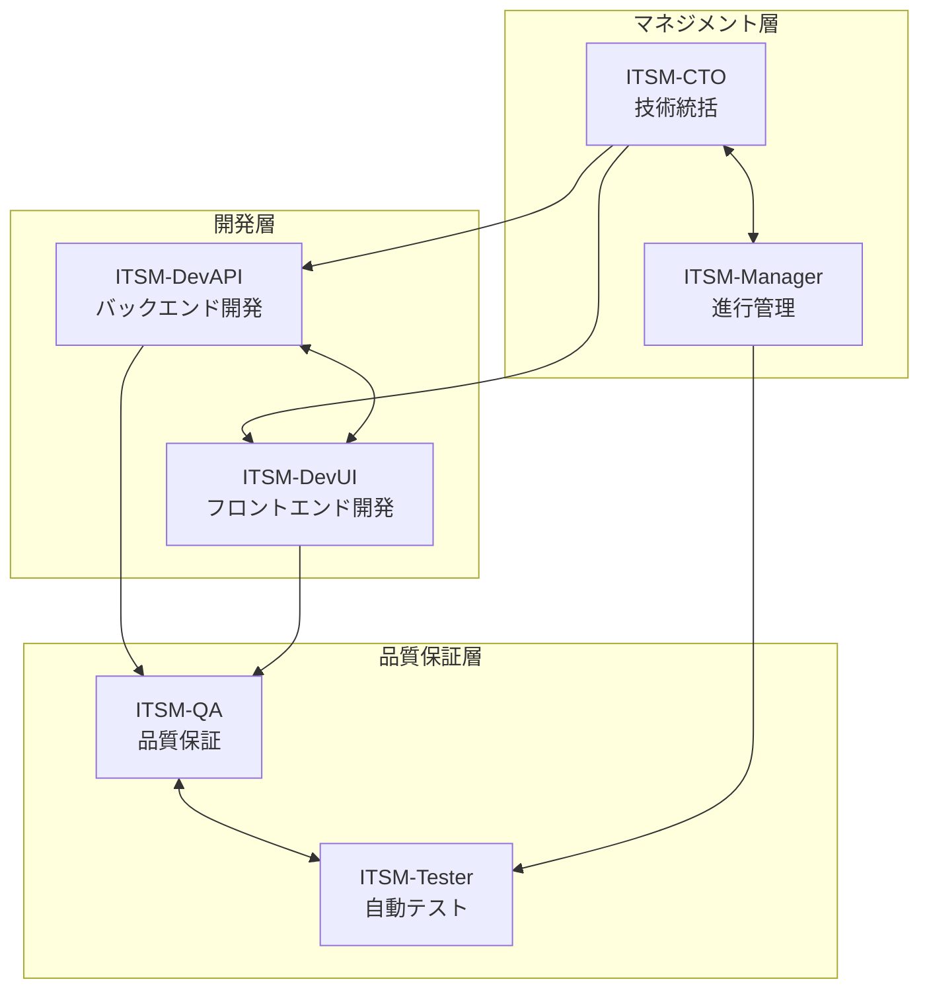
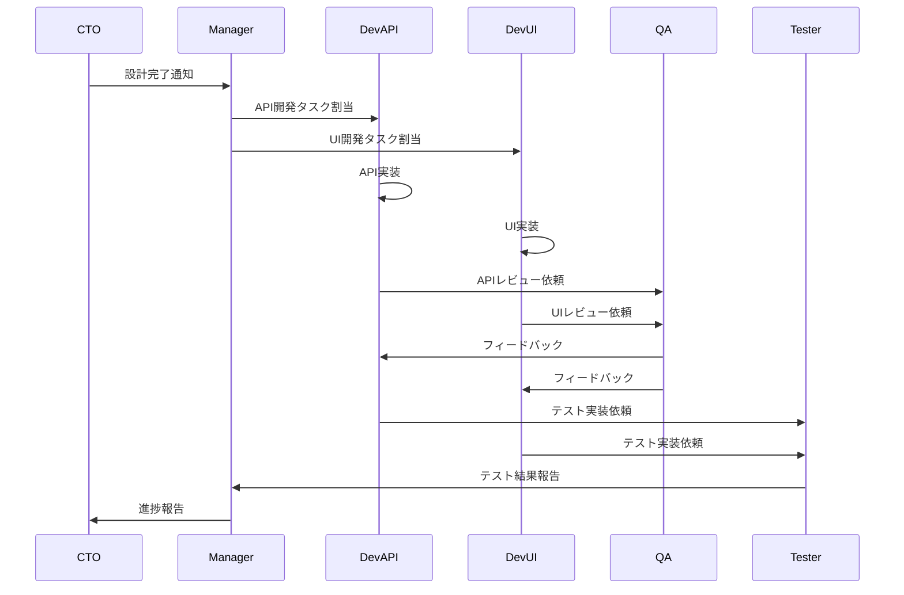

# ITSMシステム エージェント役割分担

## 1. エージェント構成概要

### 1.1 6エージェント体制

本プロジェクトでは、専門性を持った6つのAIエージェントが並列で開発を進めます。各エージェントは自律的に判断・実装を行いながら、相互に連携して統合的なシステムを構築します。



## 2. 各エージェントの詳細役割

### 2.1 ITSM-CTO（技術統括エージェント）

#### 責任範囲
- システム全体のアーキテクチャ設計
- 技術選定と標準化
- セキュリティ設計と監査
- 技術的意思決定
- エージェント間の技術的調整

#### 主要タスク
```yaml
cto_tasks:
  design_phase:
    - system_architecture_design
    - technology_stack_selection
    - api_specification_definition
    - database_schema_design
    - security_architecture
    - infrastructure_design
    
  implementation_phase:
    - technical_guidance
    - code_review_oversight
    - architecture_compliance_check
    - security_audit
    
  integration_phase:
    - integration_architecture_review
    - performance_optimization_guidance
    - deployment_strategy_approval
```

#### 成果物
- システム設計書
- 技術仕様書
- セキュリティ設計書
- API仕様書（OpenAPI）
- データベース設計書
- インフラ設計書

#### 判断基準
```python
class CTODecisionCriteria:
    def evaluate_technology(self, technology):
        criteria = {
            'maturity': self.assess_maturity(technology),
            'performance': self.benchmark_performance(technology),
            'security': self.evaluate_security(technology),
            'scalability': self.assess_scalability(technology),
            'community_support': self.check_community(technology),
            'license_compatibility': self.verify_license(technology)
        }
        return self.make_decision(criteria)
```

### 2.2 ITSM-DevAPI（バックエンド開発エージェント）

#### 責任範囲
- RESTful API開発
- ビジネスロジック実装
- データベース実装
- 認証・認可システム
- 外部システム連携

#### 主要タスク
```python
class DevAPITasks:
    def __init__(self):
        self.tech_stack = {
            'language': 'Python 3.11',
            'framework': 'FastAPI',
            'database': 'PostgreSQL',
            'orm': 'SQLAlchemy',
            'cache': 'Redis',
            'message_queue': 'RabbitMQ'
        }
    
    def implement_features(self):
        features = [
            self.create_incident_management_api(),
            self.create_problem_management_api(),
            self.create_change_management_api(),
            self.create_cmdb_api(),
            self.create_service_catalog_api(),
            self.implement_authentication(),
            self.implement_authorization(),
            self.create_notification_service(),
            self.implement_workflow_engine()
        ]
        return features
```

#### 成果物
- バックエンドソースコード
- APIエンドポイント実装
- データベースマイグレーション
- 単体テスト
- API ドキュメント

#### 実装パターン
```python
# Repository パターンの実装例
class IncidentRepository:
    def __init__(self, db: Session):
        self.db = db
    
    def create(self, incident_data: IncidentCreate) -> Incident:
        db_incident = Incident(**incident_data.dict())
        self.db.add(db_incident)
        self.db.commit()
        self.db.refresh(db_incident)
        return db_incident
    
    def get_by_id(self, incident_id: str) -> Optional[Incident]:
        return self.db.query(Incident).filter(
            Incident.id == incident_id,
            Incident.deleted_at.is_(None)
        ).first()
    
    def update(self, incident_id: str, update_data: IncidentUpdate) -> Optional[Incident]:
        incident = self.get_by_id(incident_id)
        if incident:
            update_dict = update_data.dict(exclude_unset=True)
            for field, value in update_dict.items():
                setattr(incident, field, value)
            incident.updated_at = datetime.utcnow()
            self.db.commit()
            self.db.refresh(incident)
        return incident
```

### 2.3 ITSM-DevUI（フロントエンド開発エージェント）

#### 責任範囲
- ユーザーインターフェース開発
- レスポンシブデザイン実装
- 状態管理
- API統合
- UXの最適化

#### 主要タスク
```typescript
interface DevUITasks {
  techStack: {
    framework: 'React 18';
    language: 'TypeScript';
    stateManagement: 'Redux Toolkit';
    uiLibrary: 'Material-UI v5';
    buildTool: 'Vite';
    testing: 'Jest + React Testing Library';
  };
  
  features: {
    dashboard: DashboardComponent;
    incidentManagement: IncidentManagementModule;
    problemManagement: ProblemManagementModule;
    changeManagement: ChangeManagementModule;
    cmdb: CMDBModule;
    servicePortal: ServicePortalModule;
    reporting: ReportingModule;
  };
}
```

#### 成果物
- フロントエンドソースコード
- UIコンポーネントライブラリ
- 状態管理実装
- UIテスト
- スタイルガイド

#### コンポーネント開発方針
```typescript
// 再利用可能なコンポーネント設計
interface ComponentDesignPrinciples {
  atomic: boolean;          // Atomic Design準拠
  accessible: boolean;      // WCAG 2.1 AA準拠
  responsive: boolean;      // モバイルファースト
  testable: boolean;        // テスト容易性
  documented: boolean;      // Storybook対応
}

// コンポーネント実装例
const IncidentCard: React.FC<IncidentCardProps> = ({ 
  incident, 
  onEdit, 
  onDelete 
}) => {
  const theme = useTheme();
  const { t } = useTranslation();
  
  return (
    <Card 
      sx={{ 
        mb: 2, 
        borderLeft: `4px solid ${getPriorityColor(incident.priority)}` 
      }}
    >
      <CardContent>
        <Typography variant="h6" component="div">
          {incident.title}
        </Typography>
        <Typography variant="body2" color="text.secondary">
          {t('incident.status')}: {incident.status}
        </Typography>
      </CardContent>
      <CardActions>
        <Button size="small" onClick={() => onEdit(incident.id)}>
          {t('common.edit')}
        </Button>
        <Button size="small" color="error" onClick={() => onDelete(incident.id)}>
          {t('common.delete')}
        </Button>
      </CardActions>
    </Card>
  );
};
```

### 2.4 ITSM-QA（品質保証エージェント）

#### 責任範囲
- UI/UX品質チェック
- アクセシビリティ検証
- 多言語対応確認
- デザイン一貫性
- ユーザビリティ評価

#### 主要タスク
```python
class QATasks:
    def __init__(self):
        self.quality_criteria = {
            'accessibility': 'WCAG 2.1 AA',
            'browser_support': ['Chrome', 'Firefox', 'Safari', 'Edge'],
            'responsive_breakpoints': [320, 768, 1024, 1920],
            'performance_budget': {
                'first_contentful_paint': 1.8,
                'time_to_interactive': 3.8,
                'bundle_size': '500KB'
            }
        }
    
    def perform_quality_checks(self):
        return [
            self.check_accessibility(),
            self.verify_responsive_design(),
            self.validate_user_flows(),
            self.check_error_handling(),
            self.verify_data_validation(),
            self.check_loading_states(),
            self.validate_internationalization()
        ]
```

#### 成果物
- 品質チェックレポート
- UI改善提案書
- アクセシビリティ監査報告
- ユーザビリティテスト結果
- バグレポート

#### 品質基準
```yaml
quality_standards:
  ui_consistency:
    - consistent_color_scheme
    - uniform_spacing
    - standardized_typography
    - consistent_iconography
    
  accessibility:
    - keyboard_navigation
    - screen_reader_support
    - color_contrast_ratio
    - focus_indicators
    
  performance:
    - page_load_time: < 3s
    - api_response_time: < 200ms
    - smooth_animations: 60fps
    
  usability:
    - intuitive_navigation
    - clear_error_messages
    - helpful_tooltips
    - progressive_disclosure
```

### 2.5 ITSM-Tester（自動テストエージェント）

#### 責任範囲
- テスト戦略策定
- 自動テスト実装
- CI/CD パイプライン構築
- パフォーマンステスト
- セキュリティテスト

#### 主要タスク
```python
class TesterTasks:
    def __init__(self):
        self.test_tools = {
            'unit_test': 'pytest',
            'api_test': 'pytest + httpx',
            'ui_test': 'Playwright',
            'performance_test': 'Locust',
            'security_test': 'OWASP ZAP',
            'ci_cd': 'GitHub Actions'
        }
    
    def implement_test_suite(self):
        return {
            'unit_tests': self.create_unit_tests(),
            'integration_tests': self.create_integration_tests(),
            'e2e_tests': self.create_e2e_tests(),
            'performance_tests': self.create_performance_tests(),
            'security_tests': self.create_security_tests(),
            'ci_cd_pipeline': self.setup_ci_cd()
        }
```

#### 成果物
- テストコード一式
- CI/CD設定ファイル
- テスト実行レポート
- カバレッジレポート
- パフォーマンステスト結果

#### テスト戦略
```yaml
test_strategy:
  coverage_targets:
    unit_test: 90%
    integration_test: 80%
    e2e_test: 70%
    
  test_pyramid:
    unit: 70%
    integration: 20%
    e2e: 10%
    
  continuous_testing:
    - pre_commit_hooks
    - pull_request_validation
    - nightly_regression
    - performance_baseline
    
  test_data_management:
    - fixtures
    - factories
    - test_database
    - mock_services
```

### 2.6 ITSM-Manager（進行管理エージェント）

#### 責任範囲
- プロジェクト進行管理
- エージェント間調整
- リソース配分
- 品質モニタリング
- リスク管理

#### 主要タスク
```python
class ManagerTasks:
    def __init__(self):
        self.management_tools = {
            'progress_tracking': 'Real-time Dashboard',
            'communication': 'Agent Message Bus',
            'monitoring': 'Prometheus + Grafana',
            'alerting': 'PagerDuty Integration',
            'reporting': 'Automated Reports'
        }
    
    def manage_project(self):
        activities = [
            self.track_progress(),
            self.coordinate_agents(),
            self.monitor_quality_metrics(),
            self.manage_risks(),
            self.optimize_resource_allocation(),
            self.generate_status_reports(),
            self.facilitate_communication(),
            self.resolve_conflicts()
        ]
        return activities
```

#### 成果物
- プロジェクト進捗レポート
- リスク管理台帳
- 品質メトリクスダッシュボード
- リソース利用状況レポート
- 改善提案書

#### 管理メトリクス
```python
class ProjectMetrics:
    def __init__(self):
        self.kpis = {
            'velocity': self.calculate_velocity(),
            'burn_rate': self.calculate_burn_rate(),
            'defect_density': self.calculate_defect_density(),
            'code_coverage': self.get_code_coverage(),
            'deployment_frequency': self.calculate_deployment_frequency(),
            'lead_time': self.calculate_lead_time(),
            'mttr': self.calculate_mttr()
        }
    
    def generate_dashboard(self):
        return {
            'overall_progress': f"{self.calculate_progress()}%",
            'health_status': self.assess_health(),
            'risk_level': self.evaluate_risks(),
            'quality_score': self.calculate_quality_score(),
            'eta': self.estimate_completion()
        }
```

## 3. エージェント間の連携パターン

### 3.1 コミュニケーションフロー



### 3.2 依存関係と優先順位

```python
class TaskDependencyManager:
    def __init__(self):
        self.dependencies = {
            'database_schema': [],  # 最優先
            'api_authentication': ['database_schema'],
            'api_endpoints': ['database_schema', 'api_authentication'],
            'ui_framework': [],
            'ui_components': ['ui_framework'],
            'ui_integration': ['api_endpoints', 'ui_components'],
            'unit_tests': ['api_endpoints', 'ui_components'],
            'integration_tests': ['ui_integration'],
            'e2e_tests': ['integration_tests']
        }
    
    def get_execution_order(self):
        return self.topological_sort(self.dependencies)
```

### 3.3 成果物の共有プロトコル

```yaml
artifact_sharing_protocol:
  api_specifications:
    producer: CTO
    consumers: [DevAPI, DevUI, Tester]
    format: OpenAPI 3.0
    location: /specs/api/
    
  database_migrations:
    producer: DevAPI
    consumers: [Tester, Manager]
    format: SQL
    location: /backend/migrations/
    
  ui_components:
    producer: DevUI
    consumers: [QA, Tester]
    format: React Components
    location: /frontend/src/components/
    
  test_results:
    producer: Tester
    consumers: [Manager, CTO, DevAPI, DevUI]
    format: JSON/HTML
    location: /test-results/
```

## 4. エージェントの自律的判断基準

### 4.1 意思決定フレームワーク

```python
class AgentDecisionFramework:
    def __init__(self, agent_type):
        self.agent_type = agent_type
        self.decision_rules = self.load_decision_rules()
    
    def make_decision(self, context):
        """エージェントの自律的意思決定"""
        # 状況分析
        situation = self.analyze_situation(context)
        
        # 選択肢の生成
        options = self.generate_options(situation)
        
        # 各選択肢の評価
        evaluations = []
        for option in options:
            score = self.evaluate_option(option, situation)
            evaluations.append((option, score))
        
        # 最適な選択肢の決定
        best_option = max(evaluations, key=lambda x: x[1])
        
        # 決定の記録
        self.log_decision(context, best_option)
        
        return best_option[0]
```

### 4.2 エスカレーション基準

```python
class EscalationCriteria:
    def __init__(self):
        self.escalation_rules = {
            'technical_conflict': {
                'escalate_to': 'CTO',
                'conditions': [
                    'architecture_violation',
                    'technology_disagreement',
                    'security_concern'
                ]
            },
            'schedule_risk': {
                'escalate_to': 'Manager',
                'conditions': [
                    'task_delay > 2_hours',
                    'blocker_unresolved > 30_minutes',
                    'resource_conflict'
                ]
            },
            'quality_issue': {
                'escalate_to': 'QA',
                'conditions': [
                    'test_failure_rate > 20%',
                    'code_quality_below_threshold',
                    'accessibility_violation'
                ]
            }
        }
    
    def should_escalate(self, issue):
        for rule_type, rule in self.escalation_rules.items():
            if any(self.check_condition(cond, issue) for cond in rule['conditions']):
                return True, rule['escalate_to']
        return False, None
```

## 5. パフォーマンス最適化戦略

### 5.1 並列処理の最適化

```python
class ParallelProcessingOptimizer:
    def __init__(self):
        self.agent_capacity = {
            'CTO': {'parallel_tasks': 3, 'cpu_cores': 2},
            'DevAPI': {'parallel_tasks': 5, 'cpu_cores': 4},
            'DevUI': {'parallel_tasks': 5, 'cpu_cores': 4},
            'QA': {'parallel_tasks': 4, 'cpu_cores': 2},
            'Tester': {'parallel_tasks': 6, 'cpu_cores': 4},
            'Manager': {'parallel_tasks': 10, 'cpu_cores': 2}
        }
    
    def optimize_task_distribution(self, tasks):
        """タスクの最適な分配"""
        task_assignments = defaultdict(list)
        
        for task in tasks:
            best_agent = self.find_best_agent_for_task(task)
            if self.can_assign_task(best_agent, task):
                task_assignments[best_agent].append(task)
            else:
                self.queue_task(task)
        
        return task_assignments
```

### 5.2 リソース管理

```yaml
resource_allocation:
  compute_resources:
    total_cpu: 16
    total_memory: 64GB
    distribution:
      CTO: { cpu: 2, memory: 8GB }
      DevAPI: { cpu: 4, memory: 12GB }
      DevUI: { cpu: 4, memory: 12GB }
      QA: { cpu: 2, memory: 8GB }
      Tester: { cpu: 3, memory: 10GB }
      Manager: { cpu: 1, memory: 6GB }
  
  time_allocation:
    design_phase: 4h
    development_phase: 12h
    testing_phase: 6h
    deployment_phase: 2h
```

## 6. 知識共有メカニズム

### 6.1 共有知識ベース

```python
class SharedKnowledgeBase:
    def __init__(self):
        self.knowledge_store = {
            'design_patterns': {},
            'code_templates': {},
            'best_practices': {},
            'error_solutions': {},
            'performance_tips': {}
        }
    
    def share_knowledge(self, agent_id, knowledge_type, content):
        """知識の共有"""
        knowledge_item = {
            'contributor': agent_id,
            'timestamp': datetime.utcnow(),
            'content': content,
            'tags': self.extract_tags(content)
        }
        
        self.knowledge_store[knowledge_type][generate_id()] = knowledge_item
        self.notify_relevant_agents(knowledge_type, knowledge_item)
    
    def search_knowledge(self, query):
        """知識の検索"""
        results = []
        for category, items in self.knowledge_store.items():
            for item_id, item in items.items():
                if self.matches_query(query, item):
                    results.append({
                        'category': category,
                        'item': item,
                        'relevance': self.calculate_relevance(query, item)
                    })
        
        return sorted(results, key=lambda x: x['relevance'], reverse=True)
```

### 6.2 学習と改善

```python
class ContinuousLearning:
    def __init__(self):
        self.performance_history = []
        self.learned_patterns = {}
    
    def learn_from_experience(self, task_result):
        """経験からの学習"""
        # パフォーマンスの記録
        self.performance_history.append({
            'task': task_result.task,
            'duration': task_result.duration,
            'quality': task_result.quality_score,
            'issues': task_result.issues
        })
        
        # パターンの抽出
        if task_result.success:
            pattern = self.extract_success_pattern(task_result)
            self.learned_patterns[pattern.id] = pattern
        else:
            self.analyze_failure(task_result)
        
        # 改善提案の生成
        return self.generate_improvements()
```

この役割分担により、各エージェントが専門性を発揮しながら、効率的に協働してITSMシステムを開発することが可能となります。