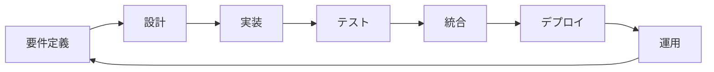

# ITSM システム 開発プロセス

## 1. 開発プロセス概要

### 1.1 開発手法

本プロジェクトでは、AIエージェントによる自律的な開発を実現するため、以下の手法を組み合わせた独自の開発プロセスを採用します。

- **並列アジャイル開発**: 6つのエージェントが同時並行で開発を進行
- **継続的統合・継続的デリバリー（CI/CD）**: 自動テスト・自動デプロイ
- **テスト駆動開発（TDD）**: テストファーストアプローチ
- **ドメイン駆動設計（DDD）**: ビジネスロジックの明確な分離

### 1.2 開発フェーズ



## 2. フェーズ別詳細プロセス

### 2.1 Phase 0: 環境準備（0-1時間）

#### 2.1.1 開発環境セットアップ

```yaml
environment_setup:
  infrastructure:
    - docker_compose_init
    - kubernetes_cluster_setup
    - ci_cd_pipeline_config
  
  repositories:
    - backend_repo_init
    - frontend_repo_init
    - infrastructure_repo_init
  
  tools:
    - ide_configuration
    - linter_setup
    - test_framework_init
    - monitoring_tools_setup
```

#### 2.1.2 エージェント初期化

```python
class AgentInitializer:
    def initialize_agents(self):
        agents = {
            'cto': CTOAgent(
                capabilities=['architecture', 'security', 'design'],
                priorities=['system_design', 'technical_decisions']
            ),
            'devapi': DevAPIAgent(
                capabilities=['backend', 'api', 'database'],
                tech_stack=['python', 'fastapi', 'postgresql']
            ),
            'devui': DevUIAgent(
                capabilities=['frontend', 'ui', 'ux'],
                tech_stack=['react', 'typescript', 'material-ui']
            ),
            'qa': QAAgent(
                capabilities=['quality', 'testing', 'validation'],
                focus=['accessibility', 'usability', 'consistency']
            ),
            'tester': TesterAgent(
                capabilities=['automation', 'testing', 'ci'],
                tools=['pytest', 'playwright', 'jest']
            ),
            'manager': ManagerAgent(
                capabilities=['coordination', 'monitoring', 'management'],
                responsibilities=['progress', 'quality', 'delivery']
            )
        }
        return agents
```

### 2.2 Phase 1: 設計フェーズ（1-4時間）

#### 2.2.1 システム設計プロセス

```python
class DesignProcess:
    def execute_design_phase(self):
        # CTOエージェントが主導
        tasks = [
            self.create_system_architecture(),
            self.define_api_specifications(),
            self.design_database_schema(),
            self.create_security_design(),
            self.define_ui_wireframes()
        ]
        
        # 並列実行
        results = parallel_execute(tasks)
        
        # 設計レビュー
        self.conduct_design_review(results)
        
        return self.generate_design_artifacts()
    
    def create_system_architecture(self):
        return {
            'microservices': self.define_services(),
            'communication': self.define_service_mesh(),
            'data_flow': self.design_data_flow(),
            'deployment': self.design_deployment_architecture()
        }
```

#### 2.2.2 API設計

```yaml
# OpenAPI仕様書生成
openapi: 3.0.0
info:
  title: ITSM System API
  version: 1.0.0
  
paths:
  /api/v1/incidents:
    get:
      summary: Get incidents list
      parameters:
        - $ref: '#/components/parameters/pagination'
        - $ref: '#/components/parameters/filtering'
      responses:
        200:
          $ref: '#/components/responses/IncidentList'
    
    post:
      summary: Create new incident
      requestBody:
        $ref: '#/components/requestBodies/IncidentCreate'
      responses:
        201:
          $ref: '#/components/responses/IncidentCreated'
```

### 2.3 Phase 2: 実装フェーズ（4-16時間）

#### 2.3.1 並列開発フロー

```python
class ParallelDevelopment:
    def __init__(self):
        self.task_queue = TaskQueue()
        self.artifact_store = ArtifactStore()
        self.integration_bus = IntegrationBus()
    
    def execute_development(self):
        # タスク分配
        api_tasks = self.create_api_tasks()
        ui_tasks = self.create_ui_tasks()
        test_tasks = self.create_test_tasks()
        
        # エージェントへの割り当て
        self.assign_to_agent('devapi', api_tasks)
        self.assign_to_agent('devui', ui_tasks)
        self.assign_to_agent('tester', test_tasks)
        
        # 継続的統合
        while not self.all_tasks_completed():
            completed_tasks = self.get_completed_tasks()
            self.integrate_artifacts(completed_tasks)
            self.run_integration_tests()
            self.update_progress()
```

#### 2.3.2 コード生成戦略

```python
class CodeGenerationStrategy:
    def generate_api_service(self, entity_name, operations):
        """サービスクラスの自動生成"""
        template = f"""
from typing import List, Optional
from sqlalchemy.orm import Session
from app.models.{entity_name.lower()} import {entity_name}
from app.schemas.{entity_name.lower()} import {entity_name}Create, {entity_name}Update

class {entity_name}Service:
    def __init__(self, db: Session):
        self.db = db
    
    def get_all(self, skip: int = 0, limit: int = 100) -> List[{entity_name}]:
        return self.db.query({entity_name}).offset(skip).limit(limit).all()
    
    def get_by_id(self, id: str) -> Optional[{entity_name}]:
        return self.db.query({entity_name}).filter({entity_name}.id == id).first()
    
    def create(self, data: {entity_name}Create) -> {entity_name}:
        db_obj = {entity_name}(**data.dict())
        self.db.add(db_obj)
        self.db.commit()
        self.db.refresh(db_obj)
        return db_obj
    
    def update(self, id: str, data: {entity_name}Update) -> Optional[{entity_name}]:
        db_obj = self.get_by_id(id)
        if db_obj:
            update_data = data.dict(exclude_unset=True)
            for field, value in update_data.items():
                setattr(db_obj, field, value)
            self.db.commit()
            self.db.refresh(db_obj)
        return db_obj
"""
        return template
```

#### 2.3.3 UI コンポーネント開発

```typescript
// 自動生成されるReactコンポーネント
interface ComponentGeneratorConfig {
  name: string;
  props: PropDefinition[];
  state: StateDefinition[];
  hooks: HookDefinition[];
}

class UIComponentGenerator {
  generateComponent(config: ComponentGeneratorConfig): string {
    return `
import React, { useState, useEffect } from 'react';
import { 
  Box, 
  Paper, 
  Typography, 
  Button,
  TextField,
  Alert
} from '@mui/material';
import { use${config.name}Hook } from '@/hooks/use${config.name}';

interface ${config.name}Props {
  ${config.props.map(p => `${p.name}: ${p.type};`).join('\n  ')}
}

export const ${config.name}: React.FC<${config.name}Props> = (props) => {
  ${config.state.map(s => `const [${s.name}, set${capitalize(s.name)}] = useState<${s.type}>(${s.initial});`).join('\n  ')}
  
  const {
    data,
    loading,
    error,
    refetch
  } = use${config.name}Hook(props);

  useEffect(() => {
    // 初期化処理
  }, []);

  if (loading) return <LoadingSpinner />;
  if (error) return <ErrorAlert error={error} />;

  return (
    <Paper sx={{ p: 3 }}>
      <Typography variant="h5" gutterBottom>
        ${config.name}
      </Typography>
      {/* 自動生成されたUIコンポーネント */}
    </Paper>
  );
};
`;
  }
}
```

### 2.4 Phase 3: テストフェーズ（並行実施）

#### 2.4.1 テスト戦略

```python
class TestStrategy:
    def __init__(self):
        self.test_levels = {
            'unit': UnitTestRunner(),
            'integration': IntegrationTestRunner(),
            'e2e': E2ETestRunner(),
            'performance': PerformanceTestRunner(),
            'security': SecurityTestRunner()
        }
    
    def execute_test_suite(self):
        """包括的なテスト実行"""
        results = {}
        
        # 並列テスト実行
        with ThreadPoolExecutor(max_workers=5) as executor:
            futures = {
                executor.submit(runner.run): level 
                for level, runner in self.test_levels.items()
            }
            
            for future in as_completed(futures):
                level = futures[future]
                results[level] = future.result()
        
        return self.analyze_results(results)
```

#### 2.4.2 自動テスト生成

```python
class AutoTestGenerator:
    def generate_api_tests(self, endpoint_spec):
        """APIエンドポイントのテスト自動生成"""
        test_template = f"""
import pytest
from fastapi.testclient import TestClient
from app.main import app

client = TestClient(app)

class Test{endpoint_spec.resource}API:
    def test_get_all_{endpoint_spec.resource}(self):
        response = client.get("{endpoint_spec.path}")
        assert response.status_code == 200
        assert isinstance(response.json(), list)
    
    def test_create_{endpoint_spec.resource}(self):
        payload = {self.generate_test_payload(endpoint_spec)}
        response = client.post("{endpoint_spec.path}", json=payload)
        assert response.status_code == 201
        assert response.json()["id"] is not None
    
    def test_get_{endpoint_spec.resource}_by_id(self):
        # 先にデータを作成
        create_response = client.post("{endpoint_spec.path}", json={self.generate_test_payload(endpoint_spec)})
        resource_id = create_response.json()["id"]
        
        # 取得テスト
        response = client.get(f"{endpoint_spec.path}/{resource_id}")
        assert response.status_code == 200
        assert response.json()["id"] == resource_id
    
    def test_update_{endpoint_spec.resource}(self):
        # データ作成
        create_response = client.post("{endpoint_spec.path}", json={self.generate_test_payload(endpoint_spec)})
        resource_id = create_response.json()["id"]
        
        # 更新テスト
        update_payload = {self.generate_update_payload(endpoint_spec)}
        response = client.patch(f"{endpoint_spec.path}/{resource_id}", json=update_payload)
        assert response.status_code == 200
    
    def test_delete_{endpoint_spec.resource}(self):
        # データ作成
        create_response = client.post("{endpoint_spec.path}", json={self.generate_test_payload(endpoint_spec)})
        resource_id = create_response.json()["id"]
        
        # 削除テスト
        response = client.delete(f"{endpoint_spec.path}/{resource_id}")
        assert response.status_code == 204
"""
        return test_template
```

### 2.5 Phase 4: 統合フェーズ（16-20時間）

#### 2.5.1 継続的統合プロセス

```yaml
# GitHub Actions CI/CD設定
name: Continuous Integration

on:
  push:
    branches: [main, develop]
  pull_request:
    branches: [main]

jobs:
  backend-tests:
    runs-on: ubuntu-latest
    steps:
      - uses: actions/checkout@v3
      
      - name: Set up Python
        uses: actions/setup-python@v4
        with:
          python-version: '3.11'
      
      - name: Install dependencies
        run: |
          pip install -r backend/requirements.txt
          pip install -r backend/requirements-dev.txt
      
      - name: Run linting
        run: |
          cd backend
          black --check .
          isort --check-only .
          flake8 .
          mypy .
      
      - name: Run tests
        run: |
          cd backend
          pytest --cov=app --cov-report=xml
      
      - name: Upload coverage
        uses: codecov/codecov-action@v3

  frontend-tests:
    runs-on: ubuntu-latest
    steps:
      - uses: actions/checkout@v3
      
      - name: Setup Node.js
        uses: actions/setup-node@v3
        with:
          node-version: '18'
      
      - name: Install dependencies
        run: |
          cd frontend
          npm ci
      
      - name: Run linting
        run: |
          cd frontend
          npm run lint
      
      - name: Run tests
        run: |
          cd frontend
          npm test -- --coverage
      
      - name: Build
        run: |
          cd frontend
          npm run build

  integration-tests:
    needs: [backend-tests, frontend-tests]
    runs-on: ubuntu-latest
    steps:
      - uses: actions/checkout@v3
      
      - name: Start services
        run: |
          docker-compose up -d
          ./scripts/wait-for-services.sh
      
      - name: Run E2E tests
        run: |
          npm run test:e2e
```

#### 2.5.2 自動マージ戦略

```python
class AutoMergeStrategy:
    def __init__(self):
        self.conflict_resolver = ConflictResolver()
        self.test_runner = TestRunner()
        self.quality_gate = QualityGate()
    
    def merge_feature_branch(self, feature_branch, target_branch='develop'):
        """フィーチャーブランチの自動マージ"""
        # 1. 最新の変更を取得
        self.git_fetch()
        
        # 2. マージ可能性チェック
        if not self.can_merge(feature_branch, target_branch):
            conflicts = self.detect_conflicts(feature_branch, target_branch)
            resolved = self.conflict_resolver.auto_resolve(conflicts)
            
            if not resolved:
                return self.escalate_to_human(conflicts)
        
        # 3. テスト実行
        test_results = self.test_runner.run_all_tests()
        
        # 4. 品質ゲートチェック
        if not self.quality_gate.passes(test_results):
            return self.create_fix_tasks(test_results)
        
        # 5. マージ実行
        self.execute_merge(feature_branch, target_branch)
        
        # 6. 後処理
        self.cleanup_branch(feature_branch)
        self.notify_team(f"Successfully merged {feature_branch}")
```

### 2.6 Phase 5: デプロイフェーズ（20-24時間）

#### 2.6.1 自動デプロイメントプロセス

```python
class AutoDeployment:
    def __init__(self):
        self.environments = ['development', 'staging', 'production']
        self.health_checker = HealthChecker()
        self.rollback_manager = RollbackManager()
    
    def deploy_to_environment(self, env, version):
        """環境へのデプロイ実行"""
        deployment_steps = [
            self.validate_deployment_package(version),
            self.backup_current_state(env),
            self.prepare_environment(env),
            self.deploy_database_migrations(env),
            self.deploy_backend_services(env, version),
            self.deploy_frontend_assets(env, version),
            self.update_load_balancer(env),
            self.run_smoke_tests(env),
            self.monitor_deployment(env)
        ]
        
        for step in deployment_steps:
            result = step()
            if not result.success:
                self.rollback_manager.rollback(env, result.failed_at)
                raise DeploymentError(f"Deployment failed at {result.failed_at}")
        
        return self.finalize_deployment(env, version)
```

#### 2.6.2 Blue-Green デプロイメント

```yaml
# Kubernetes Blue-Green Deployment
apiVersion: v1
kind: Service
metadata:
  name: itsm-backend
spec:
  selector:
    app: itsm-backend
    version: green  # 現在のアクティブバージョン
  ports:
    - port: 80
      targetPort: 8000

---
# Blue環境（現在のバージョン）
apiVersion: apps/v1
kind: Deployment
metadata:
  name: itsm-backend-blue
spec:
  replicas: 3
  selector:
    matchLabels:
      app: itsm-backend
      version: blue
  template:
    metadata:
      labels:
        app: itsm-backend
        version: blue
    spec:
      containers:
      - name: backend
        image: itsm/backend:v1.0.0
        
---
# Green環境（新バージョン）
apiVersion: apps/v1
kind: Deployment
metadata:
  name: itsm-backend-green
spec:
  replicas: 3
  selector:
    matchLabels:
      app: itsm-backend
      version: green
  template:
    metadata:
      labels:
        app: itsm-backend
        version: green
    spec:
      containers:
      - name: backend
        image: itsm/backend:v1.1.0
```

## 3. 品質管理プロセス

### 3.1 品質メトリクス

```python
class QualityMetrics:
    def __init__(self):
        self.metrics = {
            'code_coverage': 80,  # 最小カバレッジ率
            'cyclomatic_complexity': 10,  # 最大複雑度
            'duplication_ratio': 5,  # 最大重複率（%）
            'security_score': 'A',  # 最低セキュリティスコア
            'performance_baseline': {
                'api_response_time': 200,  # ms
                'page_load_time': 2000,  # ms
                'database_query_time': 50  # ms
            }
        }
    
    def evaluate_code_quality(self, codebase):
        """コード品質の評価"""
        results = {
            'coverage': self.measure_coverage(codebase),
            'complexity': self.analyze_complexity(codebase),
            'duplication': self.check_duplication(codebase),
            'security': self.scan_security(codebase),
            'performance': self.benchmark_performance(codebase)
        }
        
        return self.generate_quality_report(results)
```

### 3.2 コードレビュー自動化

```python
class AutoCodeReview:
    def __init__(self):
        self.review_rules = self.load_review_rules()
        self.ai_reviewer = AICodeReviewer()
    
    def review_pull_request(self, pr):
        """プルリクエストの自動レビュー"""
        review_results = {
            'style_issues': self.check_code_style(pr),
            'best_practices': self.check_best_practices(pr),
            'security_issues': self.check_security(pr),
            'performance_issues': self.check_performance(pr),
            'test_coverage': self.check_test_coverage(pr),
            'documentation': self.check_documentation(pr)
        }
        
        # AI による追加レビュー
        ai_feedback = self.ai_reviewer.review(pr)
        review_results['ai_suggestions'] = ai_feedback
        
        return self.format_review_comments(review_results)
```

## 4. 継続的改善プロセス

### 4.1 フィードバックループ

```python
class ContinuousImprovement:
    def __init__(self):
        self.metrics_collector = MetricsCollector()
        self.analyzer = PatternAnalyzer()
        self.optimizer = ProcessOptimizer()
    
    def improvement_cycle(self):
        """継続的改善サイクル"""
        while True:
            # メトリクス収集
            metrics = self.metrics_collector.collect_all()
            
            # パターン分析
            patterns = self.analyzer.analyze_patterns(metrics)
            
            # 改善点の特定
            improvements = self.identify_improvements(patterns)
            
            # 改善の実装
            for improvement in improvements:
                self.implement_improvement(improvement)
                self.measure_impact(improvement)
            
            # 学習と調整
            self.update_knowledge_base(improvements)
            
            time.sleep(3600)  # 1時間ごとに実行
```

### 4.2 ナレッジ管理

```python
class KnowledgeManagement:
    def __init__(self):
        self.knowledge_base = KnowledgeBase()
        self.pattern_library = PatternLibrary()
    
    def capture_knowledge(self, project_phase, outcomes):
        """プロジェクトからの知識抽出"""
        knowledge_items = {
            'successful_patterns': self.extract_success_patterns(outcomes),
            'failure_patterns': self.extract_failure_patterns(outcomes),
            'best_practices': self.identify_best_practices(outcomes),
            'reusable_components': self.catalog_reusable_components(outcomes),
            'optimization_opportunities': self.find_optimizations(outcomes)
        }
        
        # 知識ベースに保存
        for category, items in knowledge_items.items():
            self.knowledge_base.store(category, items)
        
        # パターンライブラリの更新
        self.pattern_library.update(knowledge_items)
        
        return self.generate_lessons_learned(knowledge_items)
```

## 5. エージェント協調プロトコル

### 5.1 通信プロトコル

```python
class AgentCommunicationProtocol:
    def __init__(self):
        self.message_bus = MessageBus()
        self.event_store = EventStore()
    
    def send_message(self, from_agent, to_agent, message_type, payload):
        """エージェント間メッセージ送信"""
        message = {
            'id': generate_uuid(),
            'from': from_agent,
            'to': to_agent,
            'type': message_type,
            'payload': payload,
            'timestamp': datetime.utcnow(),
            'correlation_id': self.get_correlation_id()
        }
        
        # メッセージの送信
        self.message_bus.publish(message)
        
        # イベントの記録
        self.event_store.record(message)
        
        return message['id']
    
    def handle_message(self, agent, message):
        """メッセージ処理"""
        handlers = {
            'task_assignment': agent.handle_task_assignment,
            'status_update': agent.handle_status_update,
            'artifact_ready': agent.handle_artifact_ready,
            'review_request': agent.handle_review_request,
            'help_needed': agent.handle_help_request
        }
        
        handler = handlers.get(message['type'])
        if handler:
            return handler(message['payload'])
        else:
            return agent.handle_unknown_message(message)
```

### 5.2 成果物管理

```python
class ArtifactManagement:
    def __init__(self):
        self.artifact_store = ArtifactStore()
        self.version_control = VersionControl()
    
    def store_artifact(self, artifact_type, content, metadata):
        """成果物の保存"""
        artifact = {
            'id': generate_uuid(),
            'type': artifact_type,
            'content': content,
            'metadata': metadata,
            'version': self.version_control.next_version(artifact_type),
            'created_by': metadata['agent_id'],
            'created_at': datetime.utcnow(),
            'checksum': self.calculate_checksum(content)
        }
        
        # バージョン管理
        self.version_control.commit(artifact)
        
        # ストレージに保存
        self.artifact_store.save(artifact)
        
        # 他のエージェントに通知
        self.notify_artifact_ready(artifact)
        
        return artifact['id']
```

## 6. エラーハンドリングと復旧

### 6.1 エラー処理戦略

```python
class ErrorHandlingStrategy:
    def __init__(self):
        self.error_patterns = self.load_error_patterns()
        self.recovery_strategies = self.load_recovery_strategies()
    
    def handle_error(self, error, context):
        """エラーの処理と復旧"""
        error_type = self.classify_error(error)
        
        # 既知のエラーパターンか確認
        if error_type in self.error_patterns:
            recovery_strategy = self.recovery_strategies[error_type]
            return self.apply_recovery_strategy(recovery_strategy, context)
        
        # 未知のエラーの場合
        self.log_unknown_error(error, context)
        self.escalate_to_human(error, context)
        
        # 学習のためパターンを記録
        self.record_new_error_pattern(error, context)
        
        return self.apply_fallback_strategy(context)
```

### 6.2 自己修復メカニズム

```python
class SelfHealingSystem:
    def __init__(self):
        self.health_monitor = HealthMonitor()
        self.healing_actions = HealingActions()
    
    def monitor_and_heal(self):
        """システムの自己修復"""
        while True:
            health_status = self.health_monitor.check_system_health()
            
            for issue in health_status.issues:
                if self.can_self_heal(issue):
                    healing_action = self.determine_healing_action(issue)
                    result = self.healing_actions.execute(healing_action)
                    
                    if result.success:
                        self.log_healing_success(issue, healing_action)
                    else:
                        self.escalate_issue(issue)
                else:
                    self.alert_operations_team(issue)
            
            time.sleep(30)  # 30秒ごとにチェック
```

## 7. プロジェクト完了基準

### 7.1 完了チェックリスト

```python
class CompletionCriteria:
    def __init__(self):
        self.criteria = {
            'functional_requirements': [
                'all_user_stories_implemented',
                'acceptance_criteria_met',
                'integration_complete'
            ],
            'quality_requirements': [
                'code_coverage_above_80',
                'no_critical_bugs',
                'performance_targets_met',
                'security_scan_passed'
            ],
            'documentation': [
                'api_documentation_complete',
                'user_manual_created',
                'deployment_guide_ready',
                'architecture_documented'
            ],
            'operational_readiness': [
                'monitoring_configured',
                'alerts_setup',
                'backup_tested',
                'disaster_recovery_tested'
            ]
        }
    
    def evaluate_completion(self):
        """プロジェクト完了度の評価"""
        results = {}
        
        for category, items in self.criteria.items():
            category_results = []
            for item in items:
                check_method = getattr(self, f'check_{item}', None)
                if check_method:
                    result = check_method()
                    category_results.append({
                        'item': item,
                        'passed': result.passed,
                        'details': result.details
                    })
            
            results[category] = {
                'items': category_results,
                'completion_rate': self.calculate_completion_rate(category_results)
            }
        
        return self.generate_completion_report(results)
```

このプロセスに従うことで、6つのAIエージェントが効率的に協働し、24時間以内に高品質なITSMシステムを開発することが可能となります。