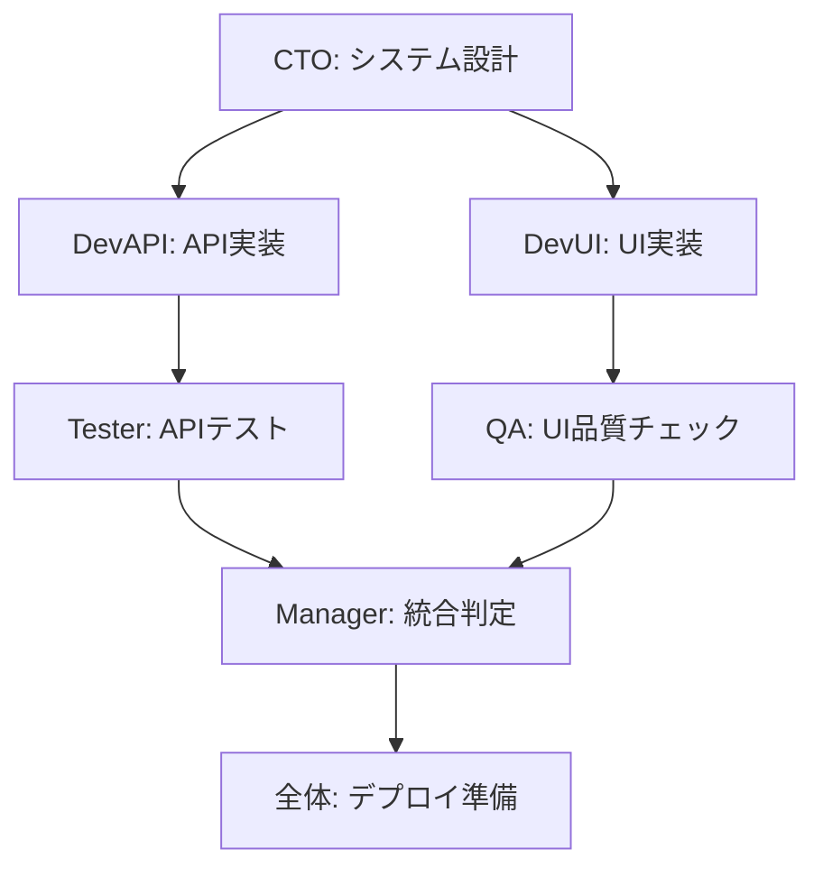

# 📋 開発工程管理テンプレート

## 🎯 概要

ITSM-Managerが使用する開発工程管理のためのテンプレート集です。各開発フェーズの管理、エージェント間調整、進捗追跡に使用します。

## 📊 1. 工程進捗管理テンプレート

### Phase 進捗レポート

```markdown
# Phase {X}: {フェーズ名} - 進捗レポート

**開始時刻**: {開始時刻}  
**現在時刻**: {現在時刻}  
**予定完了**: {予定完了時刻}  
**進捗率**: {XX}%

## ✅ 完了済みタスク
- [ ] {タスク名} ({担当エージェント} - 完了時刻: {時刻})
- [ ] {タスク名} ({担当エージェント} - 完了時刻: {時刻})

## 🔄 進行中タスク
- [ ] {タスク名} ({担当エージェント} - 進捗: {XX}% - 予定完了: {時刻})
- [ ] {タスク名} ({担当エージェント} - 進捗: {XX}% - 予定完了: {時刻})

## ⏳ 待機中タスク
- [ ] {タスク名} ({担当エージェント} - 依存: {依存タスク})
- [ ] {タスク名} ({担当エージェント} - 開始予定: {時刻})

## ⚠️ 課題・リスク
- **{課題名}**: {詳細} (影響度: {高/中/低}, 対策: {対策内容})
- **{リスク名}**: {詳細} (発生確率: {高/中/低}, 回避策: {回避策})

## 📈 品質メトリクス
- コードカバレッジ: {XX}%
- テスト成功率: {XX}%
- バグ密度: {XX} 件/KLOC
- 品質基準適合率: {XX}%

## 🎯 次のアクション
1. {アクション1} - 担当: {エージェント} - 期限: {時刻}
2. {アクション2} - 担当: {エージェント} - 期限: {時刻}
3. {アクション3} - 担当: {エージェント} - 期限: {時刻}

## 🔄 Phase移行判定
- [ ] 全必須タスク完了
- [ ] 品質基準クリア
- [ ] 次Phaseの前提条件満足
- [ ] リスク要因解決済み

**Phase移行判定**: {可/不可} - 理由: {理由}
```

## 🤖 2. エージェント指示テンプレート

### 標準指示形式

```markdown
@{エージェント名}: 

**Phase**: {現在のPhase}
**優先度**: {高/中/低}
**期限**: {完了期限}

**指示内容**:
{具体的な作業内容・要求事項}

**完了基準**:
- [ ] {基準1}
- [ ] {基準2}
- [ ] {基準3}

**注意事項**:
- {注意点1}
- {注意点2}

**依存関係**:
- 前提: {前提となるタスク・成果物}
- 後続: {この作業完了後に開始されるタスク}

**成果物**:
- {期待される成果物1}
- {期待される成果物2}

**報告方法**:
完了時は以下の形式で報告してください：
"@ITSM-Manager: {タスク名}完了。成果物: {成果物リスト}。品質確認: {品質チェック結果}。次のタスクへの準備: {準備状況}。"
```

### 緊急対応指示

```markdown
🚨 **緊急対応要請** 🚨

@{エージェント名}:

**緊急度**: 最高
**対応期限**: {緊急期限}
**問題**: {発生している問題}

**即座に実行**:
1. {緊急対応1}
2. {緊急対応2}
3. {緊急対応3}

**報告**: 30分以内に進捗報告
**エスカレーション**: 解決不能な場合は即座にエスカレーション

**他エージェントへの影響**:
- {影響するエージェント}: {影響内容と対応}
```

## 📅 3. タスクスケジューリングテンプレート

### 並列タスク計画

```yaml
# 並列タスクスケジュール
phase: "Phase {X}"
start_time: "{開始時刻}"
end_time: "{終了時刻}"

parallel_tracks:
  track_1:
    agent: "ITSM-CTO"
    tasks:
      - name: "{タスク名}"
        duration: "{所要時間}"
        dependencies: []
        priority: "高"
        
  track_2:
    agent: "ITSM-DevAPI"
    tasks:
      - name: "{タスク名}"
        duration: "{所要時間}"
        dependencies: ["CTO:システム設計完了"]
        priority: "高"
        
  track_3:
    agent: "ITSM-DevUI"
    tasks:
      - name: "{タスク名}"
        duration: "{所要時間}"
        dependencies: ["CTO:UI設計完了"]
        priority: "高"

synchronization_points:
  - time: "{時刻}"
    event: "{同期イベント}"
    required_completions: ["{必要な完了タスク}"]
```

### 依存関係マップ



## 📊 4. 品質管理テンプレート

### 品質チェックリスト

```markdown
# Phase {X} 品質チェックリスト

## コード品質
- [ ] コードカバレッジ ≥ 80%
- [ ] 循環複雑度 ≤ 10
- [ ] 重複コード率 ≤ 5%
- [ ] 静的解析エラー = 0

## 機能品質
- [ ] 全ユーザーストーリー実装完了
- [ ] 受け入れ基準満足
- [ ] API仕様準拠
- [ ] UI/UXガイドライン準拠

## テスト品質
- [ ] 単体テスト成功率 = 100%
- [ ] 統合テスト成功率 ≥ 95%
- [ ] E2Eテスト成功率 ≥ 90%
- [ ] パフォーマンステスト合格

## セキュリティ品質
- [ ] セキュリティスキャン合格
- [ ] 脆弱性スコア = 0 (Critical/High)
- [ ] 認証・認可実装確認
- [ ] データ暗号化実装確認

## ドキュメント品質
- [ ] API仕様書完成
- [ ] コードコメント適切
- [ ] 設計書更新済み
- [ ] ユーザーマニュアル更新済み

**総合判定**: {合格/不合格}
**不合格理由**: {理由}
**改善アクション**: {改善内容}
```

## 🚨 5. エスカレーション管理テンプレート

### エスカレーション記録

```markdown
# エスカレーション記録

**ID**: ESC-{YYYYMMDD}-{連番}
**発生時刻**: {発生時刻}
**検出者**: ITSM-Manager
**深刻度**: {Critical/High/Medium/Low}

## 問題概要
{問題の詳細な説明}

## 影響範囲
- 影響するエージェント: {エージェントリスト}
- 影響するPhase: {Phase}
- 予定への影響: {遅延時間・品質への影響}

## 原因分析
- 直接原因: {直接的な原因}
- 根本原因: {根本的な原因}
- 発生要因: {要因分析}

## 対応アクション
1. **即座の対応**: {緊急対応内容}
2. **根本対策**: {根本的な解決策}
3. **予防策**: {再発防止策}

## タイムライン
- {時刻}: 問題発生
- {時刻}: 問題検出
- {時刻}: エスカレーション開始
- {時刻}: 対応開始
- {時刻}: 問題解決（予定）

## 学習事項
- {学習した内容1}
- {学習した内容2}
- {プロセス改善提案}

**ステータス**: {Open/In Progress/Resolved/Closed}
```

## 📈 6. 成果物統合テンプレート

### 成果物統合チェック

```markdown
# Phase {X} 成果物統合チェック

## エージェント別成果物

### ITSM-CTO
- [ ] システム設計書 v{version}
- [ ] API仕様書 v{version}
- [ ] セキュリティ設計書 v{version}
- [ ] 技術選定書 v{version}

### ITSM-DevAPI
- [ ] バックエンドソースコード
- [ ] API実装 ({X}個のエンドポイント)
- [ ] データベースマイグレーション
- [ ] 単体テスト ({XX}% カバレッジ)

### ITSM-DevUI
- [ ] フロントエンドソースコード
- [ ] UIコンポーネント ({X}個)
- [ ] 画面実装 ({X}画面)
- [ ] UIテスト ({XX}% カバレッジ)

### ITSM-QA
- [ ] 品質チェックレポート
- [ ] UI改善提案書
- [ ] アクセシビリティ監査
- [ ] ユーザビリティ評価

### ITSM-Tester
- [ ] テストスイート ({X}個のテスト)
- [ ] CI/CD設定
- [ ] テスト実行レポート
- [ ] パフォーマンステスト結果

## 統合確認項目
- [ ] 全成果物の互換性確認
- [ ] バージョン整合性確認
- [ ] 依存関係の解決確認
- [ ] 品質基準の統合確認

## 統合テスト結果
- 統合テスト実行時刻: {時刻}
- 成功率: {XX}%
- 失敗したテスト: {失敗テストリスト}
- 修正要求事項: {修正内容}

**統合判定**: {合格/不合格}
**次フェーズ移行**: {可/否}
```

## 🔄 7. プロセス改善テンプレート

### 改善提案書

```markdown
# 開発プロセス改善提案

**提案ID**: IMP-{YYYYMMDD}-{連番}
**提案者**: ITSM-Manager
**提案日**: {提案日}

## 改善対象
- 対象プロセス: {プロセス名}
- 対象Phase: {Phase}
- 改善範囲: {改善する範囲}

## 現状の課題
- 課題1: {課題内容} (影響: {影響度})
- 課題2: {課題内容} (影響: {影響度})
- 課題3: {課題内容} (影響: {影響度})

## 改善提案
### 改善案1: {改善案名}
- **内容**: {改善内容の詳細}
- **期待効果**: {期待される効果}
- **実装工数**: {必要な工数}
- **リスク**: {想定されるリスク}

### 改善案2: {改善案名}
- **内容**: {改善内容の詳細}
- **期待効果**: {期待される効果}
- **実装工数**: {必要な工数}
- **リスク**: {想定されるリスク}

## 推奨案
**推奨**: 改善案{X}
**理由**: {推奨理由}
**実装計画**: {実装スケジュール}

## 成果測定
- 測定指標1: {指標名} (目標値: {目標})
- 測定指標2: {指標名} (目標値: {目標})
- 測定期間: {測定期間}

**承認状況**: {承認待ち/承認済み/実装中/完了}
```

## 📋 8. 使用ガイドライン

### ITSM-Manager向け使用手順

1. **Phase開始時**:
   - 進捗レポートテンプレートを初期化
   - エージェント指示テンプレートで初期タスク配布
   - タスクスケジューリングテンプレートで計画立案

2. **Phase進行中**:
   - 定期的に進捗レポート更新（30分毎推奨）
   - 問題発生時はエスカレーションテンプレート使用
   - 品質チェックリストで継続的品質監視

3. **Phase完了時**:
   - 成果物統合チェックで完了確認
   - 改善提案書で次回への学習事項記録
   - 次Phaseの準備とテンプレート初期化

### エージェント向け報告形式

各エージェントは以下の形式でITSM-Managerに報告：

```
@ITSM-Manager: 
[Phase {X}] {タスク名} - {ステータス}
進捗: {XX}%
完了予定: {時刻}
成果物: {成果物リスト}
課題: {課題があれば記載}
次のアクション: {次に実行する内容}
```

---

これらのテンプレートを活用することで、ITSM-Managerは開発工程を体系的・効率的に管理し、6エージェント並列開発の成功を実現します。